- [ ] Library and info updates
- [ ] change date
- [ ] update title
- [ ] Feature story
- [ ] Update  for images
- [ ] Update ICYDNCI
- [ ] All images 550w max only
- [ ] Link "View this email in your browser."

News Sources

- [Adafruit Playground](https://adafruit-playground.com/)
- Twitter: [CircuitPython](https://twitter.com/search?q=circuitpython&src=typed_query&f=live), [MicroPython](https://twitter.com/search?q=micropython&src=typed_query&f=live) and [Python](https://twitter.com/search?q=python&src=typed_query)
- [Raspberry Pi News](https://www.raspberrypi.com/news/), [Pi Foundation](https://www.raspberrypi.org/blog/)
- Mastodon [CircuitPython](https://mastodon.social/tags/CircuitPython) and [MicroPython](https://mastodon.social/tags/MicroPython)
- BlueSky [CircuitPython](https://bsky.app/search?q=circuitpython), [MicroPython](https://bsky.app/search?q=micropython), [Raspberry Pi](https://bsky.app/search?q=raspberry+pi)
- [Google News Python](https://news.google.com/topics/CAAqIQgKIhtDQkFTRGdvSUwyMHZNRFY2TVY4U0FtVnVLQUFQAQ?hl=en-US&gl=US&ceid=US%3Aen)
- YouTube: [CircuitPython](https://www.youtube.com/results?search_query=circuitpython&sp=CAISBAgDEAE%253D), [MicroPython](https://www.youtube.com/results?search_query=micropython&sp=CAISBAgDEAE%253D), [Prof Gallaugher](https://www.youtube.com/@BuildWithProfG/videos)
- [maker.io Python](https://www.digikey.com/en/maker/search-results?s=createdDate&t=python)
- [hackster.io CircuitPython](https://www.hackster.io/search?q=circuitpython&i=projects&sort_by=most_recent) and [MicroPython](https://www.hackster.io/search?q=micropython&i=projects&sort_by=most_recent)
- Instructables: [CircuitPython](https://www.instructables.com/search/?q=circuitpython&projects=all&sort=Newest), [MicroPython](https://www.instructables.com/search/?q=micropython&projects=all&sort=Newest), [Raspberry Pi Python](https://www.instructables.com/search/?q=raspberry+pi+python&projects=all&sort=Newest)
- [hackaday CircuitPython](https://hackaday.com/blog/?s=circuitpython) and [MicroPython](https://hackaday.com/blog/?s=micropython)
- [python.org](https://www.python.org/)
- [Python Insider - dev team blog](https://pythoninsider.blogspot.com/)
- Individuals: [bret.dk](https://bret.dk/), [Jeff Geerling](https://www.jeffgeerling.com/blog), [Yakroo](https://x.com/Yakroo5077), [coXXect](https://coxxect.blogspot.com/)
- Tom's Hardware: [CircuitPython](https://www.tomshardware.com/search?searchTerm=circuitpython&articleType=all&sortBy=publishedDate) and [MicroPython](https://www.tomshardware.com/search?searchTerm=micropython&articleType=all&sortBy=publishedDate) and [Raspberry Pi](https://www.tomshardware.com/search?searchTerm=raspberry%20pi&articleType=all&sortBy=publishedDate)
- [hackaday.io newest projects MicroPython](https://hackaday.io/projects?tag=micropython&sort=date) and [CircuitPython](https://hackaday.io/projects?tag=circuitpython&sort=date)
- hackaday.io - [CircuitPython](https://hackaday.io/search?term=circuitpython) and [MicroPython](https://hackaday.io/search?term=micropython)
- [MicroPython Meeting](https://luma.com/micropython?k=c)

View this email in your browser. **Warning: Flashing Imagery**

Welcome to the latest Python on Microcontrollers newsletter! *insert 2-3 sentences from editor (what's in overview, banter)* - *Anne Barela, Editor*

We're on [Discord](https://discord.gg/HYqvREz), [Twitter/X](https://twitter.com/search?q=circuitpython&src=typed_query&f=live), [BlueSky](https://bsky.app/profile/circuitpython.org) and for past newsletters - [view them all here](https://www.adafruitdaily.com/category/circuitpython/). If you're reading this on the web, please [subscribe here](https://www.adafruitdaily.com/). Here's the news this week:

## MicroPython v.1.28.0 is Out!

[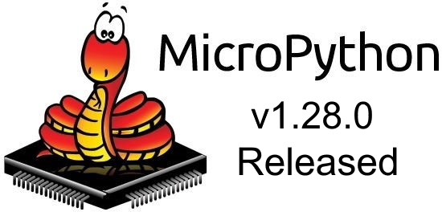](https://github.com/micropython/micropython/releases/tag/v1.28.0)

MicroPython lead developer Damien George has posted a new release, version v.1.28.0. - [MicroPython GitHub](https://github.com/micropython/micropython/releases/tag/v1.28.0). Via [Adafruit Blog](https://blog.adafruit.com/2026/04/07/micropython-v1-28-0-released/).

> "This release of MicroPython sees `machine.PWM` support finally added to the stm32 port, as well as the alif port. This rounds out PWM support to all Tier 1 and Tier 2 microcontroller-based ports. A new `machine.CAN` class that has been in development for a couple of years has now been finalised in this release, with added documentation, a common set of bindings, comprehensive tests, and an implementation for the stm32 port. 
 &nbsp; 
This release also sees the addition of template strings as per PEP 750. Template strings (or t-strings) are similar to f-strings, allowing expressions within the string literal. But unlike f-strings, t-strings do not concatenate the pieces of the literal, rather they remain as separate components within a Template object.
 &nbsp; 
An outline of MicroPython’s design values has been added to the main README. This aims to put into words some of the more intangible aspects of the project, in the hope that it will help strengthen and maintain those values moving forward. All MicroPython users and developers are encouraged to read these values, which can be found [here](https://github.com/micropython/micropython/blob/master/README.md#micropython-design-values)."

## The Pi Zero 2 W is the Only Raspberry Pi That Makes Sense Right Now

[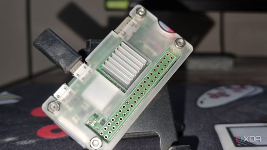](https://www.xda-developers.com/the-pi-zero-2-w-is-the-only-raspberry-pi-that-makes-sense-right-now/)

Unlike its expensive mainline brethren, the Raspberry Pi Zero systems are meant to be light and affordable machines for DIY projects, and their budget-friendly nature hasn’t changed all that much even with the ongoing RAM armageddon. Yes, it can’t hold a candle to the computing prowess of even a Raspberry Pi 4, let alone its successor or x86 rivals. But for typical DIY projects and beginner-friendly SBC experiments, this tiny board can satiate your tinkering thirst - [XDA](https://www.xda-developers.com/the-pi-zero-2-w-is-the-only-raspberry-pi-that-makes-sense-right-now/).

Stop overspending on Raspberry Pis: why I picked a $15 Pi Zero over a $200 Pi 5 - [How-To Geek](https://www.howtogeek.com/bought-raspberry-pi-zero-instead-of-pi-5/).

*Ed. Note: and with full Linux, they can call out to agentic models and do things, at a low cost. That is, if you can find one. It seems many retailers are out of stock at the moment. DigiKey quoted availability around August 10, 2026.*

## RAM Prices Are Threatening the Viability of the Raspberry Pi and Single-Board Computing

The whole point of single-board computers was their affordability. Raspberry Pi, in particular, describes its mission as "[putting] put high-performance, low-cost, general-purpose computing platforms in the hands of enthusiasts and engineers all over the world" - [Gizmodo](https://gizmodo.com/ram-prices-are-threatening-the-viability-of-the-raspberry-pi-and-single-board-computing-2000741726).

## An MCP server for MicroPython

[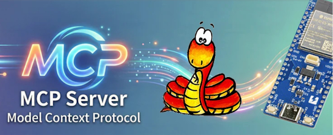](https://www.switch-science.com/blogs/magazine/mcp-micropython-bridge)

There's been a growing trend to connect Large Language Models (LLM) to various tools and systems. Physical devices like microcontrollers can become quite interesting when running LLMs with attached hardware. So Yusuke Sasaki has implemented an MCP server that allows direct code execution from an LLM on a board running MicroPython - [Switch Science](https://www.switch-science.com/blogs/magazine/mcp-micropython-bridge) and [GitHub](https://github.com/SWITCHSCIENCE/mcp-micropython-bridge). (Japanese)

## Find MicroPython Packages with Mim

If you are looking for a MicroPython package to do something you need,'mim' by Corella Creations, is very handy. It not only lists libraries and has a quick search feature, but it also provides the mip/mpremote commands to install each library - [checkmim.com](https://checkmim.com/packages). Via [X](https://x.com/matt_trentini/status/2042618246122418487).

> "While the MicroPython community is amazing at making poweful packages that make embedded development a dream, historically it has been painful to actually find what has previously been made. This has lead to a lot of re-created wheels.
 &nbsp; 
mim aims to solve this problem by providing a singular place to find all MicroPython packages that can be installed with mip↗, making the process for installation consistent and providing a clear command to follow to get running with the package you need.
 &nbsp; 
mim contains both "Official" MicroPython packages (from the micropython-lib repo↗) and "Community" packages, open-source packages submitted by the users of mim."

## Making The Case Against Markdown

*Ed: The [March 23rd Newsletter](https://www.adafruitdaily.com/2026/03/23/python-on-microcontrollers-newsletter-ai-helping-your-development-while-arduino-tcs-grow-onerous-and-more-circuitpython-python-micropython-thepsf-raspberry_pi/) had an [InfoWorld](https://www.infoworld.com/article/4146579/markdown-is-now-a-first-class-coding-language-deal-with-it.html) article advocating for Markdown. Apparently not all agree with that take.*

For some reason, Markdown has not just become the format of choice for giving READMEs in GitHub repositories some flair, but also for writing entire websites and documents. In a recent rant, Burak Güngör covers all the ways in which Markdown is a good idea as a basic document formatting concept and how its implementation is absolutely [atrocious](https://bgslabs.org/blog/why-are-we-using-markdown/) - [Hackaday](https://hackaday.com/2026/04/05/making-the-case-against-markdown/).

## This Week's Python Streams

Python on Hardware is all about building a cooperative ecosphere which allows contributions to be valued and to grow knowledge. Below are the streams within the last week focusing on the community.

**CircuitPython Deep Dive Stream**

[Last Friday](https://youtube.com/live/bUYch0IhCsE), Scott streamed work on an ESP USBIP bridge.

You can see the latest video and past videos on the Adafruit YouTube channel under the Deep Dive playlist - [YouTube](https://www.youtube.com/playlist?list=PLjF7R1fz_OOXBHlu9msoXq2jQN4JpCk8A).

**CircuitPython Parsec**

John Park’s CircuitPython Parsec this week is on UART Display Write - [Adafruit Blog](https://blog.adafruit.com/2026/04/10/john-parks-circuitpython-parsec-uart-display-write/) and [YouTube](https://www.youtube.com/watch?v=bHahVWg-YL8).

Catch all the episodes in the [YouTube playlist](https://www.youtube.com/playlist?list=PLjF7R1fz_OOWFqZfqW9jlvQSIUmwn9lWr).

**Deep Dive with Tim**

[Last week](https://youtube.com/live/FE1zJi31D7Y), Tim streamed work on trying out the Zephyr port some more.

You can see the latest video and past videos on the Adafruit YouTube channel under the Deep Dive playlist - [YouTube](https://www.youtube.com/playlist?list=PLjF7R1fz_OOWFqZfqW9jlvQSIUmwn9lWr).

**CircuitPython Weekly Meeting**

CircuitPython Weekly Meeting for April 6, 2026 ([notes](https://github.com/adafruit/adafruit-circuitpython-weekly-meeting/blob/main/2026/2026-04-06.md)) [on YouTube](https://youtu.be/YK_VYdXvsKY).

## Project of the Week: Overglade Hackathon Badges

[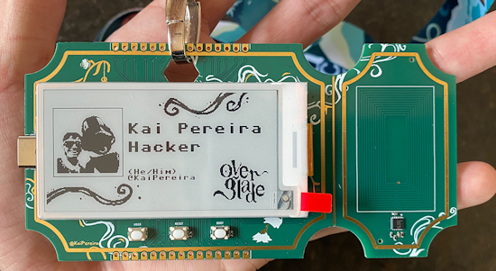](https://github.com/KaiPereira/Overglade-Badges)

Kai Pereira designed electronic e-ink badges for the Overglade Hackathon in Singapore. They have an NFC reader, an e-ink display, and run MicroPython - [GitHub](https://github.com/KaiPereira/Overglade-Badges). Via [Adafruit Blog](https://blog.adafruit.com/2026/04/08/a-custom-e-ink-badge-with-a-built-in-nfc-reader/).

## Popular Last Week

What was the most popular, most clicked link, in [last week's newsletter]([newslink](https://www.adafruitdaily.com/2026/04/06/python-on-microcontrollers-newsletter-micropython-v1-28-0-imminent-arduino-report-memory-prices-and-more-circuitpython-python-micropython-thepsf-raspberry_pi/))? [MicroPython Release Imminent](https://github.com/micropython/micropython/milestone/12).

Did you know you can read past issues of this newsletter in the Adafruit Daily Archive? [Check it out](https://www.adafruitdaily.com/category/circuitpython/).

## Put Your Projects for Free on Adafruit Playground

[Adafruit Playground](https://adafruit-playground.com/) is a new place for the community to post their projects and other making tips/tricks/techniques. Ad-free, it's an easy way to publish your work in a safe space for free with no ads, etc.

## News From Around the Web

CircuitMess timed the NASA Artemis Watch 2.0 perfectly into a cultural moment. This is a $129 programmable smartwatch, fully assembled and ready to use out of the box. The hardware inside includes a dual-core ESP32 microcontroller, a color LCD screen, an accelerometer, a gyroscope, a compass, and a temperature sensor. It pairs with iOS and Android devices over Bluetooth for activity tracking and notifications, and the firmware is entirely open-source, reprogrammable in Python, CircuitBlocks, or the Arduino IDE. You can design custom watch faces, build interactive apps, and modify sensor behavior as deep as you want to go - [Yanko Design](https://www.yankodesign.com/2026/04/05/the-nasa-artemis-2-0-smartwatch-runs-python-and-lets-kids-code-their-own-wearable/) and [CircuitMess](https://circuitmess.com/products/nasa-artemis-watch-2-0).

[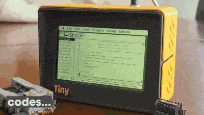](https://github.com/cuneytozseker/TinyProgrammer)

TinyProgrammer v0.1 is a self-contained device that autonomously writes, runs, and watches little Python programs... forever. Powered by a Raspberry Pi, Python and an LLM via OpenRouter. It types code at human speed, makes mistakes, fixes them, and has its own mood. The display mimics a classic Mac IDE, complete with a file browser, editor, and status bar - [GitHub](https://github.com/cuneytozseker/TinyProgrammer).

[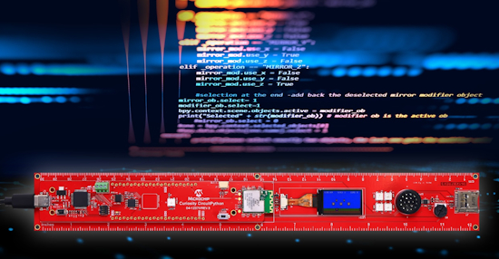](https://www.microchip.com/en-us/about/media-center/blog/2026/pykit-explorer-circuitpython-development-kit)

The Microchip Curiosity PyKit Explorer is a CircuitPython development kit in a ruler form factor. It featuring a SAME51 MCU, TFT display, IMU, sensors, audio and BLE, it enables engineers and students to go from LED blink to full games, all while reinforcing real embedded design concepts - [Microchip](https://www.microchip.com/en-us/about/media-center/blog/2026/pykit-explorer-circuitpython-development-kit).

This Python notebook flaw shows how fast hackers are acting on advisories - [Cybernews](https://cybernews.com/ai-news/python-notebook-flaw-marimo-hackers-advisories-glasswing/).

[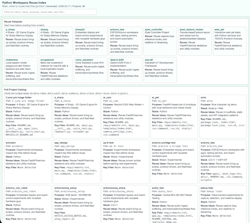](https://x.com/CosminDolha/status/2040476117874741633)

Cosmin Dolha posts "I have a few folders, with a lot of projects and experiments, some Python,  C, ESP-IDF, CircuitPython, Micropython, Lua, etc.  Each in its own folder, some of them interact across multiple languages. I made Codex go through each folder, index what it is about, put it in an index HTML with a short description for each. Now when I tell Codex to do something, it goes to that index, looks if there is something there it can re-use, and sometimes finds stuff there that is useful, modifies them and uses them in the current project" - [X](https://x.com/CosminDolha/status/2040476117874741633).

[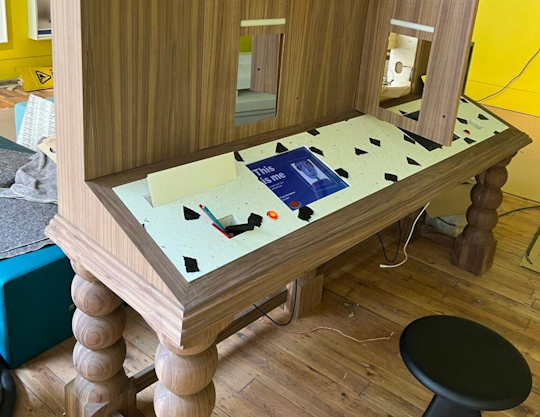](https://www.raspberrypi.com/news/hackable-history-clay-interactive-and-raspberry-pi-at-the-young-va/)

Hackable history: Clay Interactive and Raspberry Pi at the Young V&A in the uK - [Raspberry Pi News](https://www.raspberrypi.com/news/hackable-history-clay-interactive-and-raspberry-pi-at-the-young-va/).

[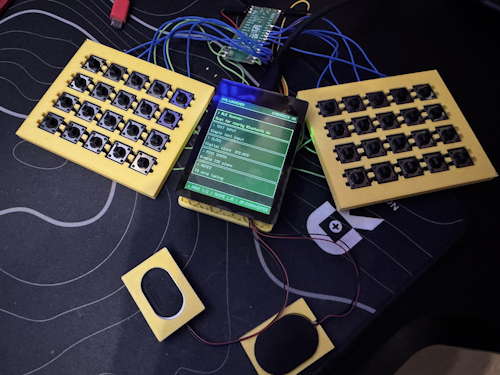](https://mastodon.social/@andy_warb/116375955422498402)

Andy Warburton writes: "I've been hacking on this little cyberdeck project. It’s very much in prototype mode at the moment, but I’ve built a mini CircuitPython powered launcher that loads 'apps' from the SD card and can be navigated by touch or keyboard navigation. The keyboard is hand-wired with tactile switches (to keep things compact) through a Pi Pico that talks to the main brain (a Waveshare ESP32-S3 2.8” touch screen) over UART and can be switched to work as a standalone keeb too" - [Mastodon](https://mastodon.social/@andy_warb/116375955422498402).

An ESP32 vs. STM32 comparison - [UltraLibrarian](https://www.ultralibrarian.com/2026/04/02/esp32-vs-stm32-comparison-ulc).

[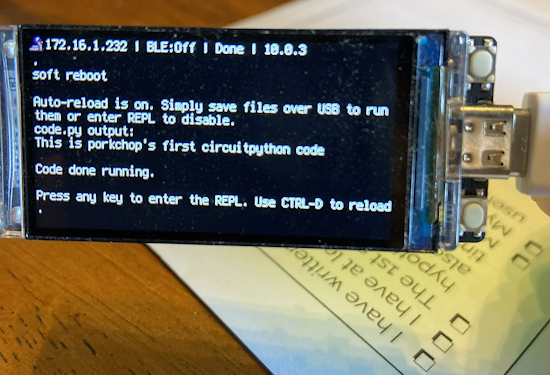](https://x.com/twinturbomonke1/status/2041205259758915791)

"We did the last school project with an ESP32 with easy CircuitPython code and grok-guided research to build an auto-clicker for Roblox" - [X](https://x.com/twinturbomonke1/status/2041205259758915791).

[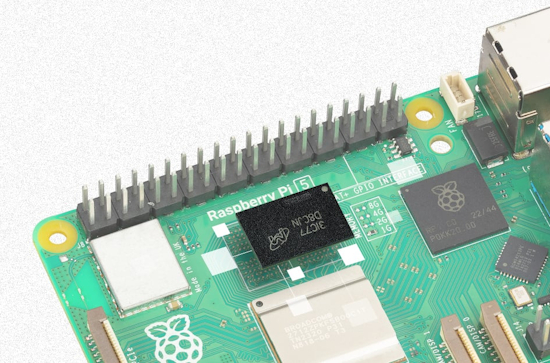](https://www.raspberrypi.com/news/mighty-projects-for-your-1gb-raspberry-pi-5/)

Mighty projects for your 1GB (or higher, of course) Raspberry Pi 5 - [Raspberry Pi News](https://www.raspberrypi.com/news/mighty-projects-for-your-1gb-raspberry-pi-5/).

[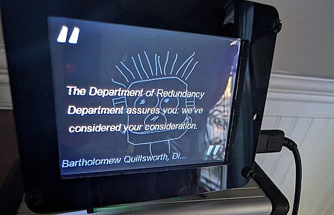](https://mastodon.social/@osunderdog@dmv.community/116369124466544563)

An Adafruit PyPortal project from Mastodon user @osunderdog@dmv.community with CircuitPython - [Mastodon](https://mastodon.social/@osunderdog@dmv.community/116369124466544563).

[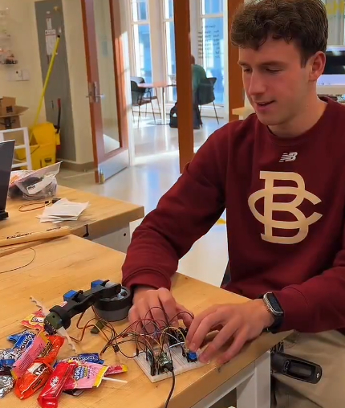](https://bsky.app/profile/gallaugher.bsky.social/post/3mj333eguks23)

Robot arm class in Physical Computing class and the MakerSpace was electric with CircuitPython, Raspberry Pi Pico and 3D printing arms battling to pick up candy - [BlueSky](https://bsky.app/profile/gallaugher.bsky.social/post/3mj333eguks23).

[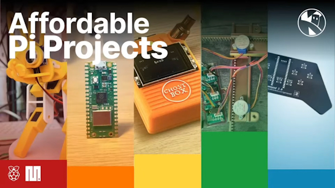](https://www.youtube.com/watch?v=TuQYtYlSEWY)

10 Affordable Pi Projects for 2026 from Kevin McAleer - [YouTube](https://www.youtube.com/watch?v=TuQYtYlSEWY).

[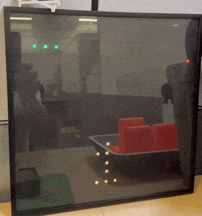](https://bsky.app/profile/nerdymark.com/post/3miw3phkm622c)

An updated snake game in MicroPython from nerdymark - [BlueSky](https://bsky.app/profile/nerdymark.com/post/3miw3phkm622c).

text - [site](url).

[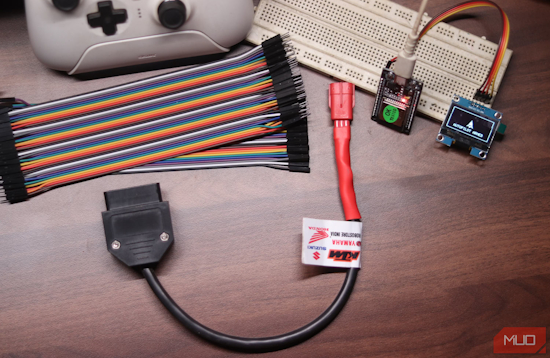](https://www.makeuseof.com/chatgpt-refused-help-vibe-code-project-led-better/)

ChatGPT refused to help me vibe code my project and it led me somewhere better - [MakeUseOf](https://www.makeuseof.com/chatgpt-refused-help-vibe-code-project-led-better/).

I replaced 3 paid productivity apps with one simple Python script - [How-To Geek](https://www.howtogeek.com/i-replaced-3-paid-productivity-apps-with-one-simple-python-script/).

PEP 816: how Python is getting serious about Wasm - [InfoWorld](https://www.infoworld.com/article/4150052/how-python-is-getting-serious-about-wasm.html).

[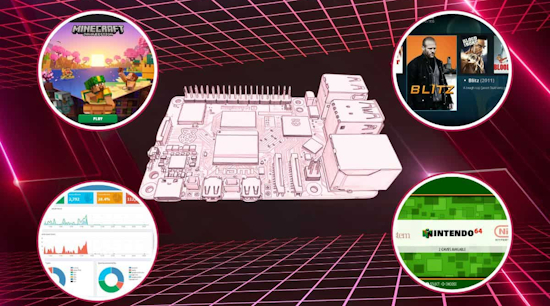](https://raspberrytips.com/quick-raspberry-pi-projects/)

Ten Raspberry Pi projects you can build in under an hour (no extra hardware needed) - [Raspberry Tips](https://raspberrytips.com/quick-raspberry-pi-projects/).

## New

[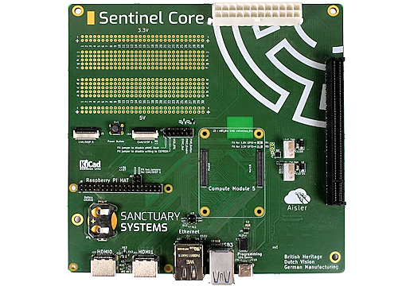](https://www.cnx-software.com/2026/04/03/sentinel-core-raspberry-pi-cm5-mini-itx-carrier-board-with-a-pcie-x16-slot/)

Sanctuary Systems’ Sentinel Core is a Raspberry Pi CM5 mini-ITX carrier board with a PCIe x16 slot to easily connect a graphics card to accelerate 3D graphics, video transcoding, or AI workloads. It’s basically a larger Raspberry Pi CM5 IO board with a prototyping area, a PCIe slot, and a 24-pin ATX power connector. The Sentinel Core also comes with two HDMI ports, a Gigabit Ethernet port, two USB 3.0 ports, MIPI DSI/CSI connectors, and the usual 40-pin GPIO header - [CNX](https://www.cnx-software.com/2026/04/03/sentinel-core-raspberry-pi-cm5-mini-itx-carrier-board-with-a-pcie-x16-slot/).

[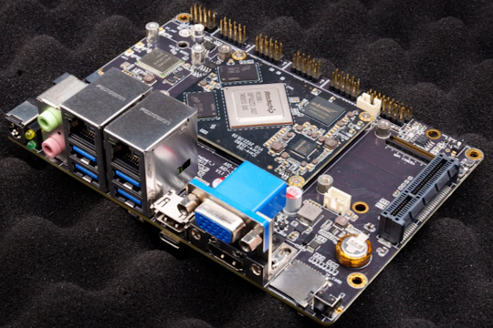](https://linuxgizmos.com/rk3588-based-3-5-inch-sbc-offers-8k-video-pcie-3-0-and-multi-display-support/)

The AIO-3588Q is an ARM-based motherboard built around the Rockchip RK3588 SoC, aimed at edge computing, industrial control, and multi-display systems. The platform integrates high-resolution video interfaces, networking, and expansion options within a compact form factor. The RK3588 features an octa-core CPU running up to 2.4 GHz, paired with a Mali-G610 MP4 GPU and a neural processing unit rated at up to 6 TOPS - [LinuxGizmos](https://linuxgizmos.com/rk3588-based-3-5-inch-sbc-offers-8k-video-pcie-3-0-and-multi-display-support/).

## New Boards Supported by CircuitPython

The number of supported microcontrollers and Single Board Computers (SBC) grows every week. This section outlines which boards have been included in CircuitPython or added to [CircuitPython.org](https://circuitpython.org/).

This week there were no new boards added.

*Note: For non-Adafruit boards, please use the support forums of the board manufacturer for assistance, as Adafruit does not have the hardware to assist in troubleshooting.*

Looking to add a new board to CircuitPython? It's highly encouraged! Adafruit has four guides to help you do so:

- [How to Add a New Board to CircuitPython](https://learn.adafruit.com/how-to-add-a-new-board-to-circuitpython/overview)
- [How to add a New Board to the circuitpython.org website](https://learn.adafruit.com/how-to-add-a-new-board-to-the-circuitpython-org-website)
- [Adding a Single Board Computer to PlatformDetect for Blinka](https://learn.adafruit.com/adding-a-single-board-computer-to-platformdetect-for-blinka)
- [Adding a Single Board Computer to Blinka](https://learn.adafruit.com/adding-a-single-board-computer-to-blinka)

## New Adafruit Learning System Guides

[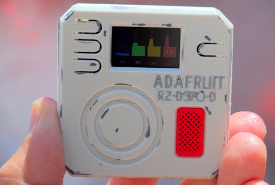](https://learn.adafruit.com/guides/latest)

The [Adafruit Learning System](https://learn.adafruit.com/) has over 3,200 free guides for learning skills and building projects including using Python.

[Star Trek Data Dispenser](https://learn.adafruit.com/star-trek-data-dispenser) from [Ruiz Brothers](https://learn.adafruit.com/star-trek-data-dispenser#:~:text=by-,Ruiz%20Brothers,-published%20April%2007)

## CircuitPython Libraries

The CircuitPython library numbers are continually increasing, while existing ones continue to be updated. Here we provide library numbers and updates!

To get the latest Adafruit libraries, download the [Adafruit CircuitPython Library Bundle](https://circuitpython.org/libraries). To get the latest community contributed libraries, download the [CircuitPython Community Bundle](https://circuitpython.org/libraries).

If you'd like to contribute to the CircuitPython project on the Python side of things, the libraries are a great place to start. Check out the [CircuitPython.org Contributing page](https://circuitpython.org/contributing). If you're interested in reviewing, check out Open Pull Requests. If you'd like to contribute code or documentation, check out Open Issues. We have a guide on [contributing to CircuitPython with Git and GitHub](https://learn.adafruit.com/contribute-to-circuitpython-with-git-and-github), and you can find us in the #help-with-circuitpython and #circuitpython-dev channels on the [Adafruit Discord](https://adafru.it/discord).

You can check out this [list of all the Adafruit CircuitPython libraries and drivers available](https://github.com/adafruit/Adafruit_CircuitPython_Bundle/blob/master/circuitpython_library_list.md). 

The current number of CircuitPython libraries is **569**!

**New Libraries**

Here are this week's new CircuitPython libraries:

* No new libraries this week.

**Updated Libraries**

Here are this week's updated CircuitPython libraries:

* [adafruit/Adafruit_CircuitPython_uBlox](https://github.com/adafruit/Adafruit_CircuitPython_uBlox)
* [adafruit/Adafruit_CircuitPython_DisplayIO_FlipClock](https://github.com/adafruit/Adafruit_CircuitPython_DisplayIO_FlipClock)

## What’s the CircuitPython team up to this week?

What is the team up to this week? Let’s check in:

**Dan**

I am on the tail end of the MicroPython v1.27 merge into CircuitPython. I have made a pull request and am now fixing the build errors. Once it builds successfully I will do some more extensive testing on different board families. After it's merged we will release CircuitPython 10.2.0, starting with a release candidate.

**Tim**

I finished the guide for using a Raspberry Pi as a router, that I mentioned last week. I've started working on some changes to the way that adabot library patches can work to make it easier to run a patch that will update the version of ruff used in the actions for the libraries.

I've also been diving into the zephyr port a bunch. I added a board def for the Feather RP2040 and have been testing display and NVM related core modules. I also have started enabling other core modules and writing native sim tests to validate their behavior. So far I've enabled msgpack and aesio successfully, the msgpack PR is in, and aesio needs a few finishing touches. I'll keep looking into what other modules might be possible to turn on with minimal effort.

**Scott**

Last week I was testing and debugging the update of the ESP IDF from 5.5 to 6. It took a while to get WiFi working but I did. It's been pushed to a branch for others to test. The testing for this highlights the need for automated testing. So, I've circled back to my idea to use USB over IP to make USB devices easily accessible for testing with needing a host OS connected directly. 

Crashing or confusing Linux with rogue USB devices hampered my automated testing in the past. My goal is to have a ready made firmware to drop on an ESP that bridges the USB host port onto the network with USBIP. Then, any network host can connect to it and do testing over the TCP socket. I'm also working on `pyusb` and `pyserial` integration that will use the TCP connection directly. It will hopefully allow existing code to target these devices too.

**Liz**

[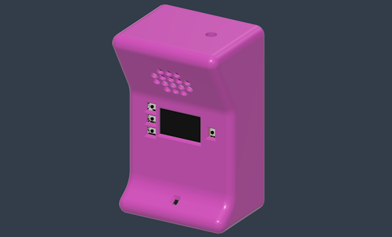](https://www.circuitpython.org/)

This week I documented the [Terminal Block BFF](https://learn.adafruit.com/adafruit-terminal-block-bff), the newest BFF in the shop. This board lets you plug in your QT Py or Xiao board and then lets you access all of the GPIO with socket headers or terminal blocks. There's also onboard battery charging and a STEMMA QT port.

I'm also continuing on the ESP-NOW powered walkie talkies. For the enclosure design, I looked at a bunch of 90s toy walkie talkies and tried to emulate that vibe.

## Upcoming Events

The next MicroPython Meetup in Melbourne will be on April 22 – [Luma](https://luma.com/r0rq9pl4). You can see recordings of previous meetings on [YouTube](https://www.youtube.com/@MicroPythonOfficial). 

[PyCon DE & PyData 2026](https://2026.pycon.de/) will be 13 April 2026 – 17 April 2026 in Darmstadt, Germany

**Other Events This Year**

* [PyCon US](https://us.pycon.org/2026/) is May 13 - May 19, 2026 in Long Beach, California
* [The Open Source Hardware Association Open Hardware Summit](https://oshwa.org/announcements/the-2026-open-hardware-summit-schedule-is-out/) is coming to Berlin, Germany on May 23rd and 24th, 2026.
* [EuroPython 2026](https://ep2026.europython.eu/) is coming to Kraków, Poland 13-19 July, 2026.
* [PyOhio 2026](https://www.pyohio.org/2026/) is from 25 July through 26 July, 2026 this year in Cleveland, USA.
* [HOPE 26 Conference](https://store.2600.com/products/tickets-to-hope-26) is from August 14th through 16th at the New Yorker Hotel, NY, NY.
* [PyCon AU 2026](https://2026.pycon.org.au/) will be 26 Aug. 2026 – 30 Aug. 2026 in Brisbane, Australia

If you know of virtual events or upcoming events, please let us know via email to cpnews(at)adafruit(dot)com.

## Latest Releases
CircuitPython's stable release is [10.1.4](https://github.com/adafruit/circuitpython/releases/latest) and its unstable release is [10.2.0-alpha.1](https://github.com/adafruit/circuitpython/releases). New to CircuitPython? Start with our [Welcome to CircuitPython Guide](https://learn.adafruit.com/welcome-to-circuitpython).

[20260402](https://github.com/adafruit/Adafruit_CircuitPython_Bundle/releases/latest) is the latest Adafruit CircuitPython library bundle.

[20260402](https://github.com/adafruit/CircuitPython_Community_Bundle/releases/latest) is the latest CircuitPython Community library bundle.

[v1.28.0](https://micropython.org/download) is the latest MicroPython release. Documentation for it is [here](http://docs.micropython.org/en/latest/pyboard/).

[3.14.4](https://www.python.org/downloads/) is the latest Python release. The latest pre-release version is [3.15.0a8](https://www.python.org/download/pre-releases/).

[4,492 Stars](https://github.com/adafruit/circuitpython/stargazers) Like CircuitPython? [Star it on GitHub!](https://github.com/adafruit/circuitpython)

## Call for Help -- Translating CircuitPython is now easier than ever

[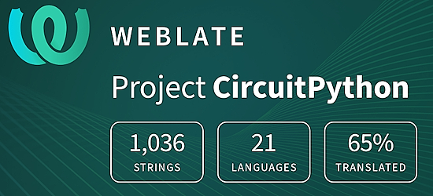](https://hosted.weblate.org/engage/circuitpython/)

One important feature of CircuitPython is translated control and error messages. With the help of fellow open source project [Weblate](https://weblate.org/), we're making it even easier to add or improve translations. 

Sign in with an existing account such as GitHub, Google or Facebook and start contributing through a simple web interface. No forks or pull requests needed! As always, if you run into trouble join us on [Discord](https://adafru.it/discord), we're here to help.

## NUMBER Thanks

The Adafruit Discord community, where we do all our CircuitPython development in the open, reached over NUMBER humans - thank you! Adafruit believes Discord offers a unique way for Python on hardware folks to connect. Join today at [https://adafru.it/discord](https://adafru.it/discord).

## ICYMI - In case you missed it

Python on hardware is the Adafruit Python video-newsletter-podcast! The news comes from the Python community, Discord, Adafruit communities and more and is broadcast on ASK an ENGINEER Wednesdays. The complete Python on Hardware weekly videocast [playlist is here](https://www.youtube.com/playlist?list=PLjF7R1fz_OOXRMjM7Sm0J2Xt6H81TdDev). The video podcast is on [iTunes](https://itunes.apple.com/us/podcast/python-on-hardware/id1451685192?mt=2), [YouTube](http://adafru.it/pohepisodes), [Instagram](https://www.instagram.com/adafruit/channel/)), and [XML](https://itunes.apple.com/us/podcast/python-on-hardware/id1451685192?mt=2).

[The weekly community chat on Adafruit Discord server CircuitPython channel - Audio / Podcast edition](https://itunes.apple.com/us/podcast/circuitpython-weekly-meeting/id1451685016) - Audio from the Discord chat space for CircuitPython, meetings are usually Mondays at 2pm ET, this is the audio version on [iTunes](https://itunes.apple.com/us/podcast/circuitpython-weekly-meeting/id1451685016), Pocket Casts, [Spotify](https://adafru.it/spotify), and [XML feed](https://adafruit-podcasts.s3.amazonaws.com/circuitpython_weekly_meeting/audio-podcast.xml).

## Contribute

The CircuitPython Weekly Newsletter is a CircuitPython community-run newsletter emailed every Monday. To contribute your content, please email your news to cpnews (at) adafruit (dot) com with information and link(s) to your content. 

Join the Adafruit [Discord](https://adafru.it/discord) or [post to the forum](https://forums.adafruit.com/viewforum.php?f=60) if you have questions.
