- [ ] Library and info updates
- [ ] change date
- [ ] update title
- [ ] Feature story
- [ ] Update  for images
- [ ] Update ICYDNCI
- [ ] All images 550w max only
- [ ] Link "View this email in your browser."

News Sources

- [Adafruit Playground](https://adafruit-playground.com/)
- Twitter: [CircuitPython](https://twitter.com/search?q=circuitpython&src=typed_query&f=live), [MicroPython](https://twitter.com/search?q=micropython&src=typed_query&f=live) and [Python](https://twitter.com/search?q=python&src=typed_query)
- [Raspberry Pi News](https://www.raspberrypi.com/news/), [Pi Foundation](https://www.raspberrypi.org/blog/)
- Mastodon [CircuitPython](https://mastodon.social/tags/CircuitPython) and [MicroPython](https://mastodon.social/tags/MicroPython)
- BlueSky [CircuitPython](https://bsky.app/search?q=circuitpython), [MicroPython](https://bsky.app/search?q=micropython), [Raspberry Pi](https://bsky.app/search?q=raspberry+pi)
- [Google News Python](https://news.google.com/topics/CAAqIQgKIhtDQkFTRGdvSUwyMHZNRFY2TVY4U0FtVnVLQUFQAQ?hl=en-US&gl=US&ceid=US%3Aen)
- YouTube: [CircuitPython](https://www.youtube.com/results?search_query=circuitpython&sp=CAISBAgDEAE%253D), [MicroPython](https://www.youtube.com/results?search_query=micropython&sp=CAISBAgDEAE%253D), [Prof Gallaugher](https://www.youtube.com/@BuildWithProfG/videos)
- [maker.io Python](https://www.digikey.com/en/maker/search-results?s=createdDate&t=python)
- [hackster.io CircuitPython](https://www.hackster.io/search?q=circuitpython&i=projects&sort_by=most_recent) and [MicroPython](https://www.hackster.io/search?q=micropython&i=projects&sort_by=most_recent)
- Instructables: [CircuitPython](https://www.instructables.com/search/?q=circuitpython&projects=all&sort=Newest), [MicroPython](https://www.instructables.com/search/?q=micropython&projects=all&sort=Newest), [Raspberry Pi Python](https://www.instructables.com/search/?q=raspberry+pi+python&projects=all&sort=Newest)
- [hackaday CircuitPython](https://hackaday.com/blog/?s=circuitpython) and [MicroPython](https://hackaday.com/blog/?s=micropython)
- [python.org](https://www.python.org/)
- [Python Insider - dev team blog](https://pythoninsider.blogspot.com/)
- Individuals: [bret.dk](https://bret.dk/), [Jeff Geerling](https://www.jeffgeerling.com/blog), [Yakroo](https://x.com/Yakroo5077), [coXXect](https://coxxect.blogspot.com/)
- Tom's Hardware: [CircuitPython](https://www.tomshardware.com/search?searchTerm=circuitpython&articleType=all&sortBy=publishedDate) and [MicroPython](https://www.tomshardware.com/search?searchTerm=micropython&articleType=all&sortBy=publishedDate) and [Raspberry Pi](https://www.tomshardware.com/search?searchTerm=raspberry%20pi&articleType=all&sortBy=publishedDate)
- [hackaday.io newest projects MicroPython](https://hackaday.io/projects?tag=micropython&sort=date) and [CircuitPython](https://hackaday.io/projects?tag=circuitpython&sort=date)
- hackaday.io - [CircuitPython](https://hackaday.io/search?term=circuitpython) and [MicroPython](https://hackaday.io/search?term=micropython)
- [MicroPython Meeting](https://luma.com/micropython?k=c)

View this email in your browser. **Warning: Flashing Imagery**

Welcome to the latest Python on Microcontrollers newsletter. Software abounds! Everyone has been excited about the new version of MicroPython being released. And it's in time for MicroPython's 13th birthday we'll be celebrating in the next newsletter. CircuitPython is getting a new release soon, you can kick the tires now. The Linux kernel has ticked over to a najor update and as soon as Debian has it I'll bet the Raspberry Pi OS folks will incorporate it.

I have a couple of updates after that, on the Pi and memory shortage, in continuing coverage. - *Anne Barela, Editor*

We're on [Discord](https://discord.gg/HYqvREz), [Twitter/X](https://twitter.com/search?q=circuitpython&src=typed_query&f=live), [BlueSky](https://bsky.app/profile/circuitpython.org) and for past newsletters - [view them all here](https://www.adafruitdaily.com/category/circuitpython/). If you're reading this on the web, please [subscribe here](https://www.adafruitdaily.com/). Here's the news this week:

## CircuitPython 10.2.0-rc.0 Released

CircuitPython 10.2.0-rc.0 is the latest release candidate for CircuitPython 10.2.0 final. CircuitPython 10.2.0 will be the latest minor revision of CircuitPython before a 10.3, and will be a new stable release - [Adafruit Blog](https://blog.adafruit.com/2026/04/16/circuitpython-10-2-0-rc0-released/) and [Release Notes](https://github.com/adafruit/circuitpython/releases/tag/10.2.0-rc.0).

**Highlights of this Release**

* New `audiotools.SpeedChanger`.
* New `qspibus` support for `displayio`.
* Stability improvements to USB SD card handling.
* Merge of MicroPython v1.27.
* Update to ESP-IDF v5.5.3.
* Many additions to the Zephyr port.
* Simulated hardware testing is now being done in the Zephyr port.

## Linux 7.0 is Out and Available on Seven Distros Now

Linux 7.0 is out, and the latest Linux kernel boasts full Rust support and a greatly improved scheduler to speed up work and games - [ZDNet](https://www.zdnet.com/article/try-new-linux-7-0-kernel-on-these-distributions/).

> "The following distros already have 7.0 available: Arch Linux, openSUSE Tumbleweed, Gentoo, NixOS (unstable), Fedora Rawhide, and Ubuntu 26.04 LTS (beta/rc). In the next few weeks, it should be in Fedora 44 and Ubuntu 26.04. After that, popular Ubuntu-derived distributions such as Linux Mint and Pop!_OS 26.04 will roll it out."

## 

text - .

## The Raspberry Pi's 15-Year Reign is Quietly Ending and Here's Why

[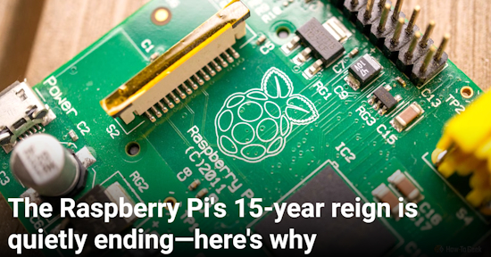](https://www.howtogeek.com/the-raspberry-pis-15-year-reign-is-quietly-endingheres-why/)

The Raspberry Pi is a single-board computer that first appeared in 2012, primarily as an educational tool. It quickly found favor with hobbyists and those looking for a device to better their skills, power small projects, and put power efficiency over raw grunt for general computing tasks. While a Raspberry Pi is perfectly capable of running Home Assistant, a bunch of Docker containers, or even acting as a makeshift NAS, it’s [no longer the best tool for the job](https://www.howtogeek.com/apps-you-can-self-host-on-a-cheap-old-dell-optiplex-mini-pc/). That crown (currently) goes to the mini PC. And on the low end, the ESP32 is putting pressure on small form factor builds - [How-To Geek](https://www.howtogeek.com/the-raspberry-pis-15-year-reign-is-quietly-endingheres-why/).

## A Security Update for Raspberry Pi OS Affects `sudo` Use

[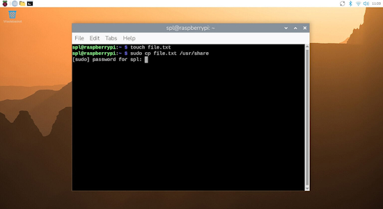](https://www.raspberrypi.com/news/a-security-update-for-raspberry-pi-os/)

Raspberry Pi has released version 6.2 of Raspberry Pi OS, the second update to the Trixie version released last year. The update is mostly a round-up of all the small changes and bug fixes made over the past few months, but there is one significant change to note: passwordless `sudo` is now disabled by default - [Raspberry Pi News](https://www.raspberrypi.com/news/a-security-update-for-raspberry-pi-os/).

## Being Hopeful About Ridiculous RAM Prices

[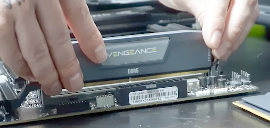](https://www.tomsguide.com/computing/hardware/from-allbirds-lunacy-to-mediateks-cautious-optimism-why-im-finally-hopeful-about-ridiculous-ram-prices)

But now that the panic has subsided and turned into people increasingly voting with their wallets by not buying until the numbers make sense, you’re starting to see a slow-burn. A calculated attempt to find just the right price where you’ll finally hit buy - [Tom's Guide](https://www.tomsguide.com/computing/hardware/from-allbirds-lunacy-to-mediateks-cautious-optimism-why-im-finally-hopeful-about-ridiculous-ram-prices). Similar video - [YouTube](https://www.youtube.com/shorts/48YDRVTrqgk).

## A Subset of MicroPython Features Comes To The Arduino Uno Q

[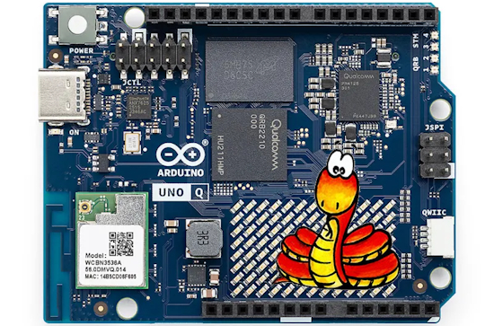](https://hackaday.com/2026/04/15/python-comes-to-the-arduino-uno-q/)

Natasha wanted to teach MicroPython using an Uno Q, but the usual MicroPython APIs weren’t available. They made their own library to implement the most important bits of the familiar API. It currently implements a subset of the machine module: Pin, PWM, ADC, I2C, SPI and UART. While not complete, this certainly has potential to make the Uno Q easier to use for those familir with MicroPython - [Hackaday](https://hackaday.com/2026/04/15/python-comes-to-the-arduino-uno-q/) and [GitHub](https://github.com/EK-IT-TEKNOLOG/gpio_api).

## This Week's Python Streams

Python on Hardware is all about building a cooperative ecosphere which allows contributions to be valued and to grow knowledge. Below are the streams within the last week focusing on the community.

**CircuitPython Deep Dive Stream**

[Last Friday](https://youtube.com/live/9de1m5kM4es), Scott streamed work on a ESP32-P4 based Logic Analyzer.

You can see the latest video and past videos on the Adafruit YouTube channel under the Deep Dive playlist - [YouTube](https://www.youtube.com/playlist?list=PLjF7R1fz_OOXBHlu9msoXq2jQN4JpCk8A).

**CircuitPython Parsec**

John Park’s CircuitPython Parsec this week is on DAC Volume Control - [Adafruit Blog](https://blog.adafruit.com/2026/04/17/john-parks-circuitpython-parsec-dac-volume-control/) and [YouTube](https://youtu.be/D2ia6CS0De0?si=LoGJDuO-ALrVCsE0).

Catch all the episodes in the [YouTube playlist](https://www.youtube.com/playlist?list=PLjF7R1fz_OOWFqZfqW9jlvQSIUmwn9lWr).

**Deep Dive with Tim**

[Last week](https://youtube.com/live/YpkLXU9zlRQ), Tim streamed work on Zephyr `bus_device` testing inside `native_sim`.

You can see the latest video and past videos on the Adafruit YouTube channel under the Deep Dive playlist - [YouTube](https://www.youtube.com/playlist?list=PLjF7R1fz_OOWFqZfqW9jlvQSIUmwn9lWr).

Paul welcomes three former guests back to the show for a panel discussion about developing for the Adafruit Fruit Jam. Tim Cocks, Dan Colgiano and Cooper Dalyrymple share their experiences in creating apps, games, and screensavers for the Adafruit Fruit Jam and FruitJamOS - [The CircuitPython Show](https://www.circuitpythonshow.com/@circuitpythonshow).

**CircuitPython Weekly Meeting**

CircuitPython Weekly Meeting for April 13, 2026 ([notes](https://github.com/adafruit/adafruit-circuitpython-weekly-meeting/blob/main/2026/2026-04-13.md)) [on YouTube](https://youtu.be/3zraME_h0jU).

## Project of the Week: Optocam Zero

[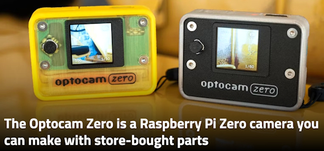](https://www.xda-developers.com/the-optocam-zero-is-a-raspberry-pi-zero-camera-you-can-make-with-store-bought-parts/)

The Optocam Zero is a pocket Raspberry Pi Zero camera running Python with off-the-shelf parts and a 3D-printed shell. It features autofocus, eight filters, a WiFi hotspot, USB-C charging, and an interchangeable 14,500 mAh battery. The tech specs include 2592x2592 JPEG photos, 240x240 1.4" LCD, 15-20 fps preview, and ~70-80 min per charge - [XDA](https://www.xda-developers.com/the-optocam-zero-is-a-raspberry-pi-zero-camera-you-can-make-with-store-bought-parts/), Hackaday](https://hackaday.com/2026/04/16/optocam-zeros-pictures-look-one-hundred/) and [GitHub](https://github.com/dorukkumkumoglu/optocamzero?tab=readme-ov-file).

## Popular Last Week

[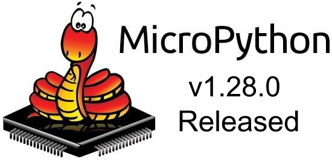](https://github.com/micropython/micropython/releases/tag/v1.28.0)

What was the most popular, most clicked link, in [last week's newsletter](https://www.adafruitdaily.com/2026/04/13/python-on-microcontrollers-newsletter-micropython-v1-28-0-is-out-folks-are-gobbling-up-pi-2ws-and-more-circuitpython-python-micropython-thepsf-raspberry_pi/)? [MicroPython v1.28.0 is out](https://github.com/micropython/micropython/releases/tag/v1.28.0).

Did you know you can read past issues of this newsletter in the Adafruit Daily Archive? [Check it out](https://www.adafruitdaily.com/category/circuitpython/).

## New Notes from Adafruit Playground

[Adafruit Playground](https://adafruit-playground.com/) is a new place for the community to post their projects and other making tips/tricks/techniques. Ad-free, it's an easy way to publish your work in a safe space for free.

Octoprint LED Status Crystal - [Adafruit Playground](https://adafruit-playground.com/u/GarronAnderson/pages/octoprint-led-status-crystal).

text - [Adafruit Playground](url).

Tiny Terminal with a Magnetic Connector - [Adafruit Playground](https://adafruit-playground.com/u/pendown/pages/tiny-terminal-with-a-magnetic-connector).

## News From Around the Web

[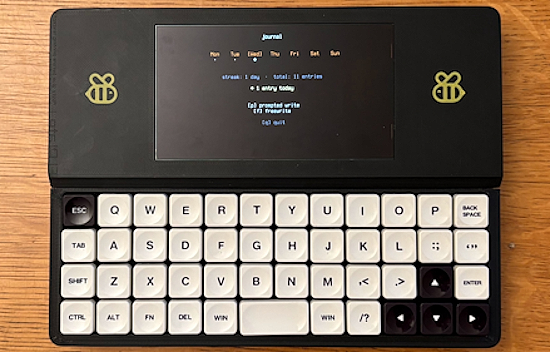](https://blog.adafruit.com/2026/04/13/bee-write-back-a-portable-journal/)

Simon Shimel created a simple Raspberry Pi based journal to enter the chaos of the day. He found that the form factor was really fun to use, and began developing more apps and functions, including a simple Claude chat client. The case is 3D printed. A Raspberry Pi Zero 2W provides the brains, running Python. Total cost less than $200 - [Adafruit Blog](https://blog.adafruit.com/2026/04/13/bee-write-back-a-portable-journal/), [YouTube](https://youtu.be/JutsTp7yeNU?si=posOLlohfPbVmAsc) and [GitHub](https://github.com/shmimel/bee-write-back/tree/main). Via [X](https://x.com/cnxsoft/status/2042554406739284271) and [CNX](https://www.cnx-software.com/2026/04/10/bee-write-back-a-raspberry-pi-zero-2-w-based-diy-writerdeck-with-5-5-inch-oled-and-mechanical-keyboard/).

[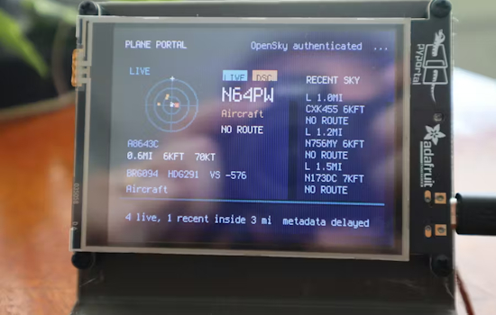](https://www.hackster.io/kevin-loeffler/planeportal-a-pyportal-desk-radar-that-tracks-planes-flying-7c83c6)

Ever stare out the window and wonder where that plane overhead is going? PlanePortal is an Adafruit PyPortal and CircuitPython-powered desk gadget for plane fans - [hackster.io](https://www.hackster.io/kevin-loeffler/planeportal-a-pyportal-desk-radar-that-tracks-planes-flying-7c83c6).

GitHub adds Stacked PRs to speed complex code reviews - [InfoWorld](https://www.infoworld.com/article/4158575/github-adds-stacked-prs-to-speed-complex-code-reviews.html).

[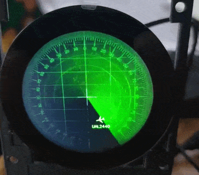](https://sozorablog.com/flightradar/)

Building a mini airplane radar using a Raspberry Pi, Python and an ADS-B receiver - [Sozorablog](https://sozorablog.com/flightradar/). Via [X](https://x.com/motorheadgeek/status/2044504764961198118).

[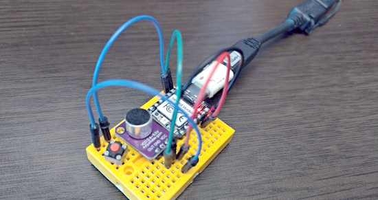](https://x.com/ryan_j23/status/2044643732025405460)

Jack Ryan and Kopai-kun created a device that detects PC beep sounds and sends the F2 key. It's configured with CircuitPython on the Seeedstudio Xiao RP2040. Basically, this thing acts like a USB keyboard that only sends the F2 key to get around an annoying BIOS issue - [X](https://x.com/ryan_j23/status/2044643732025405460).

In celebration of cyberdecks - [Raspberry Pi News](https://www.raspberrypi.com/news/in-celebration-of-cyberdecks/).

text - [site](url).

text - [site](url).

text - [site](url).

text - [site](url).

text - [site](url).

text - [site](url).

text - [site](url).

text - [site](url).

New open-source Python-based software boosts space-weather modeling - [Phys.org](https://phys.org/news/2026-04-source-python-based-software-boosts.html).

RAG isn’t enough — builting the missing context layer in Python that makes LLM systems work - [Towards Data Science](https://towardsdatascience.com/rag-isnt-enough-i-built-the-missing-context-layer-that-makes-llm-systems-work/).

Docker for Python & data projects: a beginner’s guide - [KDnuggets](https://www.kdnuggets.com/docker-for-python-data-projects-a-beginners-guide).

text - [site](url).

## New

[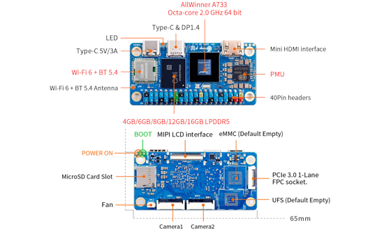](https://www.cnx-software.com/2026/04/15/orange-pi-zero-3w-an-allwinner-a733-sbc-in-raspberry-pi-zero-form-factor/)

Orange Pi Zero 3W is Raspberry Pi Zero-sized SBC powered by an [Allwinner A733](https://www.cnx-software.com/2024/12/06/allwinner-a733-octa-core-cortex-a76-a55-ai-soc-supports-up-to-16gb-ram-for-android-15-tablets-and-laptops/) octa-core Arm Cortex-A76/A55 SoC paired with up to 16GB of LPDDR5 RAM, a microSD card slot, and footprints for eMMC flash or UFS storage. Other features include a 4K-capable mini HDMI port, two USB-C ports, one with DP 1.4 Alt mode, a MIPI DSI display connector, two MIPI CSI camera connectors, a WiFi 6 and Bluetooth 5.4 module, and a 40-pin GPIO header - [CNX](https://www.cnx-software.com/2026/04/15/orange-pi-zero-3w-an-allwinner-a733-sbc-in-raspberry-pi-zero-form-factor/).

[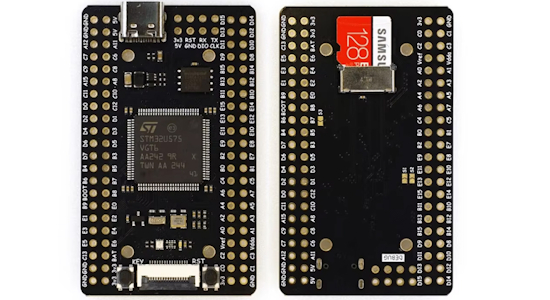](https://www.cnx-software.com/2026/04/11/15-stm32u575-development-board-features-fpc-display-connector-microsd-card-slot-two-48-pin-gpio-headers/)

The $15 STM32U575VGT6 Maker Go board offers a high-performance Cortex-M33 core running at 160 MHz, along with ultra-low-power capabilities. The board has 8MB of external flash and is designed to accept 1.47-inch or 2.0-inch LCDs directly via a ribbon cable - [CNX](https://www.cnx-software.com/2026/04/11/15-stm32u575-development-board-features-fpc-display-connector-microsd-card-slot-two-48-pin-gpio-headers/).

## New Boards Supported by CircuitPython

The number of supported microcontrollers and Single Board Computers (SBC) grows every week. This section outlines which boards have been included in CircuitPython or added to [CircuitPython.org](https://circuitpython.org/).

This week there were (#/no) new boards added:

- [Board name](url)
- [Board name](url)
- [Board name](url)

*Note: For non-Adafruit boards, please use the support forums of the board manufacturer for assistance, as Adafruit does not have the hardware to assist in troubleshooting.*

Looking to add a new board to CircuitPython? It's highly encouraged! Adafruit has four guides to help you do so:

- [How to Add a New Board to CircuitPython](https://learn.adafruit.com/how-to-add-a-new-board-to-circuitpython/overview)
- [How to add a New Board to the circuitpython.org website](https://learn.adafruit.com/how-to-add-a-new-board-to-the-circuitpython-org-website)
- [Adding a Single Board Computer to PlatformDetect for Blinka](https://learn.adafruit.com/adding-a-single-board-computer-to-platformdetect-for-blinka)
- [Adding a Single Board Computer to Blinka](https://learn.adafruit.com/adding-a-single-board-computer-to-blinka)

## New Adafruit Learning System Guides

[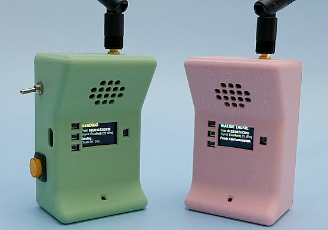](https://learn.adafruit.com/guides/latest)

The [Adafruit Learning System](https://learn.adafruit.com/) has over 3,200 free guides for learning skills and building projects including using Python.

[ESP-NOW Walkie Talkies](https://learn.adafruit.com/esp-now-walkie-talkies) from [Liz Clark](https://learn.adafruit.com/u/BlitzCityDIY) (technically not Python, but way cool)

## CircuitPython Libraries

The CircuitPython library numbers are continually increasing, while existing ones continue to be updated. Here we provide library numbers and updates!

To get the latest Adafruit libraries, download the [Adafruit CircuitPython Library Bundle](https://circuitpython.org/libraries). To get the latest community contributed libraries, download the [CircuitPython Community Bundle](https://circuitpython.org/libraries).

If you'd like to contribute to the CircuitPython project on the Python side of things, the libraries are a great place to start. Check out the [CircuitPython.org Contributing page](https://circuitpython.org/contributing). If you're interested in reviewing, check out Open Pull Requests. If you'd like to contribute code or documentation, check out Open Issues. We have a guide on [contributing to CircuitPython with Git and GitHub](https://learn.adafruit.com/contribute-to-circuitpython-with-git-and-github), and you can find us in the #help-with-circuitpython and #circuitpython-dev channels on the [Adafruit Discord](https://adafru.it/discord).

You can check out this [list of all the Adafruit CircuitPython libraries and drivers available](https://github.com/adafruit/Adafruit_CircuitPython_Bundle/blob/master/circuitpython_library_list.md). 

The current number of CircuitPython libraries is **569**!

**New Libraries**

Here are this week's new CircuitPython libraries:

* [adafruit/Adafruit_CircuitPython_MAX44009](https://github.com/adafruit/Adafruit_CircuitPython_MAX44009)

**Updated Libraries**

Here are this week's updated CircuitPython libraries:

* [adafruit/Adafruit_CircuitPython_asyncio](https://github.com/adafruit/Adafruit_CircuitPython_asyncio)

## What’s the CircuitPython team up to this week?

What is the team up to this week? Let’s check in:

**Dan**

I finished the merge from MicroPython v1.27 last week. It was incorporated into the CircuitPython 10.2.0-rc.0 release last week, in preparation for 10.2.0 final.

**Tim**

This week I wrote the guide and CircuitPython driver for the MAX44009. I've also continued enabling core modules in the Zephyr port and writing tests for them. This week I enabled `hashlib`, `zlib`, and `adafruit_bus_device`. I looked into an issue that was causing the bundle updates to fail and I am going to work on modifications in adabot to try to reveal the root cause in a more obvious way, should the same issue occur again.

**Scott**

[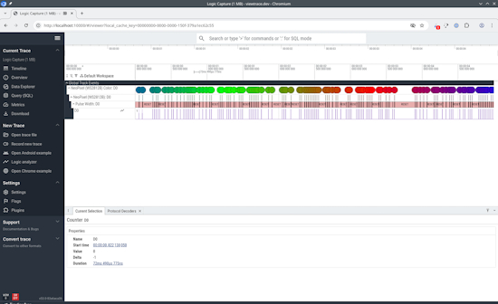](https://adafruit-playground.com/u/tannewt/pages/logic-friend)

This week (and last) I've been heads down on my vision for hardware in the loop testing. This involves many components including 1) a USB IP bridge to isolate both the test device and instrument driving it and 2) logic analyzer firmware for capturing output signals. I'm documenting the whole setup in an [Adafruit Playground note](https://adafruit-playground.com/u/tannewt/pages/logic-friend).

**Liz**

This week I finished documenting the [ESP-NOW Walkie Talkies project](https://learn.adafruit.com/esp-now-walkie-talkies). It uses a Feather ESP32-S3 Reverse TFT with an I2S microphone and I2S DAC/amp. The code is written in Arduino and handles the ESP-NOW connection, recording the audio packet, sending the packet and playing it back. I used the w.FL antenna version of the Feather and was able to get really good range between the two walkie talkies, even outside.

## Upcoming Events

The next MicroPython Meetup in Melbourne will be on April 22 – [Luma](https://luma.com/r0rq9pl4). You can see recordings of previous meetings on [YouTube](https://www.youtube.com/@MicroPythonOfficial). 

[PyCon US](https://us.pycon.org/2026/) is May 13 - May 19, 2026 in Long Beach, California

**Note: The PSF only has until April 24th to get folks into the official hotel to break even, so [please read](https://pyfound.blogspot.com/2026/04/pycon-us-2026-hotels.html), share, and book your PyCon US stay in the official block today.**

**Other Events This Year**

* [The Open Source Hardware Association Open Hardware Summit](https://oshwa.org/announcements/the-2026-open-hardware-summit-schedule-is-out/) is coming to Berlin, Germany on May 23rd and 24th, 2026.
* [EuroPython 2026](https://ep2026.europython.eu/) is coming to Kraków, Poland 13-19 July, 2026.
* [PyOhio 2026](https://www.pyohio.org/2026/) is from 25 July through 26 July, 2026 this year in Cleveland, USA.
* [HOPE 26 Conference](https://store.2600.com/products/tickets-to-hope-26) is from August 14th through 16th at the New Yorker Hotel, NY, NY.
* [PyCon AU 2026](https://2026.pycon.org.au/) will be 26 Aug. 2026 – 30 Aug. 2026 in Brisbane, Australia

If you know of virtual events or upcoming events, please let us know via email to cpnews(at)adafruit(dot)com.

## Latest Releases

CircuitPython's stable release is [10.1.4](https://github.com/adafruit/circuitpython/releases/latest) and its unstable release is [10.2.0-rc.0](https://github.com/adafruit/circuitpython/releases). New to CircuitPython? Start with our [Welcome to CircuitPython Guide](https://learn.adafruit.com/welcome-to-circuitpython).

[20260416](https://github.com/adafruit/Adafruit_CircuitPython_Bundle/releases/latest) is the latest Adafruit CircuitPython library bundle.

[20260414](https://github.com/adafruit/CircuitPython_Community_Bundle/releases/latest) is the latest CircuitPython Community library bundle.

[v1.28.0](https://micropython.org/download) is the latest MicroPython release. Documentation for it is [here](http://docs.micropython.org/en/latest/pyboard/).

[3.14.4](https://www.python.org/downloads/) is the latest Python release. The latest pre-release version is [3.15.0a8](https://www.python.org/download/pre-releases/).

[4,477 Stars](https://github.com/adafruit/circuitpython/stargazers) Like CircuitPython? [Star it on GitHub!](https://github.com/adafruit/circuitpython)

## Call for Help -- Translating CircuitPython is now easier than ever

[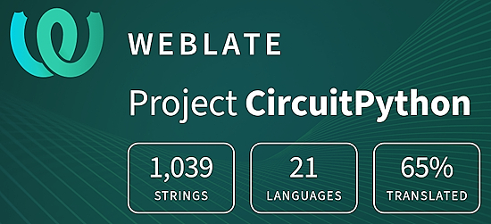](https://hosted.weblate.org/engage/circuitpython/)

One important feature of CircuitPython is translated control and error messages. With the help of fellow open source project [Weblate](https://weblate.org/), we're making it even easier to add or improve translations. 

Sign in with an existing account such as GitHub, Google or Facebook and start contributing through a simple web interface. No forks or pull requests needed! As always, if you run into trouble join us on [Discord](https://adafru.it/discord), we're here to help.

## 39,024 Thanks

The Adafruit Discord community, where we do all our CircuitPython development in the open, reached 39,024 humans - thank you! Adafruit believes Discord offers a unique way for Python on hardware folks to connect. Join today at [https://adafru.it/discord](https://adafru.it/discord).

## ICYMI - In case you missed it

Python on hardware is the Adafruit Python video-newsletter-podcast! The news comes from the Python community, Discord, Adafruit communities and more and is broadcast on ASK an ENGINEER Wednesdays. The complete Python on Hardware weekly videocast [playlist is here](https://www.youtube.com/playlist?list=PLjF7R1fz_OOXRMjM7Sm0J2Xt6H81TdDev). The video podcast is on [iTunes](https://itunes.apple.com/us/podcast/python-on-hardware/id1451685192?mt=2), [YouTube](http://adafru.it/pohepisodes), [Instagram](https://www.instagram.com/adafruit/channel/)), and [XML](https://itunes.apple.com/us/podcast/python-on-hardware/id1451685192?mt=2).

[The weekly community chat on Adafruit Discord server CircuitPython channel - Audio / Podcast edition](https://itunes.apple.com/us/podcast/circuitpython-weekly-meeting/id1451685016) - Audio from the Discord chat space for CircuitPython, meetings are usually Mondays at 2pm ET, this is the audio version on [iTunes](https://itunes.apple.com/us/podcast/circuitpython-weekly-meeting/id1451685016), Pocket Casts, [Spotify](https://adafru.it/spotify), and [XML feed](https://adafruit-podcasts.s3.amazonaws.com/circuitpython_weekly_meeting/audio-podcast.xml).

## Contribute

The CircuitPython Weekly Newsletter is a CircuitPython community-run newsletter emailed every Monday. To contribute your content, please email your news to cpnews (at) adafruit (dot) com with information and link(s) to your content. 

Join the Adafruit [Discord](https://adafru.it/discord) or [post to the forum](https://forums.adafruit.com/viewforum.php?f=60) if you have questions.
