- [ ] Library and info updates
- [ ] change date
- [ ] update title
- [ ] Feature story
- [ ] Update  for images
- [ ] Update ICYDNCI
- [ ] All images 550w max only
- [ ] Link "View this email in your browser."

News Sources

- [Adafruit Playground](https://adafruit-playground.com/)
- Twitter: [CircuitPython](https://twitter.com/search?q=circuitpython&src=typed_query&f=live), [MicroPython](https://twitter.com/search?q=micropython&src=typed_query&f=live) and [Python](https://twitter.com/search?q=python&src=typed_query)
- [Raspberry Pi News](https://www.raspberrypi.com/news/), [Pi Foundation](https://www.raspberrypi.org/blog/)
- Mastodon [CircuitPython](https://mastodon.social/tags/CircuitPython) and [MicroPython](https://mastodon.social/tags/MicroPython)
- BlueSky [CircuitPython](https://bsky.app/search?q=circuitpython), [MicroPython](https://bsky.app/search?q=micropython), [Raspberry Pi](https://bsky.app/search?q=raspberry+pi)
- [Google News Python](https://news.google.com/topics/CAAqIQgKIhtDQkFTRGdvSUwyMHZNRFY2TVY4U0FtVnVLQUFQAQ?hl=en-US&gl=US&ceid=US%3Aen)
- YouTube: [CircuitPython](https://www.youtube.com/results?search_query=circuitpython&sp=CAISBAgDEAE%253D), [MicroPython](https://www.youtube.com/results?search_query=micropython&sp=CAISBAgDEAE%253D), [Prof Gallaugher](https://www.youtube.com/@BuildWithProfG/videos)
- [maker.io Python](https://www.digikey.com/en/maker/search-results?s=createdDate&t=python)
- [hackster.io CircuitPython](https://www.hackster.io/search?q=circuitpython&i=projects&sort_by=most_recent) and [MicroPython](https://www.hackster.io/search?q=micropython&i=projects&sort_by=most_recent)
- Instructables: [CircuitPython](https://www.instructables.com/search/?q=circuitpython&projects=all&sort=Newest), [MicroPython](https://www.instructables.com/search/?q=micropython&projects=all&sort=Newest), [Raspberry Pi Python](https://www.instructables.com/search/?q=raspberry+pi+python&projects=all&sort=Newest)
- [hackaday CircuitPython](https://hackaday.com/blog/?s=circuitpython) and [MicroPython](https://hackaday.com/blog/?s=micropython)
- [python.org](https://www.python.org/)
- [Python Insider - dev team blog](https://pythoninsider.blogspot.com/)
- Individuals: [bret.dk](https://bret.dk/), [Jeff Geerling](https://www.jeffgeerling.com/blog), [Yakroo](https://x.com/Yakroo5077), [coXXect](https://coxxect.blogspot.com/)
- Tom's Hardware: [CircuitPython](https://www.tomshardware.com/search?searchTerm=circuitpython&articleType=all&sortBy=publishedDate) and [MicroPython](https://www.tomshardware.com/search?searchTerm=micropython&articleType=all&sortBy=publishedDate) and [Raspberry Pi](https://www.tomshardware.com/search?searchTerm=raspberry%20pi&articleType=all&sortBy=publishedDate)
- [hackaday.io newest projects MicroPython](https://hackaday.io/projects?tag=micropython&sort=date) and [CircuitPython](https://hackaday.io/projects?tag=circuitpython&sort=date)
- hackaday.io - [CircuitPython](https://hackaday.io/search?term=circuitpython) and [MicroPython](https://hackaday.io/search?term=micropython)
- [MicroPython Meeting](https://luma.com/micropython?k=c)

View this email in your browser. **Warning: Flashing Imagery**

Welcome to the latest Python on Microcontrollers newsletter! *insert 2-3 sentences from editor (what's in overview, banter)* - *Anne Barela, Editor*

We're on [Discord](https://discord.gg/HYqvREz), [Twitter/X](https://twitter.com/search?q=circuitpython&src=typed_query&f=live), [BlueSky](https://bsky.app/profile/circuitpython.org) and for past newsletters - [view them all here](https://www.adafruitdaily.com/category/circuitpython/). If you're reading this on the web, please [subscribe here](https://www.adafruitdaily.com/). Here's the news this week:

## CircuitPython 10.2.0 Released

CircuitPython 10.2.0 is a minor revision of CircuitPython and is a new stable release - [Adafruit Blog](https://blog.adafruit.com/2026/04/22/circuitpython-10-2-0-released/) and Release Notes - [GitHub](https://github.com/adafruit/circuitpython/releases/tag/10.2.0).

**Highlights of This Release**

* New `audiotools.SpeedChanger`.
* New `qspibus` support for `displayio`.
* Stability improvements to USB SD card handling.
* Merge of MicroPython v1.27.
* Update to ESP-IDF v5.5.3.
* Many additions to the Zephyr port.
* Simulated hardware testing is now being done in the Zephyr port.

## Feature

text - [site](url).

## Feature

text - [site](url).

## Jumping Jerboa - Transfer Mouse/Keyboard To Other Computer

[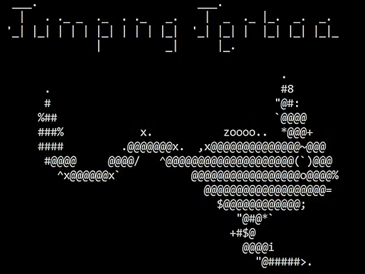](https://www.youtube.com/watch?v=6gO4RY2FTD8)

This project is a combination of Python and CircuitPython scripts to transfer mouse and keyboard of your computer to another computer. A Raspberry Pi Pico is used as a USB HID Mouse/Keyboard - [GitHub](https://github.com/rvl13/jumping-jerboa), [hackster.io](https://www.hackster.io/RVLAD/jumping-jerboa-transfer-mouse-keyboard-to-other-computer-68a134) and [YouTube](https://www.youtube.com/watch?v=6gO4RY2FTD8).

## Exciting Python Features are on the Way

Transformative new Python features are coming in [Python 3.15](https://docs.python.org/3.15/whatsnew/3.15.html#). In addition to lazy imports and an immutable `frozendict` type, the new Python release will deliver significant improvements to the native [JIT compiler](https://www.infoworld.com/article/4110565/get-started-with-pythons-new-native-jit.html) and introduce a more explicit agenda for how Python will support [WebAssembly](https://www.infoworld.com/article/2255892/what-is-webassembly-the-next-generation-web-platform-explained.html) - [InfoWorld](https://www.infoworld.com/article/4159295/exciting-python-features-are-on-the-way.html).

## MicroPython on LiteX Refreshed and Enhanced

[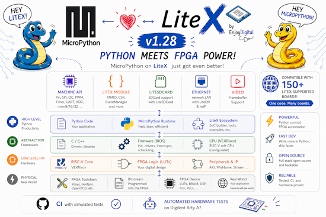](https://github.com/litex-hub/micropython/tree/litex-rebase/ports/litex)

The LiteX port of MicroPython has been refreshed and enhanced with new peripherals support - [GitHub](https://github.com/litex-hub/micropython/tree/litex-rebase/ports/litex). Via [X](https://x.com/enjoy_digital/status/2047280807325118848).

## This Week's Python Streams

Python on Hardware is all about building a cooperative ecosphere which allows contributions to be valued and to grow knowledge. Below are the streams within the last week focusing on the community.

**CircuitPython Deep Dive Stream**

[Last Friday](link), Scott streamed work on {subject}.

You can see the latest video and past videos on the Adafruit YouTube channel under the Deep Dive playlist - [YouTube](https://www.youtube.com/playlist?list=PLjF7R1fz_OOXBHlu9msoXq2jQN4JpCk8A).

**CircuitPython Parsec**

John Park’s CircuitPython Parsec this week is on {subject} - [Adafruit Blog](link) and [YouTube](link).

Catch all the episodes in the [YouTube playlist](https://www.youtube.com/playlist?list=PLjF7R1fz_OOWFqZfqW9jlvQSIUmwn9lWr).

**Deep Dive with Tim**

[Last week](), Tim streamed work on .

You can see the latest video and past videos on the Adafruit YouTube channel under the Deep Dive playlist - [YouTube](https://www.youtube.com/playlist?list=PLjF7R1fz_OOWFqZfqW9jlvQSIUmwn9lWr).

**CircuitPython Weekly Meeting**

CircuitPython Weekly Meeting for {date} ([notes](file)) [on YouTube](link).

## Project of the Week: Detecting Drones with a Raspberry Pi

[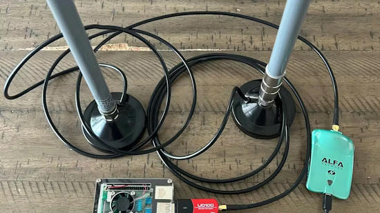](https://www.reddit.com/r/raspberry_pi/comments/1spdmdy/i_turned_a_raspberry_pi_into_a_drone_detector/)

DroneAwareDan has been messing around with turning a Raspberry Pi using Python into a drone detector by reading Remote ID broadcasts over WiFi (2.4GHz) and Bluetooth - [Reddit](https://www.reddit.com/r/raspberry_pi/comments/1spdmdy/i_turned_a_raspberry_pi_into_a_drone_detector/), [hackster.io](https://www.hackster.io/news/detecting-drones-with-a-raspberry-pi-09a8e1d2474e) and [GitHub](https://github.com/fduflyer/DroneAware-Node-Releases).

[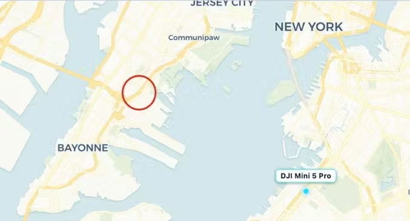](https://www.reddit.com/r/raspberry_pi/comments/1spdmdy/i_turned_a_raspberry_pi_into_a_drone_detector/)

## Popular Last Week

What was the most popular, most clicked link, in [last week's newsletter](https://www.adafruitdaily.com/2026/04/20/python-on-microcontrollers-newsletter-new-circuitpython-release-candidate-linux-7-pi-os-update-and-more-circuitpython-python-micropython-thepsf-raspberry_pi/)? [Stop buying Raspberry Pis: Why a cheap used mini PC is the better choice](https://www.howtogeek.com/apps-you-can-self-host-on-a-cheap-old-dell-optiplex-mini-pc/).

Did you know you can read past issues of this newsletter in the Adafruit Daily Archive? [Check it out](https://www.adafruitdaily.com/category/circuitpython/).

## New Notes from Adafruit Playground

[Adafruit Playground](https://adafruit-playground.com/) is a new place for the community to post their projects and other making tips/tricks/techniques. Ad-free, it's an easy way to publish your work in a safe space for free.

[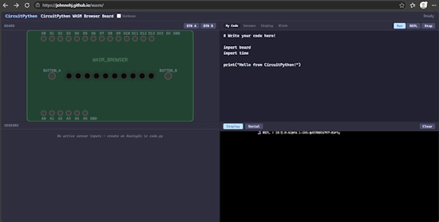](https://adafruit-playground.com/u/JohnnohJ/pages/circuitpython-wasm-port)

CircuitPython WASM Port - [Adafruit Playground](https://adafruit-playground.com/u/JohnnohJ/pages/circuitpython-wasm-port).

[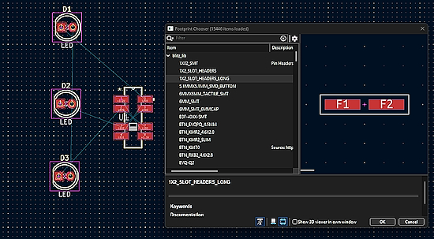](url)

text - [Adafruit Playground](url).

text - [Adafruit Playground](url).

## News From Around the Web

[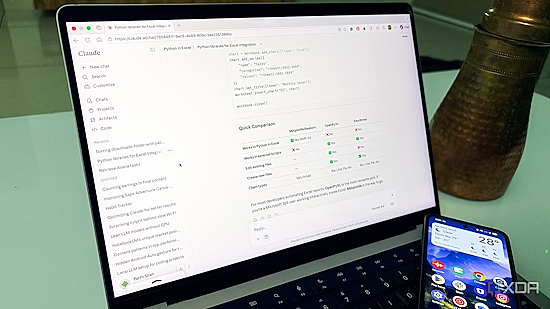](https://www.xda-developers.com/used-claude-to-learn-about-python/)

I used Claude to learn about Python and I should have sooner - [XDA](https://www.xda-developers.com/used-claude-to-learn-about-python/).

[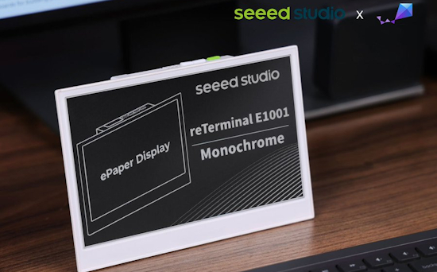]([url](https://x.com/seeedstudio/status/2047269260838248536))

Native Zephyr support for reTerminal E1001 is now available. Powered by ESP32-S3, reTerminal E1001 now supports the standard Zephyr RTOS  build using flash and debug workflows for ePaper applications - [Zephyr](https://docs.zephyrproject.org/latest/boards/seeed/reterminal_e1001/doc/index.html). Via [X](https://x.com/seeedstudio/status/2047269260838248536).

Matthias Wandel turns metal Into proximity sensors with the Raspberry Pi Pico's PIO blocks - [hackster.io](https://www.hackster.io/news/matthias-wandel-turns-metal-into-proximity-sensors-with-the-raspberry-pi-pico-s-pio-blocks-3c1d43a4b3a6), [GitHub](https://github.com/Matthias-Wandel/Pico-femtofarad) and [YouTube](https://www.youtube.com/watch?v=2uuutrcaAZ0).

[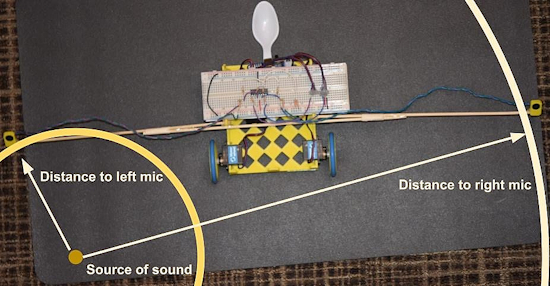](https://getnlab.com/blog/add-a-custom-sensor-to-a-robot-kit)

Give an HP Robots Otto Kit the gift of hearing. With two ears (microphones), the bot will turn towards a noise. This project shows how to design circuits and 3D printed parts, and then use MicroPython and Thonny to make a robot that listens for a loud sound and then turn in that direction - [nLab](https://getnlab.com/blog/add-a-custom-sensor-to-a-robot-kit) and [YouTube](https://youtu.be/obyH8K4fRiA?si=G47iURSWMxlwMcYF). Via [Adafruit Blog](https://blog.adafruit.com/2026/04/19/use-micropython-to-add-a-custom-sensor-to-a-robot-kit/).

[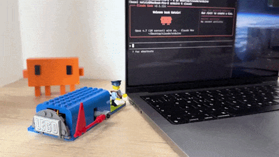](https://x.com/natzir9/status/2045933062819553623)

Claude Code Lego Flag is a physical Lego mailbox with a motorised flag that tells you when Claude Code is working vs. ready for your next prompt. A servo raises the flag when Claude finishes a response and lowers it as soon as you send a new message. Using Python and Arduino - [X](https://x.com/natzir9/status/2045933062819553623) and [GitHub](https://github.com/natzir/claude-code-lego-flag-hook). A bonus: a brick Claude - [MecaBricks](https://mecabricks.com/en/workshop/KZvmV7z9aG6).

text - [site](url).

text - [site](url).

text - [site](url).

text - [site](url).

text - [site](url).

text - [site](url).

text - [site](url).

text - [site](url).

[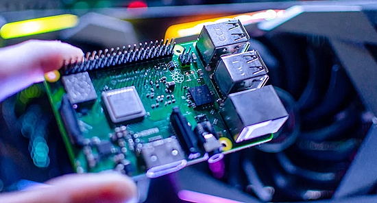](https://www.bgr.com/2146467/tiny-raspberry-pi-projects/?shem=dsdf,sharefoc,agadiscoversdl,,sh/x/discover/m1/4)

5 Tiny Raspberry Pi Projects That Can Fit In The Palm Of Your Hand - [BGR](https://www.bgr.com/2146467/tiny-raspberry-pi-projects/?shem=dsdf,sharefoc,agadiscoversdl,,sh/x/discover/m1/4).

[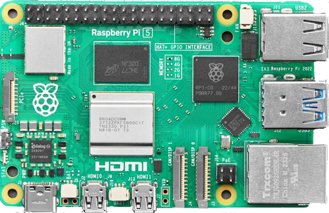](https://www.bgr.com/2146834/essential-gadgets-raspberry-pi/)

5 essential gadgets every Raspberry Pi enthusiast should have - [BGR](https://www.bgr.com/2146834/essential-gadgets-raspberry-pi/).

[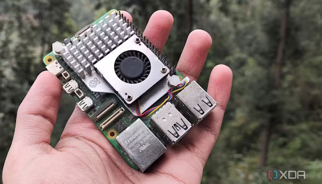](https://www.xda-developers.com/i-stopped-reaching-raspberry-pi-when-60-board-hit-95/)

I stopped reaching for Raspberry Pi when the $60 board hit $95 (and jumped to Raspberry Pi Pico 2W) - [XDA](https://www.xda-developers.com/i-stopped-reaching-raspberry-pi-when-60-board-hit-95/).

text - [site](url).

text - [site](url).

## New

[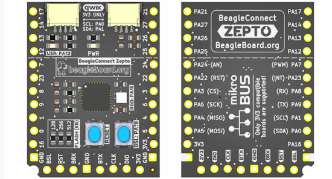](https://www.cnx-software.com/2026/04/19/beagleconnect-zepto-a-1-computer-based-on-ti-mspm0l1117-cortex-m0-mcu/)

BeagleConnect Zepto – A “$1 computer” based on TI MSPM0L1117 Cortex-M0+ MCU and qwiic connector(s) - [CNX](https://www.cnx-software.com/2026/04/19/beagleconnect-zepto-a-1-computer-based-on-ti-mspm0l1117-cortex-m0-mcu/).

[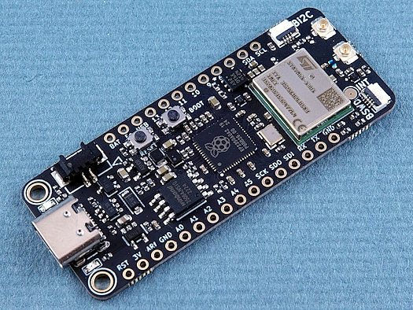](https://www.cnx-software.com/2026/04/22/raspberry-pi-rp2350-board-offers-nb-iot-cellular-connectivity-gnss-and-wi-fi-indoor-location/)

Challenger+ RP2350 NB-IoT is a Feather-compatible board pairing a Raspberry Pi RP2350 microcontroller and a certified NB-IoT cellular module with built-in GNSS, suitable for long-range, low-power connectivity. It looks to be a variant of the earlier Challenger+ RP2350 WiFi6/BLE5 board that replaces an ESP32-C6 WiFi 6, BLE, and 802.15.4 module with an STMicroelectronics ST87M01 NB-IoT and GNSS module - [CNX](https://www.cnx-software.com/2026/04/22/raspberry-pi-rp2350-board-offers-nb-iot-cellular-connectivity-gnss-and-wi-fi-indoor-location/).

## New Boards Supported by CircuitPython

The number of supported microcontrollers and Single Board Computers (SBC) grows every week. This section outlines which boards have been included in CircuitPython or added to [CircuitPython.org](https://circuitpython.org/).

This week there were (#/no) new boards added:

- [Board name](url)
- [Board name](url)
- [Board name](url)

*Note: For non-Adafruit boards, please use the support forums of the board manufacturer for assistance, as Adafruit does not have the hardware to assist in troubleshooting.*

Looking to add a new board to CircuitPython? It's highly encouraged! Adafruit has four guides to help you do so:

- [How to Add a New Board to CircuitPython](https://learn.adafruit.com/how-to-add-a-new-board-to-circuitpython/overview)
- [How to add a New Board to the circuitpython.org website](https://learn.adafruit.com/how-to-add-a-new-board-to-the-circuitpython-org-website)
- [Adding a Single Board Computer to PlatformDetect for Blinka](https://learn.adafruit.com/adding-a-single-board-computer-to-platformdetect-for-blinka)
- [Adding a Single Board Computer to Blinka](https://learn.adafruit.com/adding-a-single-board-computer-to-blinka)

## New Adafruit Learning System Guides

The [Adafruit Learning System](https://learn.adafruit.com/) has over 3,200 free guides for learning skills and building projects including using Python.

[title](url) from [name](url)

[title](url) from [name](url)

[title](url) from [name](url)

## Updated Learn Guides

[title](url)

## CircuitPython Libraries

The CircuitPython library numbers are continually increasing, while existing ones continue to be updated. Here we provide library numbers and updates!

To get the latest Adafruit libraries, download the [Adafruit CircuitPython Library Bundle](https://circuitpython.org/libraries). To get the latest community contributed libraries, download the [CircuitPython Community Bundle](https://circuitpython.org/libraries).

If you'd like to contribute to the CircuitPython project on the Python side of things, the libraries are a great place to start. Check out the [CircuitPython.org Contributing page](https://circuitpython.org/contributing). If you're interested in reviewing, check out Open Pull Requests. If you'd like to contribute code or documentation, check out Open Issues. We have a guide on [contributing to CircuitPython with Git and GitHub](https://learn.adafruit.com/contribute-to-circuitpython-with-git-and-github), and you can find us in the #help-with-circuitpython and #circuitpython-dev channels on the [Adafruit Discord](https://adafru.it/discord).

You can check out this [list of all the Adafruit CircuitPython libraries and drivers available](https://github.com/adafruit/Adafruit_CircuitPython_Bundle/blob/master/circuitpython_library_list.md). 

The current number of CircuitPython libraries is **###**!

**New Libraries**

Here are this week's new CircuitPython libraries:

* [library](url)

**Updated Libraries**

Here are this week's updated CircuitPython libraries:

* [library](url)

## What’s the CircuitPython team up to this week?

What is the team up to this week? Let’s check in:

**Dan**

I released CircuitPython 10.2.0 final last week. The release candidate, 10.2.0-rc.0, had a regression that caused problems when web workflow was used. I fixed that with some helpful advice from an LLM about some unnecessary changes I had made.

I'm now working on some other bugs, including a mysterious problem with `memcpy` on ESP32-C6.

**Tim**

This week I wrote a guide about using [iNTERCEPT](https://github.com/smittix/intercept.git) with a USB SDR on a Raspberry Pi. It's a signals intellegence system that can scan various types of radio signals and record them and metadata about them. I enabled a few more modules in the zephyr port this week: `jpegio`, `gifio`, and `storage`. I also fixed the flash size declaration for the Feather RP2040 zephyr board def. I'm also working on finishing up a sweep over the libraries with a patch to update the version of ruff being used and some new capabilities in adabot that will allow me to fix any errors raised by the new ruff rules effeciently.

**Scott**

At the end of last week, I fixed the P4 logic analyzer capture firmware and that got me thinking about what I need to get things scaled up a bit. So, I've been heads down designing a basic ESP32-P4 board. It is a platform for learning everything needed for the new ESP32-P4. I've done the schematic and board layout. I'm adding silkscreen labels and then will get the bill of materials formalized for ordering. Once this is ordered, I want to make a logic analyzer specific board and a hardware-in-the-loop specific board.

**Liz**

This week I worked on some [CircuitPython Tetris code](https://github.com/adafruit/Adafruit_Learning_System_Guides/blob/main/Tetris_MIT_Green_Building/code.py). This code runs on an RP2040 Prop-Maker Feather with a NeoPixel grid as the display and a seesaw gamepad as the controller. This is for an upcoming Learn Guide with Noe Ruiz. He modeled the MIT Green Building, which is famous for being hacked with lights in its windows to show various displays including a playable game of Tetris.

## Upcoming Events

The next MicroPython Meetup in Melbourne will be on April 22 – [Luma](https://luma.com/r0rq9pl4). You can see recordings of previous meetings on [YouTube](https://www.youtube.com/@MicroPythonOfficial). 

[PyCon US](https://us.pycon.org/2026/) is May 13 - May 19, 2026 in Long Beach, California

**Other Events This Year**

* [PyCon US](https://us.pycon.org/2026/) is May 13 - May 19, 2026 in Long Beach, California
* [The Open Source Hardware Association Open Hardware Summit](https://oshwa.org/announcements/the-2026-open-hardware-summit-schedule-is-out/) is coming to Berlin, Germany on May 23rd and 24th, 2026.
* [EuroPython 2026](https://ep2026.europython.eu/) is coming to Kraków, Poland 13-19 July, 2026.
* [PyOhio 2026](https://www.pyohio.org/2026/) is from 25 July through 26 July, 2026 this year in Cleveland, USA.
* [HOPE 26 Conference](https://store.2600.com/products/tickets-to-hope-26) is from August 14th through 16th at the New Yorker Hotel, NY, NY.
* [PyCon AU 2026](https://2026.pycon.org.au/) will be 26 Aug. 2026 – 30 Aug. 2026 in Brisbane, Australia

If you know of virtual events or upcoming events, please let us know via email to cpnews(at)adafruit(dot)com.

## Latest Releases

CircuitPython's stable release is [#.#.#](https://github.com/adafruit/circuitpython/releases/latest) and its unstable release is [#.#.#-##.#](https://github.com/adafruit/circuitpython/releases). New to CircuitPython? Start with our [Welcome to CircuitPython Guide](https://learn.adafruit.com/welcome-to-circuitpython).

[2026####](https://github.com/adafruit/Adafruit_CircuitPython_Bundle/releases/latest) is the latest Adafruit CircuitPython library bundle.

[2026####](https://github.com/adafruit/CircuitPython_Community_Bundle/releases/latest) is the latest CircuitPython Community library bundle.

[v#.#.#](https://micropython.org/download) is the latest MicroPython release. Documentation for it is [here](http://docs.micropython.org/en/latest/pyboard/).

[#.#.#](https://www.python.org/downloads/) is the latest Python release. The latest pre-release version is [#.#.#](https://www.python.org/download/pre-releases/).

[#,### Stars](https://github.com/adafruit/circuitpython/stargazers) Like CircuitPython? [Star it on GitHub!](https://github.com/adafruit/circuitpython)

## Call for Help -- Translating CircuitPython is now easier than ever

[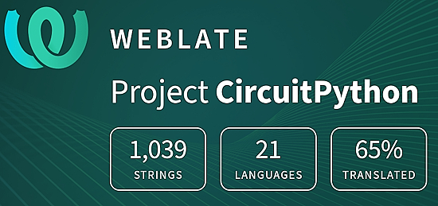](https://hosted.weblate.org/engage/circuitpython/)

One important feature of CircuitPython is translated control and error messages. With the help of fellow open source project [Weblate](https://weblate.org/), we're making it even easier to add or improve translations. 

Sign in with an existing account such as GitHub, Google or Facebook and start contributing through a simple web interface. No forks or pull requests needed! As always, if you run into trouble join us on [Discord](https://adafru.it/discord), we're here to help.

## NUMBER Thanks

The Adafruit Discord community, where we do all our CircuitPython development in the open, reached over NUMBER humans - thank you! Adafruit believes Discord offers a unique way for Python on hardware folks to connect. Join today at [https://adafru.it/discord](https://adafru.it/discord).

## ICYMI - In case you missed it

Python on hardware is the Adafruit Python video-newsletter-podcast! The news comes from the Python community, Discord, Adafruit communities and more and is broadcast on ASK an ENGINEER Wednesdays. The complete Python on Hardware weekly videocast [playlist is here](https://www.youtube.com/playlist?list=PLjF7R1fz_OOXRMjM7Sm0J2Xt6H81TdDev). The video podcast is on [iTunes](https://itunes.apple.com/us/podcast/python-on-hardware/id1451685192?mt=2), [YouTube](http://adafru.it/pohepisodes), [Instagram](https://www.instagram.com/adafruit/channel/)), and [XML](https://itunes.apple.com/us/podcast/python-on-hardware/id1451685192?mt=2).

[The weekly community chat on Adafruit Discord server CircuitPython channel - Audio / Podcast edition](https://itunes.apple.com/us/podcast/circuitpython-weekly-meeting/id1451685016) - Audio from the Discord chat space for CircuitPython, meetings are usually Mondays at 2pm ET, this is the audio version on [iTunes](https://itunes.apple.com/us/podcast/circuitpython-weekly-meeting/id1451685016), Pocket Casts, [Spotify](https://adafru.it/spotify), and [XML feed](https://adafruit-podcasts.s3.amazonaws.com/circuitpython_weekly_meeting/audio-podcast.xml).

## Contribute

The CircuitPython Weekly Newsletter is a CircuitPython community-run newsletter emailed every Monday. To contribute your content, please email your news to cpnews (at) adafruit (dot) com with information and link(s) to your content. 

Join the Adafruit [Discord](https://adafru.it/discord) or [post to the forum](https://forums.adafruit.com/viewforum.php?f=60) if you have questions.
