View this email in your browser. **Warning: Flashing Imagery**

Welcome to the latest Python on Microcontrollers newsletter! May the 4th Be With You this fine Spring Monday. In keeping my eye out in the Python arena, I knew cyberdecks (small portable custom computers) were getting popular. But I was surprised in finding out that the younger crowd (um, cough) have been seen using them to avoid AI/surveillance while looking trendy. Thay works for me. CircuitPython, meanwhile, is getting some more polishing and a look at single-board computers (SBC) two years ago vs. today makes me a bit sad. All this and much more in a larger than usual issue I hope you enjoy. - *Anne Barela, Editor*

We're on [Discord](https://discord.gg/HYqvREz), [Twitter/X](https://twitter.com/search?q=circuitpython&src=typed_query&f=live), [BlueSky](https://bsky.app/profile/circuitpython.org) and for past newsletters - [view them all here](https://www.adafruitdaily.com/category/circuitpython/). If you're reading this on the web, please [subscribe here](https://www.adafruitdaily.com/). Here's the news this week:

## The Hottest Anti-AI Gadget Is a Cyberdeck

On TikTok, young women are going viral for crafting whimsical homemade computers inside their purses. There is a renewed interest in cyberdecks, especially among women eager to share their creations online - [Wired](https://www.wired.com/story/cyberdecks-tiktok-ube-boobey-diy-computer-gadget/).

> “What we should do with cyberdecks is gatekeep them from AI and megacorp.”

## CircuitPython 10.3.0-alpha.1 Released

CircuitPython 10.3.0-alpha.1 is an alpha release for 10.3.0. Further features, changes, and bug fixes will be added before the final release of 10.3.0. - [Adafruit Blog](https://blog.adafruit.com/2026/04/30/circuitpython-10-3-0-alpha-1-released/) and Release Notes - [GitHub](https://github.com/adafruit/circuitpython/releases/tag/10.3.0-alpha.1).

**Highlights of This Release**

* Improve SD card USB presentation on macOS.
* Prefer `foo.py` over `foo/` package when importing, like CPython.
* Pin fixes.
* Enable `gifio` and `storage` in Zephyr port.

## What a Difference Two Years Makes? Comparing SBC Prices in 2024 and 2026

Looking back, 2024 feels like a golden year for single board computers, as the increasing price of RAM (and storage and other components) since late 2025 due to the AI demand has made those much less attractive, price/performance ratio-wise - [CNX Software](https://www.cnx-software.com/2026/04/28/what-a-difference-two-years-make-comparing-sbc-prices-in-2024-and-2026/).

> "We’ve already documented Raspberry Pi SBC price hikes, and after several increases, the Raspberry Pi 5 16GB went from $120 to $305, or a 154% change in price. Yesterday, I noticed the Banana Pi BPI-M4 Zero had a new version with 4GB RAM and 32GB eMMC flash, and a reader was quick to point out the $181 price tag to Europe was painful, bearing in mind it also includes VAT and shipping. Looking at the original December 2023 article, the BPI-M4 Zero 2GB/8GB sold for $28.90 plus shipping, and it now shows up at $115 before taxes. That’s a 297% hike, or about four times the price from a little over two years ago."

## A Network Scanner To Find All Your Raspberry Pis

[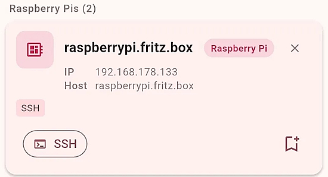](https://hackaday.com/2026/04/29/network-scanner-finds-every-raspberry-pi/)

Anyone running a Raspberry Pi in their home network knows the problem: What is the Pi’s IP address right now? The DHCP server assigns a different one at every restart, and searching the router interface is tedious. That’s exactly why there is the raspberry.tips app for Android – an IP scanner specifically developed for the Raspberry Pi, combined with all the website’s tools right on your smartphone - [Hackaday](https://hackaday.com/2026/04/29/network-scanner-finds-every-raspberry-pi/) and website - [raspberry.tips](https://raspberry.tips/en/raspberrypi-tutorials/raspberry-pi-ip-scanner-app-raspberry-tips-for-android).

## Malicious Python Package Poses New Supply Chain Threat

The open-source package elementary-data, with over a million downloads per month, has been compromised. Attackers exploited a vulnerability in a GitHub Actions workflow to steal signing keys and publish a malicious version. Users of version 0.23.3 are advised to rotate their credentials immediately. This will be a familiar phenomenon to developers by now: open-source packages are a popular delivery mechanism for malware - [TechZine](https://www.techzine.eu/news/security/140826/malicious-python-package-poses-new-supply-chain-threat/).

## The Linux Kernel Tree About To Hit 40 Million Lines, AMD Driver Above 6 Million Lines

Linux 7.1-rc1 kernel release is out, closing the Linux 7.1 merge window. Michael Larabel was curious if all the code removals would lead to a negative change in line count over Linux 7.0. The removals were not enough and Linux 7.1 Git is fast approaching 40 million lines - [Phoronix](https://www.phoronix.com/news/Linux-Kernel-Nearly-40M).

## Raspberry Pi CM0 System-on-Module is Now Sold for $33 and Up on AliExpress

[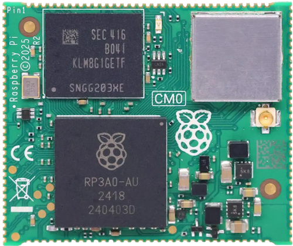](https://www.cnx-software.com/2026/04/27/raspberry-pi-cm0-system-on-module-is-now-sold-for-33-and-up-on-aliexpress/)

The Raspberry Pi CM0 system-on-module is now available on AliExpress for $33 and up from various resellers, many of which claim to have several thousand in stock. The Raspberry Pi Compute Module Zero was introduced last year with a Raspberry Pi RP3A0 SiP with 512MB RAM,  optional 8GB or 16GB eMMC flash, optional WiFi and Bluetooth, and castellated I/Os, or basically a Raspberry Pi Zero 2 W in Compute Module form factor. There’s just one little issue: it’s only officially sold in China, and (previously) the only way to get one is to get a development board like the Makerfabs CM0IQ or a complete product such as the ED-AIC1000 smart camera or ED-IPC1100 industrial box PC - [CNX](https://www.cnx-software.com/2026/04/27/raspberry-pi-cm0-system-on-module-is-now-sold-for-33-and-up-on-aliexpress/). Via [X](https://x.com/cnxsoft/status/2048623780969468226).

## This Week's Python Streams

Python on Hardware is all about building a cooperative ecosphere which allows contributions to be valued and to grow knowledge. Below are the streams within the last week focusing on the community.

**CircuitPython Deep Dive Stream**

[Last Friday](https://youtube.com/live/J0OlnG6yIXs), Scott streamed work on Hardware in the Loop Host.

You can see the latest video and past videos on the Adafruit YouTube channel under the Deep Dive playlist - [YouTube](https://www.youtube.com/playlist?list=PLjF7R1fz_OOXBHlu9msoXq2jQN4JpCk8A).

**CircuitPython Parsec**

John Park’s CircuitPython Parsec this week is on Smooth Noise Road - [Adafruit Blog](https://blog.adafruit.com/2026/04/30/john-parks-circuitpython-parsec-smooth-noise-road/) and [YouTube](https://youtu.be/4n9KP9QK1Gw?si=l8uuiltWk_jnDZRu).

Catch all the episodes in the [YouTube playlist](https://www.youtube.com/playlist?list=PLjF7R1fz_OOWFqZfqW9jlvQSIUmwn9lWr).

**Deep Dive with Tim**

[Last week](https://youtube.com/live/Nu1x_cQTXLc), Tim streamed work on `I2SIn` for CircuitPython.

You can see the latest video and past videos on the Adafruit YouTube channel under the Deep Dive playlist - [YouTube](https://www.youtube.com/playlist?list=PLjF7R1fz_OOWFqZfqW9jlvQSIUmwn9lWr).

Tom Fox joins the show and discusses the SPOKE board, which had a successful Kickstarter in 2025. Tom shares how the SPOKE came to be, how it works, the SPOKE CircuitPython Online Editor, and more - [The CircuitPython Show](https://www.circuitpythonshow.com/@circuitpythonshow).

**CircuitPython Weekly Meeting**

CircuitPython Weekly Meeting for April 27, 2026 ([notes](https://github.com/adafruit/adafruit-circuitpython-weekly-meeting/blob/main/2026/2026-04-27.md)) [on YouTube](https://www.youtube.com/watch?v=GLe5Jn8sVHA).

## Project of the Week: AIS Shiptracker

[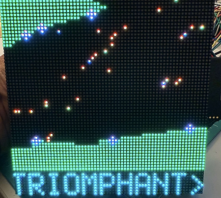](https://forums.adafruit.com/viewtopic.php?p=1087390#p1087390)

Jeff Gillow on the Adafruit Forums posts a real-time maritime vessel tracking system built on a Raspberry Pi 5, displaying live ship traffic in the English Channel on a 64×64 RGB LED matrix panel. Vessels are color-coded by type, positioned on a geographic map with coastline reference, and identified by a scrolling ticker with type codes, destination, speed, heading, and nav status - [Adafruit Forums](https://forums.adafruit.com/viewtopic.php?p=1087390#p1087390) and [GitHub](https://github.com/jeffg38/ais_SHIPTRACKER).

## Popular Last Week

What was the most popular, most clicked link, in [last week's newsletter](https://www.adafruitdaily.com/2026/04/27/python-on-microcontrollers-newsletter-happy-birthday-micropython-new-circuitpython-esp-claw-and-more-circuitpython-python-micropython-thepsf-raspberry_pi/)? [Stop buying Raspberry Pis: Why a cheap used mini PC is the better choice](https://www.howtogeek.com/apps-you-can-self-host-on-a-cheap-old-dell-optiplex-mini-pc/).

Did you know you can read past issues of this newsletter in the Adafruit Daily Archive? [Check it out](https://www.adafruitdaily.com/category/circuitpython/).

## Put Your Projects Up For Free With Adafruit Playground Notes

[Adafruit Playground](https://adafruit-playground.com/) is a new place for the community to post their projects and other making tips/tricks/techniques. Ad-free, it's an easy way to publish your work in a safe space for free.

## News From Around the Web

[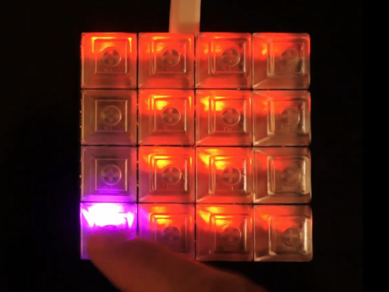](https://www.instructables.com/Pimoroni-Keybow-2040-Macropad-Speaker-Addition/)

Adding an Adafruit STEMMA Speaker board to the quiet Pimoroni Keybow 2040 Macropad kit for extra noisy fun - [Instructables](https://www.instructables.com/Pimoroni-Keybow-2040-Macropad-Speaker-Addition/).

[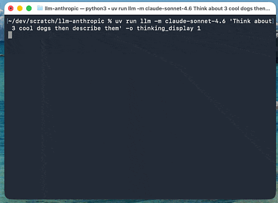](https://simonwillison.net/2026/Apr/29/llm/)

Simon Willison has LLM 0.32a0, an alpha release of a LLM Python library and CLI tool for accessing LLMs. LLM provides an abstraction over thousands of different models via its plugin system - [Simon Willison](https://simonwillison.net/2026/Apr/29/llm/).

[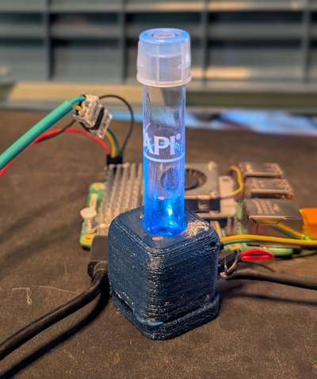](https://krillswarm.com/posts/2026/04/20/diy-liquid-color-sensor/)

A DIY liquid color sensor with Raspberry Pi, Python and Blinka - [KrillSwarm](https://krillswarm.com/posts/2026/04/20/diy-liquid-color-sensor/) and code - [GitHub](https://github.com/Sautner-Studio-LLC/krill-oss/tree/main/cookbook/color%20sensor).

[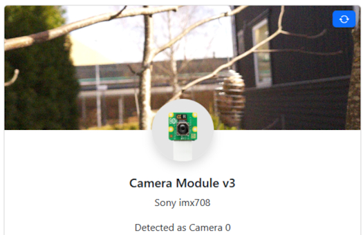](https://curiousscientist.tech/blog/bird-camera-raspberry-pi-zero-2-w)

A Raspberry Pi Zero 2 W and Raspberry Pi Camera Module 3 based bird camera coded with Python - [Curious Scientist](https://curiousscientist.tech/blog/bird-camera-raspberry-pi-zero-2-w), [GitHub](https://github.com/monkeymademe/CamUI) and [YouTube](https://youtu.be/K0L4CnxKBgk?si=dy7dX1FH0Aq1G84l).

[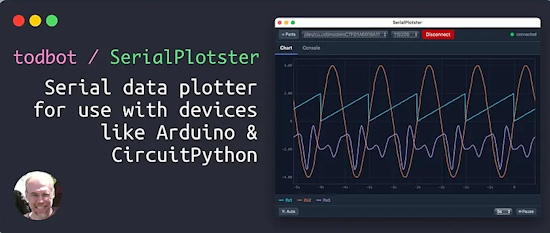](https://github.com/todbot/SerialPlotster)

SerialPlotster is a cross-platform desktop serial plotter built with Tauri 2. It graphs line-oriented numeric data from a serial port as a real-time strip chart, with scrub/zoom that does not pause data collection, plus a console pane for bidirectional communication with the device - [GitHub](https://github.com/todbot/SerialPlotster). Via [BlueSky](https://bsky.app/profile/todbot.com/post/3mkl4cposmk2i).

[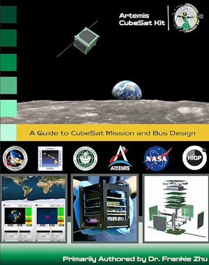](https://blog.adafruit.com/2026/04/28/free-book-a-guide-to-cubesat-mission-and-bus-design-by-frances-zhu/)

Free book: *A Guide to CubeSat Mission and Bus Design* by Frances Zhu - [hawaii.edu](https://pressbooks-dev.oer.hawaii.edu/epet302/). Via [Adafruit Blog](https://blog.adafruit.com/2026/04/28/free-book-a-guide-to-cubesat-mission-and-bus-design-by-frances-zhu/).

[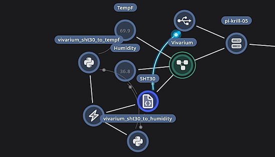](https://krillswarm.com/posts/2026/04/28/vivarium-sht30-temp-humidity/)

Logging Vivarium temperature and humidity with an SHT30, CircuitPython and two lambdas - [krillswarm.com](https://krillswarm.com/posts/2026/04/28/vivarium-sht30-temp-humidity/). Via [Reddit](https://www.reddit.com/r/krill_zone/comments/1s84uxu/comment/oisn137/).

[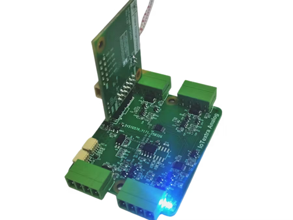](https://github.com/makethingshappy/iotflow)

IoTflow is a simple, scalable automation engine for IoTextra boards and MicroPython - [makethingshappy.io](https://makethingshappy.io/pages/iotflow) and [GitHub](https://github.com/makethingshappy/iotflow).

[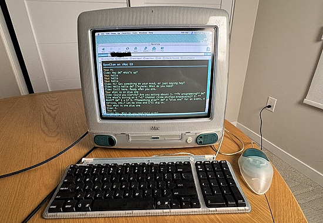](https://x.com/colossusmag/status/2049511207904657509)

The nine coolest Raspberry Pi projects from Colossus Magazine - [X](https://x.com/colossusmag/status/2049511207904657509).

[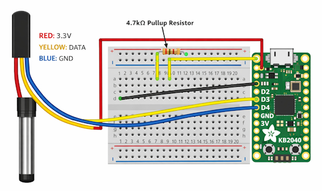](https://krillswarm.com/posts/2026/03/11/sensors/)

Using sensors with CircuitPython - [KrillSwarm](https://krillswarm.com/posts/2026/03/11/sensors/).

[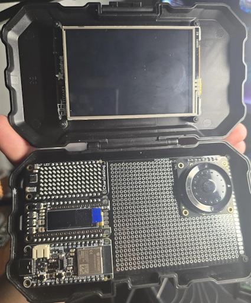](https://www.reddit.com/r/adafruit/comments/1ssftq5/micropythonmicrodeck_v01/)

AlderVaren posts the MicroPython-Microdeck v0.1 using an Adafruit KB2040 - [Reddit](https://www.reddit.com/r/adafruit/comments/1ssftq5/micropythonmicrodeck_v01/).

[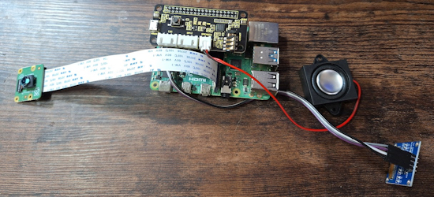](https://el3ktra.net/introducing-lilll3x-the-desktop-ai-sidekick/)

LilL3x, the desktop AI sidekick using Raspberry Pi 4 8MB and Python - [El3ktra.net](https://el3ktra.net/introducing-lilll3x-the-desktop-ai-sidekick/).

Running an old WaveShare black and white e-paper display with CircuitPython & more - [Akki's Diary](https://akkiesoft.hatenablog.jp/entry/20260427/1777301743).

text - [site](url).

[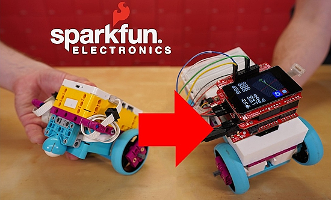](https://news.sparkfun.com/16410)

RedBoard Robot - compatible with LEGO® components and MicroPython - [SparkFun News](https://news.sparkfun.com/16410), [YouTube](https://youtu.be/rWQwnq6qLWM?si=DRx87V7OEq056Vxb), and [GitHub](https://github.com/sfe-SparkFro/redboard_robot_compatible_with_lego).

[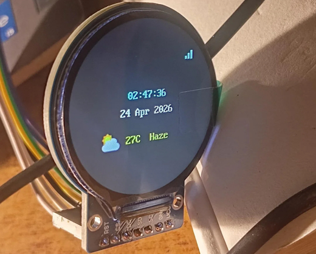](https://www.reddit.com/r/circuitpython/comments/1stw9o9/day_79100_built_a_cyberpunk_smartwatch_on_a_round/)

Building a Cyberpunk smartwatch on a round GC9A01 display with MicroPython - [Reddit](https://www.reddit.com/r/circuitpython/comments/1stw9o9/day_79100_built_a_cyberpunk_smartwatch_on_a_round/).

Bork: *Heart of the Earth* exhibit reveals a Raspberry Pi in existential crisis, running CircuitPython and Blinka - [The Register](https://www.theregister.com/2026/04/27/the_raspberry_pi_turns_up/).

[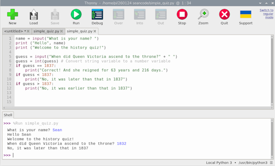](https://www.raspberrypi.com/news/build-a-simple-quiz-game-in-python/)

Build a simple quiz game in Python - [Raspberry Pi News](https://www.raspberrypi.com/news/build-a-simple-quiz-game-in-python/).

Why it’s so hard to create stand-alone Python apps - [InfoWorld](https://www.infoworld.com/article/4163874/why-its-so-hard-to-create-stand-alone-python-apps.html).

GitHub says sorry and vows to do better as uptime slips and devs complain - [The Register](https://www.theregister.com/2026/04/29/github_says_sorry_and_says/).

## New

[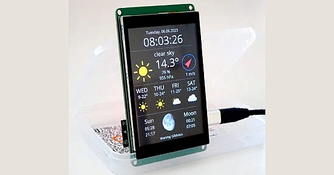](https://thingpulse.com/sp/color-kit-offer/?v=0b3b97fa6688)

This kit ships with the ePulse Feather ESP32 development board. The large 3.5″ 320×480 color display also sports a high-precision capacitive touch interface. Contrary to resistive touch interfaces that often work best when using a stylus this auto-calibrated module offers a smartphone-like user experience - [ThingPulse](https://thingpulse.com/sp/color-kit-offer/?v=0b3b97fa6688). CircuitPython support note - [
Gillius's Programming](https://gillius.org/blog/2025/11/circuitpython-on-thingpulse-color-kit-grande.html) and MicroPython support - [ThingPulse forums](https://support.thingpulse.com/1546/using-micropython-on-esp32-color-kit-grande).

[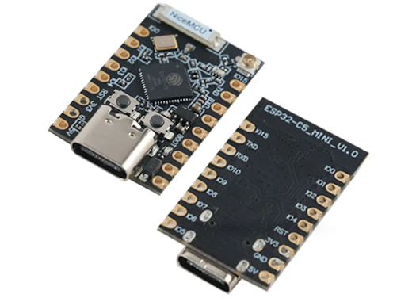](https://www.cnx-software.com/2026/04/28/esp32-c5-mini-usb-c-board-offers-dual-band-wifi-6-and-up-to-14x-gpio-pins-for-iot-projects/)

ESP32-C5 Mini is a tiny development board with dual-band (2.4/5 GHz) WiFi 6, Bluetooth 5.x LE, and an 802.15.4 radio for Zigbee, Thread, and Matter, as well as two 9-pin headers offering up to fourteen GPIOs for IoT and Smart Home projects. It's similar to the XIAO ESP32-C5, but it’s slightly longer and features an ESP32-C5HF4 SoC instead of an ESP32-C5HR8 + 8MB SPI flash, meaning it lacks PSRAM, and only comes with 4MB flash on-chip instead of external flash. It also adds four GPIO pins and comes with a built-in antenna and an IPEX antenna connector - [CNX](https://www.cnx-software.com/2026/04/28/esp32-c5-mini-usb-c-board-offers-dual-band-wifi-6-and-up-to-14x-gpio-pins-for-iot-projects/).

[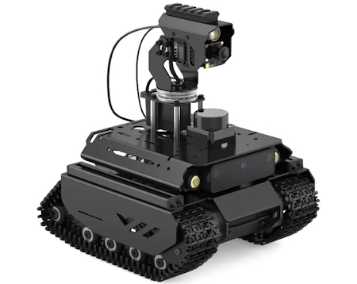](https://www.cnx-software.com/2026/04/21/ugv-beast-an-off-road-tracked-ai-robot-built-for-raspberry-pi-4-5/)

Waveshare UGV Beast is an off-road robot with tracked wheels designed for Raspberry Pi 4 or 5 SBC handling AI vision and strategy planning, while an ESP32 sub-controller takes care of motion control and sensor data processing. Python programmable. - [CNX](https://www.cnx-software.com/2026/04/21/ugv-beast-an-off-road-tracked-ai-robot-built-for-raspberry-pi-4-5/) and [YouTube](https://youtu.be/8wqPs7rNkJ4?si=VKcWMY7wNhGCgH1q).

## New Boards Supported by CircuitPython

The number of supported microcontrollers and Single Board Computers (SBC) grows every week. This section outlines which boards have been included in CircuitPython or added to [CircuitPython.org](https://circuitpython.org/).

This week there were no new boards added.

*Note: For non-Adafruit boards, please use the support forums of the board manufacturer for assistance, as Adafruit does not have the hardware to assist in troubleshooting.*

Looking to add a new board to CircuitPython? It's highly encouraged! Adafruit has four guides to help you do so:

- [How to Add a New Board to CircuitPython](https://learn.adafruit.com/how-to-add-a-new-board-to-circuitpython/overview)
- [How to add a New Board to the circuitpython.org website](https://learn.adafruit.com/how-to-add-a-new-board-to-the-circuitpython-org-website)
- [Adding a Single Board Computer to PlatformDetect for Blinka](https://learn.adafruit.com/adding-a-single-board-computer-to-platformdetect-for-blinka)
- [Adding a Single Board Computer to Blinka](https://learn.adafruit.com/adding-a-single-board-computer-to-blinka)

## New Adafruit Learning System Guides

The [Adafruit Learning System](https://learn.adafruit.com/) has over 3,200 free guides for learning skills and building projects including using Python.

[Stomp-Reactive Light Up Slippers](https://learn.adafruit.com/stomp-reactive-light-up-slippers) from [Erin St Blaine](https://learn.adafruit.com/u/firepixie)

## CircuitPython Libraries

The CircuitPython library numbers are continually increasing, while existing ones continue to be updated. Here we provide library numbers and updates!

To get the latest Adafruit libraries, download the [Adafruit CircuitPython Library Bundle](https://circuitpython.org/libraries). To get the latest community contributed libraries, download the [CircuitPython Community Bundle](https://circuitpython.org/libraries).

If you'd like to contribute to the CircuitPython project on the Python side of things, the libraries are a great place to start. Check out the [CircuitPython.org Contributing page](https://circuitpython.org/contributing). If you're interested in reviewing, check out Open Pull Requests. If you'd like to contribute code or documentation, check out Open Issues. We have a guide on [contributing to CircuitPython with Git and GitHub](https://learn.adafruit.com/contribute-to-circuitpython-with-git-and-github), and you can find us in the #help-with-circuitpython and #circuitpython-dev channels on the [Adafruit Discord](https://adafru.it/discord).

You can check out this [list of all the Adafruit CircuitPython libraries and drivers available](https://github.com/adafruit/Adafruit_CircuitPython_Bundle/blob/master/circuitpython_library_list.md). 

The current number of CircuitPython libraries is **569**!

## What’s the CircuitPython team up to this week?

What is the team up to this week? Let’s check in:

**Dan**

I released CircuitPython 10.3.0-alpha.1 last week, to introduce the first development releases past 10.2.x. There are only a few changes in this release, but there are a number of interesting updates in the works, including updating to ESP-IDF 6 and further work on Zephyr.

I spent a while continuing to debug a problem with `memcpy()` on ESP32-C6. It is apparently a configuration problem in our build: a simple reproducer in ESP-IDF clearly works in with one setting but not the oppsoite. But in CircuitPython the "correct" setting causes an early crash. Updating ESP-IDF may solve this problem, as there has been work on `memcpy()` in ESP-IDF v5.4.4 and later.

**Tim**

This week I'm working on adding support for `I2SIn` with a new module in the core. I have tested it successfully on a Sparkle Motion and have just received some breakouts to test it more widely. I've been working on code and pages for my next guide about sensor-locked secrets, it's about using environmental sensor readings as the key to unlock secret messages as pictures. I also tinkered a little with the [ESP-Claw](https://github.com/espressif/esp-claw) project that Espressif published. I added support for the Metro S3 + 2.8" TFT shield in a development branch.

**Scott**

[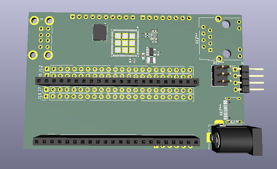](https://www.circuitpython.org/)

This week I've been heads down on another ESP32-P4 board designed to host other dev kits (device under test/DUT) for automated "hardware-in-the-loop" (HIL) testing. I've come up with a layout that I'm happy with and I've been brainstorming exactly how I want it to work. The layout is designed to fit as an Arduino shield or as a breadboard style two pin header rows. (Note: I'm still working on this, so it'll likely change.)

It'll have two USB-A on the left to connect to and power the DUT. The P4 will host them via a hub chip. 

On the right, there may be:

* An RJ45 for ethernet connectivity and, maybe, power.
* Barrel jack for power.
* USB-C for flashing the P4 and powering it.
* Headers for selecting power source and adding wide voltage regulator to 5V. (For the barrel jack and ethernet.)
* Boot and reset buttons.

**Liz**

This week I published the [LED Matrix FIFA World Cup Scoreboard guide](https://learn.adafruit.com/led-matrix-fifa-world-cup-scoreboard). This guide uses a Matrix Portal S3 running CircuitPython code to access the World Cup scoreboard API from ESPN. All of the info is displayed on four LED matrices tiled together to make a 128x64 display.

## Upcoming Events

[PyCon US](https://us.pycon.org/2026/) is May 13 - May 19, 2026 in Long Beach, California

The next MicroPython Meetup in Melbourne will be on May 27 – [Luma](https://luma.com/micropython). You can see recordings of previous meetings on [YouTube](https://www.youtube.com/@MicroPythonOfficial). 

**Other Events This Year**

* [The Open Source Hardware Association Open Hardware Summit](https://oshwa.org/announcements/the-2026-open-hardware-summit-schedule-is-out/) is coming to Berlin, Germany on May 23rd and 24th, 2026.
* [EuroPython 2026](https://ep2026.europython.eu/) is coming to Kraków, Poland 13-19 July, 2026.
* [PyOhio 2026](https://www.pyohio.org/2026/) is from 25 July through 26 July, 2026 this year in Cleveland, USA.
* [HOPE 26 Conference](https://store.2600.com/products/tickets-to-hope-26) is from August 14th through 16th at the New Yorker Hotel, NY, NY.
* [PyCon AU 2026](https://2026.pycon.org.au/) will be 26 Aug. 2026 – 30 Aug. 2026 in Brisbane, Australia

If you know of virtual events or upcoming events, please let us know via email to cpnews(at)adafruit(dot)com.

## Latest Releases

CircuitPython's stable release is [10.2.0](https://github.com/adafruit/circuitpython/releases/latest) and its unstable release is [10.3.0-alpha.1](https://github.com/adafruit/circuitpython/releases). New to CircuitPython? Start with our [Welcome to CircuitPython Guide](https://learn.adafruit.com/welcome-to-circuitpython).

[20260424](https://github.com/adafruit/Adafruit_CircuitPython_Bundle/releases/latest) is the latest Adafruit CircuitPython library bundle.

[20260414](https://github.com/adafruit/CircuitPython_Community_Bundle/releases/latest) is the latest CircuitPython Community library bundle.

[v1.28.0](https://micropython.org/download) is the latest MicroPython release. Documentation for it is [here](http://docs.micropython.org/).

[3.14.4](https://www.python.org/downloads/) is the latest Python release. The latest pre-release version is [3.15.0a8](https://www.python.org/download/pre-releases/).

[4,477 Stars](https://github.com/adafruit/circuitpython/stargazers) Like CircuitPython? [Star it on GitHub!](https://github.com/adafruit/circuitpython)

## Call for Help -- Translating CircuitPython is now easier than ever

[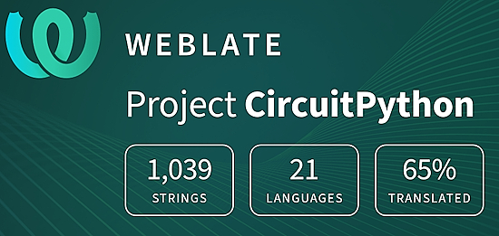](https://hosted.weblate.org/engage/circuitpython/)

One important feature of CircuitPython is translated control and error messages. With the help of fellow open source project [Weblate](https://weblate.org/), we're making it even easier to add or improve translations. 

Sign in with an existing account such as GitHub, Google or Facebook and start contributing through a simple web interface. No forks or pull requests needed! As always, if you run into trouble join us on [Discord](https://adafru.it/discord), we're here to help.

## 39,024 Thanks

The Adafruit Discord community, where we do all our CircuitPython development in the open, reached over 39,024 humans - thank you! Adafruit believes Discord offers a unique way for Python on hardware folks to connect. Join today at [https://adafru.it/discord](https://adafru.it/discord).

## ICYMI - In case you missed it

Python on hardware is the Adafruit Python video-newsletter-podcast! The news comes from the Python community, Discord, Adafruit communities and more and is broadcast on ASK an ENGINEER Wednesdays. The complete Python on Hardware weekly videocast [playlist is here](https://www.youtube.com/playlist?list=PLjF7R1fz_OOXRMjM7Sm0J2Xt6H81TdDev). The video podcast is on [iTunes](https://itunes.apple.com/us/podcast/python-on-hardware/id1451685192?mt=2), [YouTube](http://adafru.it/pohepisodes), [Instagram](https://www.instagram.com/adafruit/channel/), and [XML](https://itunes.apple.com/us/podcast/python-on-hardware/id1451685192?mt=2).

[The weekly community chat on Adafruit Discord server CircuitPython channel - Audio / Podcast edition](https://itunes.apple.com/us/podcast/circuitpython-weekly-meeting/id1451685016) - Audio from the Discord chat space for CircuitPython, meetings are usually Mondays at 2pm ET, this is the audio version on [iTunes](https://itunes.apple.com/us/podcast/circuitpython-weekly-meeting/id1451685016), Pocket Casts, [Spotify](https://adafru.it/spotify), and [XML feed](https://adafruit-podcasts.s3.amazonaws.com/circuitpython_weekly_meeting/audio-podcast.xml).

## Contribute

The CircuitPython Weekly Newsletter is a CircuitPython community-run newsletter emailed every Monday. To contribute your content, please email your news to cpnews (at) adafruit (dot) com with information and link(s) to your content. 

Join the Adafruit [Discord](https://adafru.it/discord) or [post to the forum](https://forums.adafruit.com/viewforum.php?f=60) if you have questions.
