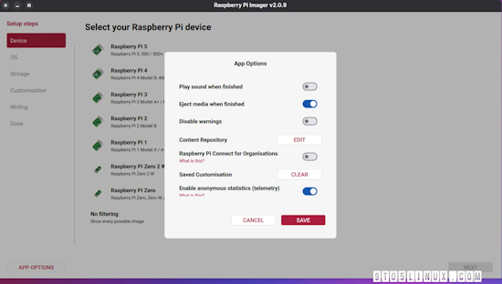
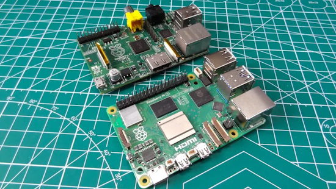
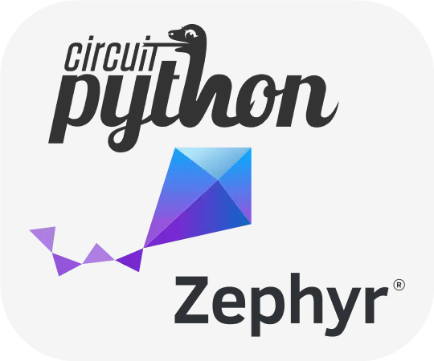
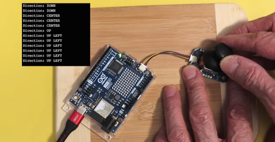
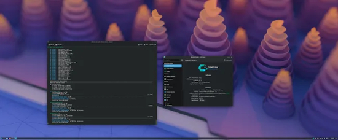

- [ ] Library and info updates
- [ ] change date
- [ ] update title
- [ ] Feature story
- [ ] Update  for images
- [ ] Update ICYDNCI
- [ ] All images 550w max only
- [ ] Link "View this email in your browser."

News Sources

- [Adafruit Playground](https://adafruit-playground.com/)
- Twitter: [CircuitPython](https://twitter.com/search?q=circuitpython&src=typed_query&f=live), [MicroPython](https://twitter.com/search?q=micropython&src=typed_query&f=live) and [Python](https://twitter.com/search?q=python&src=typed_query)
- [Raspberry Pi News](https://www.raspberrypi.com/news/), [Pi Foundation](https://www.raspberrypi.org/blog/)
- Mastodon [CircuitPython](https://mastodon.social/tags/CircuitPython) and [MicroPython](https://mastodon.social/tags/MicroPython)
- BlueSky [CircuitPython](https://bsky.app/search?q=circuitpython), [MicroPython](https://bsky.app/search?q=micropython), [Raspberry Pi](https://bsky.app/search?q=raspberry+pi)
- [Google News Python](https://news.google.com/topics/CAAqIQgKIhtDQkFTRGdvSUwyMHZNRFY2TVY4U0FtVnVLQUFQAQ?hl=en-US&gl=US&ceid=US%3Aen)
- YouTube: [CircuitPython](https://www.youtube.com/results?search_query=circuitpython&sp=CAISBAgDEAE%253D), [MicroPython](https://www.youtube.com/results?search_query=micropython&sp=CAISBAgDEAE%253D), [Prof Gallaugher](https://www.youtube.com/@BuildWithProfG/videos)
- [maker.io Python](https://www.digikey.com/en/maker/search-results?s=createdDate&t=python)
- [hackster.io CircuitPython](https://www.hackster.io/search?q=circuitpython&i=projects&sort_by=most_recent) and [MicroPython](https://www.hackster.io/search?q=micropython&i=projects&sort_by=most_recent)
- Instructables: [CircuitPython](https://www.instructables.com/search/?q=circuitpython&projects=all&sort=Newest), [MicroPython](https://www.instructables.com/search/?q=micropython&projects=all&sort=Newest), [Raspberry Pi Python](https://www.instructables.com/search/?q=raspberry+pi+python&projects=all&sort=Newest)
- [hackaday CircuitPython](https://hackaday.com/blog/?s=circuitpython) and [MicroPython](https://hackaday.com/blog/?s=micropython)
- [python.org](https://www.python.org/)
- [Python Insider - dev team blog](https://pythoninsider.blogspot.com/)
- Individuals: [bret.dk](https://bret.dk/), [Jeff Geerling](https://www.jeffgeerling.com/blog), [Yakroo](https://x.com/Yakroo5077), [coXXect](https://coxxect.blogspot.com/)
- Tom's Hardware: [CircuitPython](https://www.tomshardware.com/search?searchTerm=circuitpython&articleType=all&sortBy=publishedDate) and [MicroPython](https://www.tomshardware.com/search?searchTerm=micropython&articleType=all&sortBy=publishedDate) and [Raspberry Pi](https://www.tomshardware.com/search?searchTerm=raspberry%20pi&articleType=all&sortBy=publishedDate)
- [hackaday.io newest projects MicroPython](https://hackaday.io/projects?tag=micropython&sort=date) and [CircuitPython](https://hackaday.io/projects?tag=circuitpython&sort=date)
- hackaday.io - [CircuitPython](https://hackaday.io/search?term=circuitpython) and [MicroPython](https://hackaday.io/search?term=micropython)
- [MicroPython Meeting](https://luma.com/micropython?k=c)

View this email in your browser. **Warning: Flashing Imagery**

Welcome to the latest Python on Microcontrollers newsletter! *insert 2-3 sentences from editor (what's in overview, banter)* - *Anne Barela, Editor*

We're on [Discord](https://discord.gg/HYqvREz), [Twitter/X](https://twitter.com/search?q=circuitpython&src=typed_query&f=live), [BlueSky](https://bsky.app/profile/circuitpython.org) and for past newsletters - [view them all here](https://www.adafruitdaily.com/category/circuitpython/). If you're reading this on the web, please [subscribe here](https://www.adafruitdaily.com/). Here's the news this week:

## Headline

text - [site](url).

## Feature

text - [site](url).

## Feature

text - [site](url).

## Raspberry Pi Imager Now Supports Raspberry Pi Connect for Organizations

Raspberry Pi Imager 2.0.9 has been released as the latest stable release of this user-friendly tool for creating bootable media for Raspberry Pi devices, introducing support for Raspberry Pi Connect for Organizations. Connect for Organisations now lets administrators require all members to use two-factor authentication (2FA) on their Raspberry Pi ID - [9to5Linux](https://9to5linux.com/raspberry-pi-imager-now-supports-raspberry-pi-connect-for-organizations), [Raspberry Pi News](https://www.raspberrypi.com/news/raspberry-pi-connect-device-tags-required-2fa-and-a-mobile-keyboard/) and release notes - [GitHub](https://github.com/raspberrypi/rpi-imager/releases/tag/v2.0.9).

> "Raspberry Pi Imager 2.0.9 also improves write reliability with better overflow handling for GPT, MBR, and FAT partition wrappers, better handling of long filenames in FAT partitions, support for parsing zstd headers to recover the extract size for local archives, and support for handling extremely large sectors_per_fat in the disk formatter. It also removes the 512-byte alignment requirement. &nbsp;  You can now apply tags to any device — for example, by location (london, cambridge), by environment (production, staging), or by what the device actually does (point-of-sale, kiosk). Tags appear underneath the device name on both the device page and the device list."

## Hearing from BeagleBoard

Chris Gammell interviews BeagleBoard's Jason Kridner as they discuss Beagle happenings, including [BeagleBoard.org](https://www.beagleboard.org/) recently joining Zephyr - [The Amp Hour](https://theamphour.com/723-beagleboards-back-with-jason-kridner/). Via [BlueSky](https://bsky.app/profile/chrisgammell.bsky.social/post/3mlb3gubbg72p).

## New VS Code Released

A new version of VS Code is out with some new features and fixes. New items include share integrated browser tabs as context, a new Markdown preview experience and more - [Release Notes](https://code.visualstudio.com/updates/v1_119). Via [X](https://x.com/code/status/2052131507989369112).

## This Week's Python Streams

Python on Hardware is all about building a cooperative ecosphere which allows contributions to be valued and to grow knowledge. Below are the streams within the last week focusing on the community.

**CircuitPython Deep Dive Stream**

[Last Friday](), Scott streamed work on .

You can see the latest video and past videos on the Adafruit YouTube channel under the Deep Dive playlist - [YouTube](https://www.youtube.com/playlist?list=PLjF7R1fz_OOXBHlu9msoXq2jQN4JpCk8A).

**CircuitPython Parsec**

John Park’s CircuitPython Parsec this week is on  - [Adafruit Blog]() and [YouTube]().

Catch all the episodes in the [YouTube playlist](https://www.youtube.com/playlist?list=PLjF7R1fz_OOWFqZfqW9jlvQSIUmwn9lWr).

**Deep Dive with Tim**

[Last week](), Tim streamed work on .

You can see the latest video and past videos on the Adafruit YouTube channel under the Deep Dive playlist - [YouTube](https://www.youtube.com/playlist?list=PLjF7R1fz_OOWFqZfqW9jlvQSIUmwn9lWr).

**CircuitPython Weekly Meeting**

CircuitPython Weekly Meeting for May 4th, 2026 ([notes](https://github.com/adafruit/adafruit-circuitpython-weekly-meeting/blob/main/2026/2026-05-04.md)) [on YouTube](https://youtu.be/WNIWOiYVrMo).

## Project of the Week: How to Reverse-Engineer Almost Any Keyboard Matrix With Raspberry Pi Pico

thanishurs31 on Instructables has developed a Pi Pico and CircuitPython solution to scan an entire keyboard ribbon cable matrix. It figures out which pins are rows, which are columns, handles diode-protected N-key rollover boards and old simple membrane boards, flags shared power lines, and spits out a clean JSON map at the end - [Instructables](https://www.instructables.com/How-to-Reverse-Engineer-Almost-Any-Keyboard-Matrix/). Via [hackster.io](https://www.hackster.io/news/this-diy-gadget-automatically-deciphers-keyboard-matrices-a945f7fa2bc4).

## Popular Last Week

What was the most popular, most clicked link, in [last week's newsletter](newslink)? .

Did you know you can read past issues of this newsletter in the Adafruit Daily Archive? [Check it out](https://www.adafruitdaily.com/category/circuitpython/).

## New Notes from Adafruit Playground

[Adafruit Playground](https://adafruit-playground.com/) is a new place for the community to post their projects and other making tips/tricks/techniques. Ad-free, it's an easy way to publish your work in a safe space for free.

text - [Adafruit Playground](url).

text - [Adafruit Playground](url).

text - [Adafruit Playground](url).

## News From Around the Web

New server-focused SPEC CPU 2026 benchmarking suite has results for a Raspberry Pi 5 — updated tools feature more tests and can run a wide range of systems - [Tom's Hardware](https://www.tomshardware.com/pc-components/cpus/new-server-focused-spec-cpu-2026-benchmarking-suite-has-results-for-a-raspberry-pi-5-updated-tools-feature-more-tests-and-can-run-a-wide-range-of-systems).

Greg Steiert posts this on X (formerly Twitter) - [X](https://x.com/fpgahelper/status/2050602263698415770?s=12&t=mRnQzGGFjEw7RxPgOGUyLA).

> "Adafruit does not get enough credit.  
It is easy to take things like CircuitPython for granted.  Abstracting away the complexities of programming, you are too busy being productive to think about how difficult it is to make complex things like embedded programming simple.  The difficulty is amplified exponentially when you think about all the different hardware and architectures that it supports.  
CircuitPython is truly a work of art, and it would not be possible without professional development processes.
The best part of CircuitPython is that it is open source, so after you have mastered programming MCUs in Python and are looking for the next steps in embedded development, you can see and learn the world-class, best practices for supporting diverse hardware.  
This is why it is worth noting that Adafruit has decided to build CircuitPython on the Zephyr RTOS.  And as with everything they do, they share the reasoning openly.  This may be one of the best arguments for Zephyr that I have seen.  CircuitPython is not a toy, the variety of hardware it supports is beyond impressive.  There is a lot we can learn from Adafruit."

How long do Raspberry Pis last? Here's what users say - [BGR](https://www.bgr.com/2158222/how-long-do-raspberry-pi-lasts/).

Five useful things a $5 ESP32 can do for your home network - [Make Use Of](https://www.makeuseof.com/useful-things-esp32-home-network/).

text - [site](url).

text - [site](url).

Every type of microcontroller explained (video). Note the images have AI generation, the voiceover appears correct - [YouTube](https://www.youtube.com/watch?v=8PI_vP4TBfA). Via the [Adafruit Blog](https://blog.adafruit.com/2026/05/04/explaining-different-microcontrollers/).

text - [site](url).

text - [site](url).

text - [site](url).

text - [site](url).

text - [site](url).

text - [site](url).

text - [site](url).

Arduino Modulino - intelligent I2C iodules used with MicroPython and the Arduino IDE - [YouTube](https://www.youtube.com/watch?v=jlwkmkbAoRA).

text - [site](url).

text - [site](url).

CachyOS switches Python to using the Python 3.14 tail-call interpreter for 5~15% better performance - [Phoronix](https://www.phoronix.com/news/CachyOS-Better-Python-Perf).

## Coming Soon / New

text - [site](url).

text - [site](url).

## New Boards Supported by CircuitPython

The number of supported microcontrollers and Single Board Computers (SBC) grows every week. This section outlines which boards have been included in CircuitPython or added to [CircuitPython.org](https://circuitpython.org/).

This week there were (#/no) new boards added:

- [Board name](url)
- [Board name](url)
- [Board name](url)

*Note: For non-Adafruit boards, please use the support forums of the board manufacturer for assistance, as Adafruit does not have the hardware to assist in troubleshooting.*

Looking to add a new board to CircuitPython? It's highly encouraged! Adafruit has four guides to help you do so:

- [How to Add a New Board to CircuitPython](https://learn.adafruit.com/how-to-add-a-new-board-to-circuitpython/overview)
- [How to add a New Board to the circuitpython.org website](https://learn.adafruit.com/how-to-add-a-new-board-to-the-circuitpython-org-website)
- [Adding a Single Board Computer to PlatformDetect for Blinka](https://learn.adafruit.com/adding-a-single-board-computer-to-platformdetect-for-blinka)
- [Adding a Single Board Computer to Blinka](https://learn.adafruit.com/adding-a-single-board-computer-to-blinka)

## New Adafruit Learning System Guides

The [Adafruit Learning System](https://learn.adafruit.com/) has over 3,200 free guides for learning skills and building projects including using Python.

[title](url) from [name](url)

[title](url) from [name](url)

[title](url) from [name](url)

## Updated Learn Guides

[title](url)

## CircuitPython Libraries

The CircuitPython library numbers are continually increasing, while existing ones continue to be updated. Here we provide library numbers and updates!

To get the latest Adafruit libraries, download the [Adafruit CircuitPython Library Bundle](https://circuitpython.org/libraries). To get the latest community contributed libraries, download the [CircuitPython Community Bundle](https://circuitpython.org/libraries).

If you'd like to contribute to the CircuitPython project on the Python side of things, the libraries are a great place to start. Check out the [CircuitPython.org Contributing page](https://circuitpython.org/contributing). If you're interested in reviewing, check out Open Pull Requests. If you'd like to contribute code or documentation, check out Open Issues. We have a guide on [contributing to CircuitPython with Git and GitHub](https://learn.adafruit.com/contribute-to-circuitpython-with-git-and-github), and you can find us in the #help-with-circuitpython and #circuitpython-dev channels on the [Adafruit Discord](https://adafru.it/discord).

You can check out this [list of all the Adafruit CircuitPython libraries and drivers available](https://github.com/adafruit/Adafruit_CircuitPython_Bundle/blob/master/circuitpython_library_list.md). 

The current number of CircuitPython libraries is **###**!

**New Libraries**

Here are this week's new CircuitPython libraries:

* [library](url)

**Updated Libraries**

Here are this week's updated CircuitPython libraries:

* [library](url)

## What’s the CircuitPython team up to this week?

What is the team up to this week? Let’s check in:

**Dan**

Last week, I added support for floating-point values in the `settings.toml` file. Users can use this in their own code. I will also be adding new settings to allow changing durations of various startup delays that CircuitPython uses.

In these notes from last week, I mentioned a bug in the `memcpy()` function on Espressif RISCVchips, which caused bugs on CircuitPython ESP32-C6 builds. Espressif fixed the problem in newer versions of ESP-IDF. We are moving to ESP-IDF v6.0.1, which incorporates the fix, in the CircuitPython 10.3.0-alpha.2 release; it will be available shortly.

More than a year ago, users of Chromebooks started having trouble seeing or accessing the UF2 BOOT drive on SAMD boards. Many classrooms were using MakeCode with Circuit Playground Express boards on Chromebooks, but this bug made that impossible. The problem came and went multiple times with different ChromeOS versions, and was hard to debug. The ChromeOS developers tracked it down to `fwupd`, a firmware update service for attached devices, including USB devices, but the actual cause was still confusing.

A couple of weeks ago I installed the just-released Ubuntu 26.04 on my regular development machine. Then I also started seeing the same SAMD BOOT drive problem. On my own fully accessible machine, I was able to track this bug down to an incorrect error response to a legitimate USB mass storage request coming from `fwupd`. With some analysis and code suggestions from a couple of LLM's, this problem now appears to be fixed, and we'll be releasing updates for the SAMD UF2 bootloaders.

**Tim**

This week I finished writing up the sensor locked secrets guide after cleaning up the code and accompanying web page. I have tinkered a little more with esp-claw, setting up a way to flash the Metro S3 with a fork of the web flasher hosted in GitHub Pages. I submitted a PR with the Metro S3 board definition to the upstream project. I picked back up work on `I2SIn`, the `raspberrypi` port is my next focus. It can currently produce recordings with sound in them but there is lots of extra noise. It's getting closer but needs more troubleshooting.

**Scott**

This week I've been hard at work on the ESP32-P4 based hardware-in-the-loop host board. I've routed everything and labeled stuff with silkscreen. So, I'm getting close to ordering it. I also got back my P4 GPIO minimal design and the chip can communicate over USB but the flash doesn't seem to be working. I'll debug that before ordering either because the flash portion is shared between designs.

**Liz**

I had the idea to try and install CircuitPython on the new Ikea Matter sensors. They use a SiLabs EFR32MG24. Unfortunately, the chips are fully locked and do not even allow an erase so it's a non-starter. I did try out some new skills in this process though. I used OpenOCD and SiLabs Simplicity Commander software to interface with the chip.

## Upcoming Events

[PyCon US](https://us.pycon.org/2026/) is May 13 - May 19, 2026 in Long Beach, California

The next MicroPython Meetup in Melbourne will be on May 27 – [Luma](https://luma.com/micropython). You can see recordings of previous meetings on [YouTube](https://www.youtube.com/@MicroPythonOfficial). 

**Other Events This Year**

* [The Open Source Hardware Association Open Hardware Summit](https://oshwa.org/announcements/the-2026-open-hardware-summit-schedule-is-out/) is coming to Berlin, Germany on May 23rd and 24th, 2026.
* [EuroPython 2026](https://ep2026.europython.eu/) is coming to Kraków, Poland 13-19 July, 2026.
* [PyOhio 2026](https://www.pyohio.org/2026/) is from 25 July through 26 July, 2026 this year in Cleveland, USA.
* [HOPE 26 Conference](https://store.2600.com/products/tickets-to-hope-26) is from August 14th through 16th at the New Yorker Hotel, NY, NY.
* [PyCon AU 2026](https://2026.pycon.org.au/) will be 26 Aug. 2026 – 30 Aug. 2026 in Brisbane, Australia

If you know of virtual events or upcoming events, please let us know via email to cpnews(at)adafruit(dot)com.

## Latest Releases

CircuitPython's stable release is [#.#.#](https://github.com/adafruit/circuitpython/releases/latest) and its unstable release is [#.#.#-##.#](https://github.com/adafruit/circuitpython/releases). New to CircuitPython? Start with our [Welcome to CircuitPython Guide](https://learn.adafruit.com/welcome-to-circuitpython).

[2026####](https://github.com/adafruit/Adafruit_CircuitPython_Bundle/releases/latest) is the latest Adafruit CircuitPython library bundle.

[2026####](https://github.com/adafruit/CircuitPython_Community_Bundle/releases/latest) is the latest CircuitPython Community library bundle.

[v#.#.#](https://micropython.org/download) is the latest MicroPython release. Documentation for it is [here](http://docs.micropython.org/en/latest/pyboard/).

[#.#.#](https://www.python.org/downloads/) is the latest Python release. The latest pre-release version is [#.#.#](https://www.python.org/download/pre-releases/).

[#,### Stars](https://github.com/adafruit/circuitpython/stargazers) Like CircuitPython? [Star it on GitHub!](https://github.com/adafruit/circuitpython)

## Call for Help -- Translating CircuitPython is now easier than ever

One important feature of CircuitPython is translated control and error messages. With the help of fellow open source project [Weblate](https://weblate.org/), we're making it even easier to add or improve translations. 

Sign in with an existing account such as GitHub, Google or Facebook and start contributing through a simple web interface. No forks or pull requests needed! As always, if you run into trouble join us on [Discord](https://adafru.it/discord), we're here to help.

## NUMBER Thanks

The Adafruit Discord community, where we do all our CircuitPython development in the open, reached over NUMBER humans - thank you! Adafruit believes Discord offers a unique way for Python on hardware folks to connect. Join today at [https://adafru.it/discord](https://adafru.it/discord).

## ICYMI - In case you missed it

Python on hardware is the Adafruit Python video-newsletter-podcast! The news comes from the Python community, Discord, Adafruit communities and more and is broadcast on ASK an ENGINEER Wednesdays. The complete Python on Hardware weekly videocast [playlist is here](https://www.youtube.com/playlist?list=PLjF7R1fz_OOXRMjM7Sm0J2Xt6H81TdDev). The video podcast is on [iTunes](https://itunes.apple.com/us/podcast/python-on-hardware/id1451685192?mt=2), [YouTube](http://adafru.it/pohepisodes), [Instagram](https://www.instagram.com/adafruit/channel/), and [XML](https://itunes.apple.com/us/podcast/python-on-hardware/id1451685192?mt=2).

[The weekly community chat on Adafruit Discord server CircuitPython channel - Audio / Podcast edition](https://itunes.apple.com/us/podcast/circuitpython-weekly-meeting/id1451685016) - Audio from the Discord chat space for CircuitPython, meetings are usually Mondays at 2pm ET, this is the audio version on [iTunes](https://itunes.apple.com/us/podcast/circuitpython-weekly-meeting/id1451685016), Pocket Casts, [Spotify](https://adafru.it/spotify), and [XML feed](https://adafruit-podcasts.s3.amazonaws.com/circuitpython_weekly_meeting/audio-podcast.xml).

## Contribute

The CircuitPython Weekly Newsletter is a CircuitPython community-run newsletter emailed every Monday. To contribute your content, please email your news to cpnews (at) adafruit (dot) com with information and link(s) to your content. 

Join the Adafruit [Discord](https://adafru.it/discord) or [post to the forum](https://forums.adafruit.com/viewforum.php?f=60) if you have questions.
