- [ ] Library and info updates
- [ ] change date
- [ ] update title
- [ ] Feature story
- [ ] Update  for images
- [ ] Update ICYDNCI
- [ ] All images 550w max only
- [ ] Link "View this email in your browser."

News Sources

- [Adafruit Playground](https://adafruit-playground.com/)
- Twitter: [CircuitPython](https://twitter.com/search?q=circuitpython&src=typed_query&f=live), [MicroPython](https://twitter.com/search?q=micropython&src=typed_query&f=live) and [Python](https://twitter.com/search?q=python&src=typed_query)
- [Raspberry Pi News](https://www.raspberrypi.com/news/), [Pi Foundation](https://www.raspberrypi.org/blog/)
- Mastodon [CircuitPython](https://mastodon.social/tags/CircuitPython) and [MicroPython](https://mastodon.social/tags/MicroPython)
- BlueSky [CircuitPython](https://bsky.app/search?q=circuitpython), [MicroPython](https://bsky.app/search?q=micropython), [Raspberry Pi](https://bsky.app/search?q=raspberry+pi)
- [Google News Python](https://news.google.com/topics/CAAqIQgKIhtDQkFTRGdvSUwyMHZNRFY2TVY4U0FtVnVLQUFQAQ?hl=en-US&gl=US&ceid=US%3Aen)
- YouTube: [CircuitPython](https://www.youtube.com/results?search_query=circuitpython&sp=CAISBAgDEAE%253D), [MicroPython](https://www.youtube.com/results?search_query=micropython&sp=CAISBAgDEAE%253D), [Prof Gallaugher](https://www.youtube.com/@BuildWithProfG/videos)
- [maker.io Python](https://www.digikey.com/en/maker/search-results?s=createdDate&t=python)
- [hackster.io CircuitPython](https://www.hackster.io/search?q=circuitpython&i=projects&sort_by=most_recent) and [MicroPython](https://www.hackster.io/search?q=micropython&i=projects&sort_by=most_recent)
- Instructables: [CircuitPython](https://www.instructables.com/search/?q=circuitpython&projects=all&sort=Newest), [MicroPython](https://www.instructables.com/search/?q=micropython&projects=all&sort=Newest), [Raspberry Pi Python](https://www.instructables.com/search/?q=raspberry+pi+python&projects=all&sort=Newest)
- [hackaday CircuitPython](https://hackaday.com/blog/?s=circuitpython) and [MicroPython](https://hackaday.com/blog/?s=micropython)
- [python.org](https://www.python.org/)
- [Python Insider - dev team blog](https://pythoninsider.blogspot.com/)
- Individuals: [bret.dk](https://bret.dk/), [Jeff Geerling](https://www.jeffgeerling.com/blog), [Yakroo](https://x.com/Yakroo5077), [coXXect](https://coxxect.blogspot.com/)
- Tom's Hardware: [CircuitPython](https://www.tomshardware.com/search?searchTerm=circuitpython&articleType=all&sortBy=publishedDate) and [MicroPython](https://www.tomshardware.com/search?searchTerm=micropython&articleType=all&sortBy=publishedDate) and [Raspberry Pi](https://www.tomshardware.com/search?searchTerm=raspberry%20pi&articleType=all&sortBy=publishedDate)
- [hackaday.io newest projects MicroPython](https://hackaday.io/projects?tag=micropython&sort=date) and [CircuitPython](https://hackaday.io/projects?tag=circuitpython&sort=date)
- hackaday.io - [CircuitPython](https://hackaday.io/search?term=circuitpython) and [MicroPython](https://hackaday.io/search?term=micropython)
- [MicroPython Meeting](https://luma.com/micropython?k=c)

View this email in your browser. **Warning: Flashing Imagery**

Welcome to the latest Python on Microcontrollers newsletter! *insert 2-3 sentences from editor (what's in overview, banter)* 

Just a note that I try to remove tracking cruft on links - *Anne Barela, Editor*

We're on [Discord](https://discord.gg/HYqvREz), [Twitter/X](https://twitter.com/search?q=circuitpython&src=typed_query&f=live), [BlueSky](https://bsky.app/profile/circuitpython.org) and for past newsletters - [view them all here](https://www.adafruitdaily.com/category/circuitpython/). If you're reading this on the web, please [subscribe here](https://www.adafruitdaily.com/). Here's the news this week:

## CERN’s Open Source KiCad Library Gives the World 17,000 Circuit Board Components

[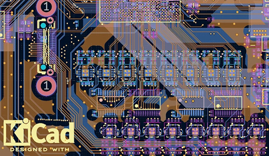](https://www.helpnetsecurity.com/2026/05/14/cern-kicad-component-library/)

CERN has released its complete KiCad component library under an open source license, making it available to hardware designers anywhere in the world. The library, maintained by CERN’s Design Office, contains more than 17,000 electronic components in the form of schematic symbols and printed circuit board footprints - [https://www.helpnetsecurity.com/2026/05/14/cern-kicad-component-library/](https://www.helpnetsecurity.com/2026/05/14/cern-kicad-component-library/).

Also: A web-based Python tool, JLC2KiCad, that converts JLCPCB parts information into KiCad format - [jlc2kicad-webui.manus.space](https://jlc2kicad-webui.manus.space/).

*Editor's Note: This allows easier access to making KiCad PCBs, in turn turning Python projects into tangible hardware. A win for us all.*

## A PIO simulator for Raspberry Pi RP2040/RP2350

[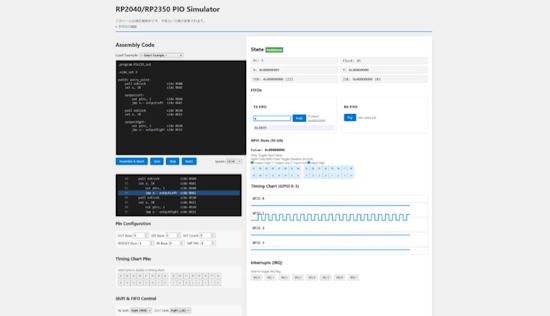](url)

ice458 on GitHub has made an extremely useful tool for folks using PIO on Raspberry Pi RP2040/RP2350 microcontrollers. A full simulator for PIO programs with waveforms, pins, and registers - [GitHub.io](https://ice458.github.io/tools/pio_sim/index.html) and [Adafruit Blog](https://blog.adafruit.com/2026/05/13/a-pio-simulator-for-the-raspberry-pi-rp2040-and-rp2350/). Via [X](https://x.com/ice_458/status/2054200747496284248).

## A Foundation Model in Your Pocket

Eben Upton built Raspberry Pi to get more kids into computer science. It’s now the third most popular computer in history, a $1.5 billion industrial business, and used everywhere from outer space to the AI frontier - [Colossus](https://colossus.com/article/raspberry-pi-eben-upton/).

## CircuitPython 10.2.1 Released

CircuitPython 10.2.1 has been released. It is a bugfix revision of CircuitPython and it is a new stable release - [Adafruit Blog](https://blog.adafruit.com/2026/05/12/circuitpython-10-2-1-released/) and release notes - [GitHub](https://github.com/adafruit/circuitpython/releases/tag/10.2.1).

**Highlights of this Release**

* Fix crashes on certain boards with integral displays.
* Adafruit MagTag 2025: improve display quality and support new display variant.

## AI is Ready to Take Over Python Programming, But Not Much Else

A [Microsoft paper](https://arxiv.org/abs/2604.15597) finds that AI performance varies sharply by domain. Python is the only domain where most models are ‘ready,’ and the best model reaches that threshold in only 11 of 52 domains - [CIO](https://www.cio.com/article/4170475/ai-is-ready-to-take-over-python-programming-but-not-much-else.html).

I tested the new OpenAI Codex features on a real Python codebase, and it’s the strongest Claude Code rival yet - [The New Stack](https://thenewstack.io/openai-codex-claude-code/).

## TIOBE Index for May 2026: R Ascends as Python Slips Below 20%

May’s TIOBE Index has a clear headline move inside the top 10: R climbs to #8, matching its best-ever rank. TIOBE CEO Paul Jansen says it fits a broader pattern in statistical programming, where attention is gathering around fewer ecosystems rather than spreading across a long list of specialized tools. Python remains #1 at 19.98%, and even with the drop, it still sits far ahead of every other language in the table. The lead is not in question, but the rating continues to drift downward month to month - [TechRepublic](https://www.techrepublic.com/article/news-tiobe-may-2026-r-hits-8/).

## A Raspberry Pi AMA on Reddit

On Thursday, 21st May, Eben Upton, James Adams and Gordon Hollingworth of Raspberry Pi will be live on [Reddit's r/engineering](https://www.reddit.com/r/engineering/) from 3 to 5pm BST, answering questions about industrial and embedded applications of Raspberry Pi. Compute Modules in production, RP2040/RP2350, real-time performance, industrial protocols... bring whatever you've got. Between the three of them they cover the full stack - [Reddit](https://www.reddit.com/r/engineering/comments/1tcyfvk/hello_rengineering_were_eben_upton_ceo_james/). Via [LinkedIn](https://www.linkedin.com/posts/one-of-our-colleagues-maybe-the-one-posting-share-7461044132350824448-CyRO).

## An Altoids Tin Mini-Cyberdeck

[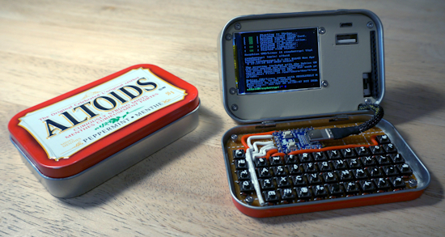](https://hackaday.io/project/205598-altoids-tin-mini-cyberdeck)

Altoids Tins are the perfect container. From survival kits, custom handheld game systems, to sewing, watercolors, and first aid, people have been repurposing the tin of the curiously strong mints for decades. Recently a strong desire came over YouTuber Exercising Ingenuity to build a tiny cyberdeck inside of one of these tins using a Raspberry Pi Zero W - [Hackaday.io](https://hackaday.io/project/205598-altoids-tin-mini-cyberdeck), [Hackster.io](https://www.hackster.io/news/the-curiously-strong-portable-computer-9d1c6d62d14a), [YouTube](https://youtu.be/j262kCYZxZI?si=-6jTVmVuCc-xO4Bm) and [GitHub](https://github.com/exercising-ingenuity/altoid-tin-cyberdeck). Via [X](https://x.com/Hacksterio/status/2053807336872161325).

## This Week's Python Streams

Python on Hardware is all about building a cooperative ecosphere which allows contributions to be valued and to grow knowledge. Below are the streams within the last week focusing on the community.

**CircuitPython Deep Dive Stream**

[Last Friday](https://youtube.com/live/bN6EOEmLzvA), Scott streamed work on hardware in the loop software.

You can see the latest video and past videos on the Adafruit YouTube channel under the Deep Dive playlist - [YouTube](https://www.youtube.com/playlist?list=PLjF7R1fz_OOXBHlu9msoXq2jQN4JpCk8A).

**CircuitPython Parsec**

John Park’s CircuitPython Parsec this week is on LCD Character Display Buffer Width - [Adafruit Blog](https://blog.adafruit.com/2026/05/15/john-parks-circuitpython-parsec-lcd-character-display-buffer-width/) and [YouTube](https://youtu.be/H6BxA5_Bax0?si=QXBZFnFE490ygZFl).

Catch all the episodes in the [YouTube playlist](https://www.youtube.com/playlist?list=PLjF7R1fz_OOWFqZfqW9jlvQSIUmwn9lWr).

**Deep Dive with Tim**

[Last week](https://youtube.com/live/zrwqlHc6n8k), Tim streamed work on LLM Agent Embodiment Kit and HTTPServer Channel.

You can see the latest video and past videos on the Adafruit YouTube channel under the Deep Dive playlist - [YouTube](https://www.youtube.com/playlist?list=PLjF7R1fz_OOWFqZfqW9jlvQSIUmwn9lWr).

**CircuitPython Weekly Meeting**

CircuitPython Weekly Meeting for May 11, 2026 ([notes](https://github.com/adafruit/adafruit-circuitpython-weekly-meeting/blob/main/2026/2026-05-11.md)) [on YouTube](https://youtu.be/JQgzeWP10cs).

## Project of the Week: A Little Computer That Writes Poems About Computers

[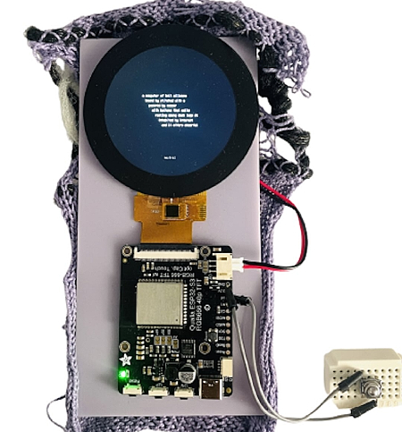](https://www.instagram.com/p/DYOOEsBDG3m/?img_index=1)

Yafira, electrocutelab on Instagram, has created ribbon_logic (2026) - [Instagram](https://www.instagram.com/p/DYOOEsBDG3m/?img_index=1).

> "apparently i can’t stop making things about computers. my thesis is a computer. now this is a little computer that writes poems about computers. at some point i stopped questioning it lol ✿. a tiny poetry generator that lives on a 2.1” round screen. one button, one LiPo battery, infinite soft poems about soft machines. built with circuitpython on an @adafruit qualia, running a markov chain trained on my own freewriting and seeded with words from our class’s hand-tagged semantic corpus. it refuses cold, sharp, and academic words at the point of generation. the form and the content say the same thing. the text gives the computer a different personality, less command line, more daydream. the glitch is intentional. the screen stutters, the text flickers, the poem arrives in pieces. small machines should be allowed to be imperfect."

## Popular Last Week

[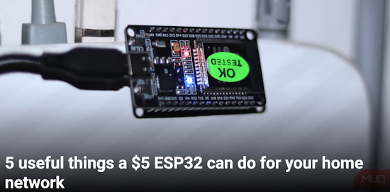](https://www.makeuseof.com/useful-things-esp32-home-network/)

What was the most popular, most clicked link, in [last week's newsletter](https://www.adafruitdaily.com/2026/05/11/python-on-microcontrollers-newsletter-new-python-versions-now-pcbs-are-getting-scarce-beagleboard-and-more/)? [5 useful things a $5 ESP32 can do for your home network](https://www.makeuseof.com/useful-things-esp32-home-network/).

Did you know you can read past issues of this newsletter in the Adafruit Daily Archive? [Check it out](https://www.adafruitdaily.com/category/circuitpython/).

## Adafruit Playground Notes

[Adafruit Playground](https://adafruit-playground.com/) is a new place for the community to post their projects and other making tips/tricks/techniques. Ad-free, it's an easy way to publish your work in a safe space for free.

## News From Around the Web

[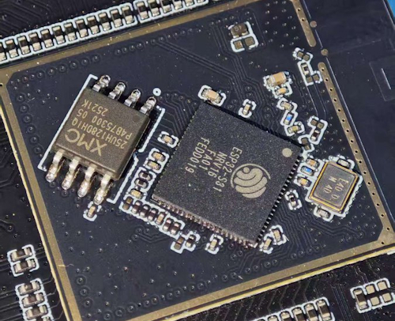](https://x.com/its_hard_2_name/status/2054811242108432582)

The ESP32-S31, [announced](https://www.espressif.com/en/news/ESP32_S31_Release) back in March, has been spotted on social media - [X](https://x.com/its_hard_2_name/status/2054811242108432582).

There has been discussion of it not being a drop in replacement for the ESP32-S3 - [SeeedStudio](https://www.seeedstudio.com/blog/2026/04/14/esp32-s31-vs-esp32-s3-should-the-xiao-get-an-upgrade/).

[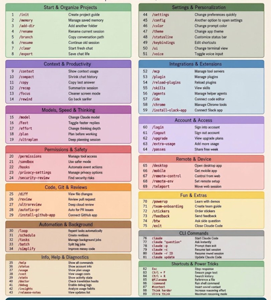](https://x.com/prayag_sonar/status/2054274997817053305)

Claude Code Commands cheat sheet - [X](https://x.com/prayag_sonar/status/2054274997817053305).

Also a Claude cheat sheet - [X](https://x.com/prayag_sonar/status/2053954135259742598).

[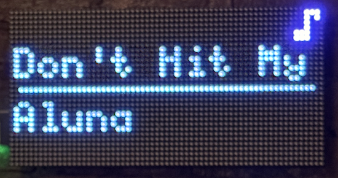](https://guylewin.com/blog/2026-04-26-matrixportal-concierge/)

A tiny, always-on display using an Adafruit Matrix Portal S3 + 64×32 RGB LED matrix, coded in CircuitPython - [guylewin.com](https://guylewin.com/blog/2026-04-26-matrixportal-concierge/) and [GitHub](https://github.com/GuyLewin/matrixportal-concierge).

[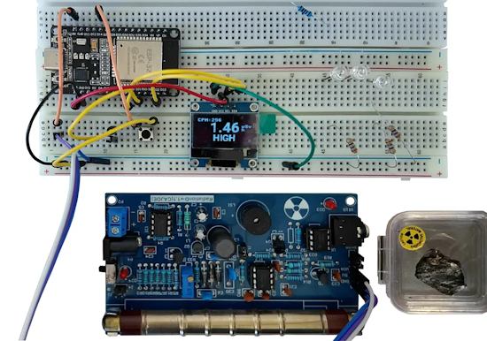](https://levelup.gitconnected.com/micropython-esp32-making-a-real-time-iot-radiation-monitor-e08a46221b8a)

Dmitrii Eliuseev provides a comprehensive guide on building a DIY real-time radiation monitor using an ESP32 and MicroPython. The project is designed to be affordable and capable of sending data to IoT platforms - [Medium](https://levelup.gitconnected.com/micropython-esp32-making-a-real-time-iot-radiation-monitor-e08a46221b8a).

Pyrefly, the fast, open-source type checker and language server for Python, built by Meta, has reached version 1.0.0 - [YouTube](https://www.youtube.com/watch?v=_o0TZG_xrys).

[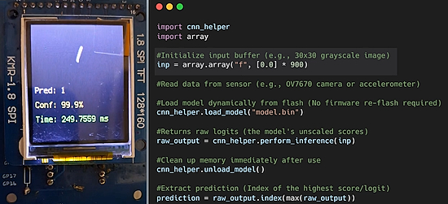](https://www.reddit.com/r/circuitpython/comments/1t9zq71/native_cnn_convolutional_neural_network_module/)

A native CNN (Convolutional Neural Network Module) for CircuitPython - [Reddit](https://www.reddit.com/r/circuitpython/comments/1t9zq71/native_cnn_convolutional_neural_network_module/).

[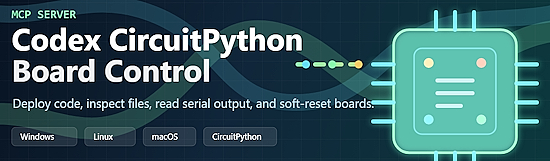](https://github.com/neusse/Codex-Circuitpython-MCP)

A starter MCP server for controlled access to CircuitPython boards across Windows, Linux, and macOS. It is built for the common edit-deploy-reset loop: inspect the board, update files, read serial output, and recover quickly when code needs to be interrupted - [GitHub](https://github.com/neusse/Codex-Circuitpython-MCP).

An MCP for MicroPython, featured last month - [Switch Science](https://www.switch-science.com/blogs/magazine/mcp-micropython-bridge) and [GitHub](https://github.com/SWITCHSCIENCE/mcp-micropython-bridge). (Japanese)

[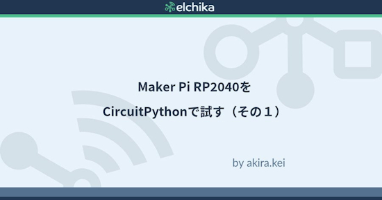](https://elchika.com/article/c9299969-719b-4c35-947c-ee6a16fc7080/)

Trying Maker Pi RP2040 with CircuitPython (Part 1) - [elchika](https://elchika.com/article/c9299969-719b-4c35-947c-ee6a16fc7080/) (Japanese). Via [X](https://x.com/elchika_info/status/2054438194897408370).

[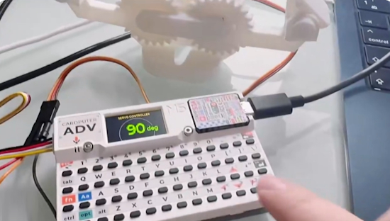](https://x.com/timcanby/status/2053235376270262724)

Connie's first mini experiment with the Cardputer ADV. Bypassed the default firmware to directly read the TCA8418 I2C keyboard chip and drive a PWM servo with MicroPython. Added a custom UI for that extra slick feel - [X](https://x.com/timcanby/status/2053235376270262724).

New: search Raspberry Pi documentation by meaning, not keywords - [Raspberry Pi News](https://www.raspberrypi.com/news/search-our-documentation-by-meaning-not-keywords/).

[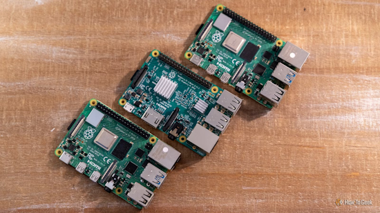](https://www.howtogeek.com/raspberry-pi-weekend-projects-solve-real-problems-may-15-17/)

Three Raspberry Pi weekend projects that actually solve real problems - [How-To Geek](https://www.howtogeek.com/raspberry-pi-weekend-projects-solve-real-problems-may-15-17/).

text - [site](url).

text - [site](url).

text - [site](url).

text - [site](url).

text - [site](url).

How to install Python 3.14.5 on Windows 11 - [YouTube](https://www.youtube.com/watch?v=XFdmd4c68eQ).

Create mathematical animations with Python code - [GitHub](https://github.com/ManimCommunity/manim).

## New

CyberArch/Carbon Computers brand, has introduced the Pi Slate, a powerful handheld cyberdeck designed for portable computing and security-focused applications. Built around the Raspberry Pi 5, the Pi Slate integrates a 5-inch 1280×720 touchscreen, a backlit RGB keyboard with an integrated cursor, and a 10,000 mAh battery for 3–5 hours of portable use in a compact enclosure. It supports modular expansion for HATs such as LoRa, SDR, AI accelerators, and M.2 storage, and includes cooling support, antenna mounts, and an optional modular back with a kickstand - [CNX](https://www.cnx-software.com/2026/05/11/pi-slate-a-raspberry-pi-5-handheld-linux-cyberdeck-with-a-5-inch-1280x720-touchscreen-display/).

[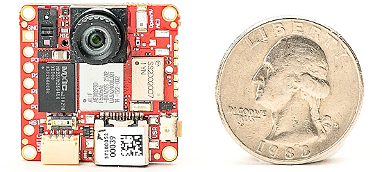](https://openmv.io/products/openmv-ae3)

ThThe OpenMV AE3 is a small, low power, microcontroller board which allows you to easily implement applications using machine vision in the real-world. You program the OpenMV AE3 in high level Python scripts (courtesy of the MicroPython Operating System) instead of C/C++ - [OpenMV](https://openmv.io/products/openmv-ae3). Via [X](https://x.com/humancell/status/2054988926624887010).

[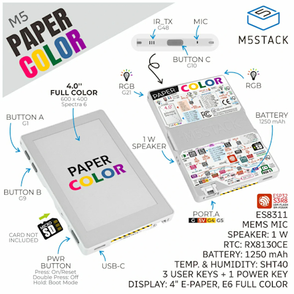](https://linuxgizmos.com/m5stack-papercolor-is-an-esp32-s3-dev-kit-with-spectra-6-e-paper-panel/)

M5Stack has introduced the PaperColor, a compact development board built around the ESP32-S3R8 processor and a 4-inch Spectra 6 full-color e-paper display. The system is based on the ESP32-S3R8 SoC featuring dual Xtensa LX7 cores operating at up to 240 MHz together with 2.4 GHz Wi-Fi support. The board integrates 16MB Flash storage, 8MB PSRAM, and an onboard microSD card slot for expandable storage - [LinuxGizmos](https://linuxgizmos.com/m5stack-papercolor-is-an-esp32-s3-dev-kit-with-spectra-6-e-paper-panel/).

## New Boards Supported by CircuitPython

The number of supported microcontrollers and Single Board Computers (SBC) grows every week. This section outlines which boards have been included in CircuitPython or added to [CircuitPython.org](https://circuitpython.org/).

This week there were two new boards added:

- [WeAct Studio RP2350B Core by WeAct Studio](https://circuitpython.org/board/weact_studio_rp2350b_core/)
- [Waveshare ESP32-S3-Touch-AMOLED-2.41 by Waveshare](https://circuitpython.org/board/waveshare_esp32_s3_amoled_241/)

*Note: For non-Adafruit boards, please use the support forums of the board manufacturer for assistance, as Adafruit does not have the hardware to assist in troubleshooting.*

Looking to add a new board to CircuitPython? It's highly encouraged! Adafruit has four guides to help you do so:

- [How to Add a New Board to CircuitPython](https://learn.adafruit.com/how-to-add-a-new-board-to-circuitpython/overview)
- [How to add a New Board to the circuitpython.org website](https://learn.adafruit.com/how-to-add-a-new-board-to-the-circuitpython-org-website)
- [Adding a Single Board Computer to PlatformDetect for Blinka](https://learn.adafruit.com/adding-a-single-board-computer-to-platformdetect-for-blinka)
- [Adding a Single Board Computer to Blinka](https://learn.adafruit.com/adding-a-single-board-computer-to-blinka)

## New Adafruit Learning System Guides

[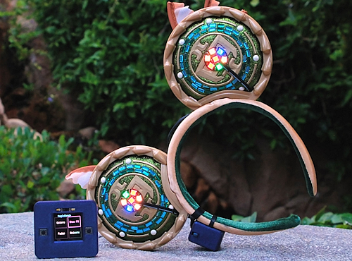](https://learn.adafruit.com/guides/latest)

The [Adafruit Learning System](https://learn.adafruit.com/) has over 3,200 free guides for learning skills and building projects including using Python.

[title](url) from [name](url)

[title](url) from [name](url)

[title](url) from [name](url)

## Updated Learn Guides

[title](url)

## CircuitPython Libraries

The CircuitPython library numbers are continually increasing, while existing ones continue to be updated. Here we provide library numbers and updates!

To get the latest Adafruit libraries, download the [Adafruit CircuitPython Library Bundle](https://circuitpython.org/libraries). To get the latest community contributed libraries, download the [CircuitPython Community Bundle](https://circuitpython.org/libraries).

If you'd like to contribute to the CircuitPython project on the Python side of things, the libraries are a great place to start. Check out the [CircuitPython.org Contributing page](https://circuitpython.org/contributing). If you're interested in reviewing, check out Open Pull Requests. If you'd like to contribute code or documentation, check out Open Issues. We have a guide on [contributing to CircuitPython with Git and GitHub](https://learn.adafruit.com/contribute-to-circuitpython-with-git-and-github), and you can find us in the #help-with-circuitpython and #circuitpython-dev channels on the [Adafruit Discord](https://adafru.it/discord).

You can check out this [list of all the Adafruit CircuitPython libraries and drivers available](https://github.com/adafruit/Adafruit_CircuitPython_Bundle/blob/master/circuitpython_library_list.md). 

The current number of CircuitPython libraries is **569**!

**New Libraries**

There are no new CircuitPython libraries this week.

**Updated Libraries**

Here are this week's updated CircuitPython libraries:

* [relic-se/CircuitPython_TLV320AIC3204](https://github.com/relic-se/CircuitPython_TLV320AIC3204)

## What’s the CircuitPython team up to this week?

What is the team up to this week? Let’s check in:

**Dan**

I released CircuitPython 10.2.1 last week, with fixes for crashes for certain boards with integral displays, and a big improvement in display quality for the MagTag 2025 (thanks Mikey Sklar!).

CircuitPython 10.2.1-alpha.2 is underway, but we might like to fix some non-working boards before releasing it.

**Tim**

I've been working on a few more revisions of my PR to implement a module in the CircuitPython core for `I2SIn`. I showed a demo on Show & Tell that uses `ulab` for FFT to make multiple strips of NeoPixels reactive to different frequencies within audio. My other project right now is an embodiment kit that uses a Feather S3 reverse TFT with various sensors and outputs like lights, vibration motor, and piezo buzzer to make a device intended to let an LLM sense and interact with the environment that the human user is in. I refactored parts of the communication on my stream Tuesday, and I've got all of the hardware put together on a perma-proto breadboard now.

**Scott**

This past week I tested the P4GPIO board, found and fixed an issue. I also made the same fix to the P4HIL board and then ordered them both. I've detoured back to Zephyr to update to the latest and greatest. At the same time, I'm working on the software side of hardware in the loop. It involves the harness firmware for USBIP, logic capture and toggling GPIO. My goal is to have the testing working on generic hardware and be able to scale up when the P4HIL boards arrive.

**Liz**

This week I've been working on a PCB that can fit in the Ikea Alpstuga CO2 monitor. It uses an ESP32-S3 and an HT16K33 to drive the LEDs that fit into a character mask in the enclosure. I have a scan of the original board to get the coordinates of each LED for the layout.

## Upcoming Events

[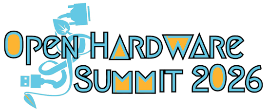](https://oshwa.org/events/open-hardware-summit-2026/)

[The Open Source Hardware Association Open Hardware Summit](https://oshwa.org/events/open-hardware-summit-2026/) will be in Berlin, Germany on May 23rd and 24th, 2026.

The next MicroPython Meetup in Melbourne will be on May 27 – [Luma](https://luma.com/micropython). You can see recordings of previous meetings on [YouTube](https://www.youtube.com/@MicroPythonOfficial). 

**Other Events This Year**

* [EuroPython 2026](https://ep2026.europython.eu/) is coming to Kraków, Poland 13-19 July, 2026.
* [PyOhio 2026](https://www.pyohio.org/2026/) is from 25 July through 26 July, 2026 this year in Cleveland, USA.
* [HOPE 26 Conference](https://store.2600.com/products/tickets-to-hope-26) is from August 14th through 16th at the New Yorker Hotel, NY, NY.
* [PyCon AU 2026](https://2026.pycon.org.au/) will be 26 Aug. 2026 – 30 Aug. 2026 in Brisbane, Australia

If you know of virtual events or upcoming events, please let us know via email to cpnews(at)adafruit(dot)com.

## Latest Releases

## Latest Releases
 
CircuitPython's stable release is [10.1.4](https://github.com/adafruit/circuitpython/releases/latest) and its unstable release is [10.2.0-alpha.1](https://github.com/adafruit/circuitpython/releases). New to CircuitPython? Start with our [Welcome to CircuitPython Guide](https://learn.adafruit.com/welcome-to-circuitpython).
 
[20260508](https://github.com/adafruit/Adafruit_CircuitPython_Bundle/releases/latest) is the latest Adafruit CircuitPython library bundle.
 
[20260515](https://github.com/adafruit/CircuitPython_Community_Bundle/releases/latest) is the latest CircuitPython Community library bundle.
 
[v1.28.0](https://micropython.org/download) is the latest MicroPython release. Documentation for it is [here](http://docs.micropython.org/en/latest/pyboard/).
 
[3.14.5](https://www.python.org/downloads/) is the latest Python release. The latest pre-release version is [3.15.0b1](https://www.python.org/download/pre-releases/).
 
[4,477 Stars](https://github.com/adafruit/circuitpython/stargazers) Like CircuitPython? [Star it on GitHub!](https://github.com/adafruit/circuitpython)

## Call for Help -- Translating CircuitPython is now easier than ever

[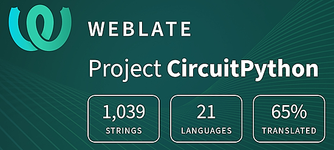](https://hosted.weblate.org/engage/circuitpython/)

One important feature of CircuitPython is translated control and error messages. With the help of fellow open source project [Weblate](https://weblate.org/), we're making it even easier to add or improve translations. 

Sign in with an existing account such as GitHub, Google or Facebook and start contributing through a simple web interface. No forks or pull requests needed! As always, if you run into trouble join us on [Discord](https://adafru.it/discord), we're here to help.

## 39,007 Thanks

The Adafruit Discord community, where we do all our CircuitPython development in the open, reached over 39,007 humans - thank you! Adafruit believes Discord offers a unique way for Python on hardware folks to connect. Join today at [https://adafru.it/discord](https://adafru.it/discord).

## ICYMI - In case you missed it

Python on hardware is the Adafruit Python video-newsletter-podcast! The news comes from the Python community, Discord, Adafruit communities and more and is broadcast on ASK an ENGINEER Wednesdays. The complete Python on Hardware weekly videocast [playlist is here](https://www.youtube.com/playlist?list=PLjF7R1fz_OOXRMjM7Sm0J2Xt6H81TdDev). The video podcast is on [iTunes](https://itunes.apple.com/us/podcast/python-on-hardware/id1451685192?mt=2), [YouTube](http://adafru.it/pohepisodes), [Instagram](https://www.instagram.com/adafruit/channel/), and [XML](https://itunes.apple.com/us/podcast/python-on-hardware/id1451685192?mt=2).

[The weekly community chat on Adafruit Discord server CircuitPython channel - Audio / Podcast edition](https://itunes.apple.com/us/podcast/circuitpython-weekly-meeting/id1451685016) - Audio from the Discord chat space for CircuitPython, meetings are usually Mondays at 2pm ET, this is the audio version on [iTunes](https://itunes.apple.com/us/podcast/circuitpython-weekly-meeting/id1451685016), Pocket Casts, [Spotify](https://adafru.it/spotify), and [XML feed](https://adafruit-podcasts.s3.amazonaws.com/circuitpython_weekly_meeting/audio-podcast.xml).

## Contribute

The CircuitPython Weekly Newsletter is a CircuitPython community-run newsletter emailed every Monday. To contribute your content, please email your news to cpnews (at) adafruit (dot) com with information and link(s) to your content. 

Join the Adafruit [Discord](https://adafru.it/discord) or [post to the forum](https://forums.adafruit.com/viewforum.php?f=60) if you have questions.
