- [ ] Library and info updates
- [ ] change date
- [ ] update title
- [ ] Feature story
- [ ] Update  for images
- [ ] Update ICYDNCI
- [ ] All images 550w max only
- [ ] Link "View this email in your browser."

News Sources

- [Adafruit Playground](https://adafruit-playground.com/)
- Twitter: [CircuitPython](https://twitter.com/search?q=circuitpython&src=typed_query&f=live), [MicroPython](https://twitter.com/search?q=micropython&src=typed_query&f=live) and [Python](https://twitter.com/search?q=python&src=typed_query)
- [Raspberry Pi News](https://www.raspberrypi.com/news/), [Pi Foundation](https://www.raspberrypi.org/blog/)
- Mastodon [CircuitPython](https://mastodon.social/tags/CircuitPython) and [MicroPython](https://mastodon.social/tags/MicroPython)
- BlueSky [CircuitPython](https://bsky.app/search?q=circuitpython), [MicroPython](https://bsky.app/search?q=micropython), [Raspberry Pi](https://bsky.app/search?q=raspberry+pi)
- [Google News Python](https://news.google.com/topics/CAAqIQgKIhtDQkFTRGdvSUwyMHZNRFY2TVY4U0FtVnVLQUFQAQ?hl=en-US&gl=US&ceid=US%3Aen)
- YouTube: [CircuitPython](https://www.youtube.com/results?search_query=circuitpython&sp=CAISBAgDEAE%253D), [MicroPython](https://www.youtube.com/results?search_query=micropython&sp=CAISBAgDEAE%253D), [Prof Gallaugher](https://www.youtube.com/@BuildWithProfG/videos)
- [maker.io Python](https://www.digikey.com/en/maker/search-results?s=createdDate&t=python)
- [hackster.io CircuitPython](https://www.hackster.io/search?q=circuitpython&i=projects&sort_by=most_recent) and [MicroPython](https://www.hackster.io/search?q=micropython&i=projects&sort_by=most_recent)
- Instructables: [CircuitPython](https://www.instructables.com/search/?q=circuitpython&projects=all&sort=Newest), [MicroPython](https://www.instructables.com/search/?q=micropython&projects=all&sort=Newest), [Raspberry Pi Python](https://www.instructables.com/search/?q=raspberry+pi+python&projects=all&sort=Newest)
- [hackaday CircuitPython](https://hackaday.com/blog/?s=circuitpython) and [MicroPython](https://hackaday.com/blog/?s=micropython)
- [python.org](https://www.python.org/)
- [Python Insider - dev team blog](https://pythoninsider.blogspot.com/)
- Individuals: [bret.dk](https://bret.dk/), [Jeff Geerling](https://www.jeffgeerling.com/blog), [Yakroo](https://x.com/Yakroo5077), [coXXect](https://coxxect.blogspot.com/)
- Tom's Hardware: [CircuitPython](https://www.tomshardware.com/search?searchTerm=circuitpython&articleType=all&sortBy=publishedDate) and [MicroPython](https://www.tomshardware.com/search?searchTerm=micropython&articleType=all&sortBy=publishedDate) and [Raspberry Pi](https://www.tomshardware.com/search?searchTerm=raspberry%20pi&articleType=all&sortBy=publishedDate)
- [hackaday.io newest projects MicroPython](https://hackaday.io/projects?tag=micropython&sort=date) and [CircuitPython](https://hackaday.io/projects?tag=circuitpython&sort=date)
- hackaday.io - [CircuitPython](https://hackaday.io/search?term=circuitpython) and [MicroPython](https://hackaday.io/search?term=micropython)
- [MicroPython Meeting](https://luma.com/micropython?k=c)

View this email in your browser. **Warning: Flashing Imagery**

Welcome to the latest Python on Microcontrollers newsletter! Q&A: Q "Is this newsletter generated by AI?" AB: "No, hand curated" Q "Will it be AI generated in the future?" AB: "There is no plans to do so, but who knows about the state of data aggregation." As I sit at my desk, gathering the newsletter content, it seems like AI will provide us with all our data needs, if you believe folks like at the recent [Google I/O '26](https://www.youtube.com/watch?v=tfx2CjqtCUI). I see things differently and I'd bet many subscribers would also: having an industry group of experts provide pertinent information beats sifting through algorithically generated material. - *Anne Barela, Editor*

We're on [Discord](https://discord.gg/HYqvREz), [Twitter/X](https://twitter.com/search?q=circuitpython&src=typed_query&f=live), [BlueSky](https://bsky.app/profile/circuitpython.org) and for past newsletters - [view them all here](https://www.adafruitdaily.com/category/circuitpython/). If you're reading this on the web, please [subscribe here](https://www.adafruitdaily.com/). Here's the news this week:

## Mozilla and Adafruit Bring Web Serial Workflows to Firefox

This week’s [Firefox 151 release](https://hacks.mozilla.org/2026/05/web-serial-support-in-firefox/) introduced support for the [Web Serial API on desktop](https://hacks.mozilla.org/2026/05/web-serial-support-in-firefox/). Many folks won’t use this API, but for our community of builders and tinkerers, it unlocks the ability to use Firefox to communicate directly with compatible hardware devices like microcontrollers, development boards, and other serial-connected devices - [Distilled](https://blog.mozilla.org/en/firefox/firefox-web-serial-adafruit/).

> "With Firefox’s browser engine, Gecko, now supporting Web Serial, users can now connect, code, configure, and control compatible hardware directly from the browser in many workflows, often without additional software or complicated setup. As part of this week’s launch, [Adafruit](https://www.adafruit.com/), one of the internet’s most beloved open-source hardware communities, is collaborating with us to test and validate what browser-based hardware development can look like in Firefox with Web Serial support.
 &nbsp;  
If you’ve ever spent time with CircuitPython, browser-based board programming, custom controllers, sensors, classroom kits, STEM homework assignments, or a desk covered in blinking microcontrollers—you probably already know Adafruit. With Web Serial support in Firefox 151, Adafruit’s browser-based hardware workflows now work directly in Firefox as well, with no additional software or complicated setup required for many projects. [We invite you to give it a try](https://adafruit.github.io/Adafruit_WebSerial_ESPTool/)."

Related: Mozilla officially confirms Firefox 2026 "Nova" redesign, and you can already enable it - [Neowin](https://www.neowin.net/news/mozilla-officially-confirms-firefox-2026-nova-redesign-and-you-can-already-enable-it/).

## Python Developers Update the *Guidelines For Using AI Tools*

The guidelines for using AI tools when contributing to CPython has just been updated. Must read whether you're an existing or aspiring contributor. tl;dr: you're still responsible for what you submit - [Python Developer's Guide](https://devguide.python.org/getting-started/ai-tools/). Via [LinkedIn](https://www.linkedin.com/posts/mariatta_python-share-7463076886668292096-Ufbv/).

## Feature

text - [site](url).

## The "Mac Nano" Ppowered by the Raspberry Pi CM0

[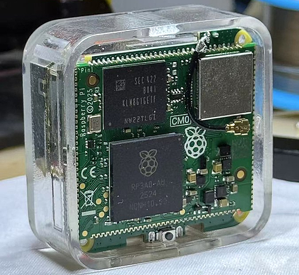](https://x.com/SipeedIO/status/2057018756212416570)

The "Mac Nano" is a very small Linux computer powered by the Raspberry Pi CM0, built by Sipeed community developers - [X](https://x.com/SipeedIO/status/2057018756212416570).

## Does Cooling a Raspberry Pi Zero 2W Help It Process More?

[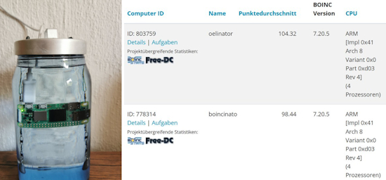](https://x.com/GFreiNews/status/2056060930967154970)

"Exactly one year ago, I submerged a Raspberry Pi Zero 2 W in paraffin oil. The oil ensures that the processor barely gets warmer than room temperature even under maximum load. Since then, it has been computing asteroid data 24/7 with a BOINC client for the Faculty of Mathematics and Physics in Prague. This way, we determine the orbits of all asteroids and know where they trace their paths—and also whether we need to worry that one might hit us in the future. An identical Zero 2 W with exactly the same software performs exactly the same task without cooling.
 &nbsp;  
And now the question arises: Does perfect cooling make a performance difference? And the answer is: Yes! And significantly so! – 5.97 %" - [X](https://x.com/GFreiNews/status/2056060930967154970).

## GitHub Internal Repositories Hacked

[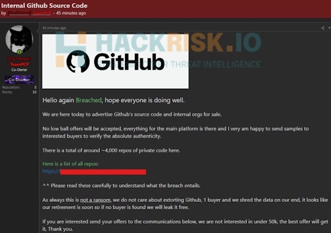](https://www.infoworld.com/article/4174734/github-admits-major-source-code-leak-after-3800-internal-repositories-breached.html)

Microsoft’s GitHub has suffered what appears to be its biggest ever security breach after confirming that attackers exfiltrated code from around 3,800 of the company’s internal repositories - [InfoWorld](https://www.infoworld.com/article/4174734/github-admits-major-source-code-leak-after-3800-internal-repositories-breached.html) and [VentureBeat](https://venturebeat.com/security/github-confirms-3800-repos-stolen-poisoned-vs-code-extension-supply-chain-worm-microsoft-python-sdk). Via [X](https://x.com/Pirat_Nation/status/2056944832237449347).

## Feature

text - [site](url).

## This Week's Python Streams

Python on Hardware is all about building a cooperative ecosphere which allows contributions to be valued and to grow knowledge. Below are the streams within the last week focusing on the community.

**CircuitPython Deep Dive Stream**

[Last Friday](), Scott streamed work on .

You can see the latest video and past videos on the Adafruit YouTube channel under the Deep Dive playlist - [YouTube](https://www.youtube.com/playlist?list=PLjF7R1fz_OOXBHlu9msoXq2jQN4JpCk8A).

**CircuitPython Parsec**

John Park’s CircuitPython Parsec is off this week. Catch all the episodes in the [YouTube playlist](https://www.youtube.com/playlist?list=PLjF7R1fz_OOWFqZfqW9jlvQSIUmwn9lWr).

**Deep Dive with Tim**

[Last week](), Tim streamed work on .

You can see the latest video and past videos on the Adafruit YouTube channel under the Deep Dive playlist - [YouTube](https://www.youtube.com/playlist?list=PLjF7R1fz_OOWFqZfqW9jlvQSIUmwn9lWr).

**CircuitPython Weekly Meeting**

CircuitPython Weekly Meeting for May 18, 2026 ([notes](https://github.com/adafruit/adafruit-circuitpython-weekly-meeting/blob/main/2026/2026-05-18.md)) [on YouTube](https://youtu.be/0_Ey1Wh1sXg).

## Project of the Week: A Stratum-1 Time Server Built From a Raspberry Pi

Developer Ben Leikin has released, via an MIT license, everything you need to turn a Raspberry Pi and a low-cost Global Navigation Satellite System (GNSS) receiver into a Stratum-1 time server for your network — delivering a claimed sub-microsecond accuracy. "[I] spent the last few weekends building out a hardware time reference using a [Raspberry] Pi 4 (could use any [Raspberry] Pi really as it uses almost no CPU power and memory)" and Python - [Hackster.io](https://www.hackster.io/news/got-the-time-ben-leikin-does-thanks-to-a-stratum-1-time-server-built-from-a-raspberry-pi-755764618216) and [GitHub](https://github.com/BenLeikin/PiTime/).

## Popular Last Week

What was the most popular, most clicked link, in [last week's newsletter](https://www.adafruitdaily.com/2026/05/18/python-on-microcontrollers-newsletter-open-source-components-for-kicad-pi-pio-simulator-new-circuitpython-and-more/)? [5 useful things a $5 ESP32 can do for your home network](https://www.makeuseof.com/useful-things-esp32-home-network/).

Did you know you can read past issues of this newsletter in the Adafruit Daily Archive? [Check it out](https://www.adafruitdaily.com/category/circuitpython/).

## New Notes from Adafruit Playground

[Adafruit Playground](https://adafruit-playground.com/) is a new place for the community to post their projects and other making tips/tricks/techniques. Ad-free, it's an easy way to publish your work in a safe space for free.

[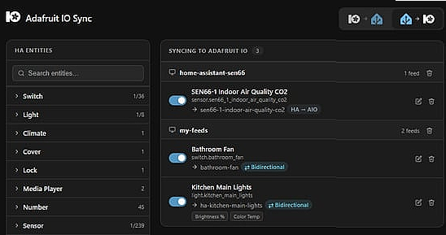](https://adafruit-playground.com/u/tcooper/pages/sync-adafruit-io-and-home-assistant)

Sync Adafruit IO and Home Assistant - [Adafruit Playground](https://adafruit-playground.com/u/tcooper/pages/sync-adafruit-io-and-home-assistant).

[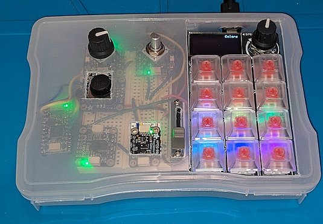](https://adafruit-playground.com/u/afranchuk/pages/page-playground-using-web-serial-in-firefox)

Page Playground: Using Web Serial in Firefox - [Adafruit Playground](https://adafruit-playground.com/u/afranchuk/pages/page-playground-using-web-serial-in-firefox).

text - [Adafruit Playground](url).

## News From Around the Web

[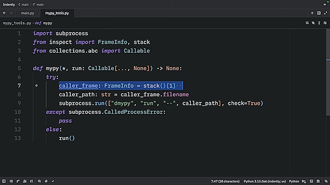](https://www.youtube.com/watch?v=LRGKtGnsufM)

Did I just ruin Python with Enforced Static Typing? - [YouTube](https://www.youtube.com/watch?v=LRGKtGnsufM).

[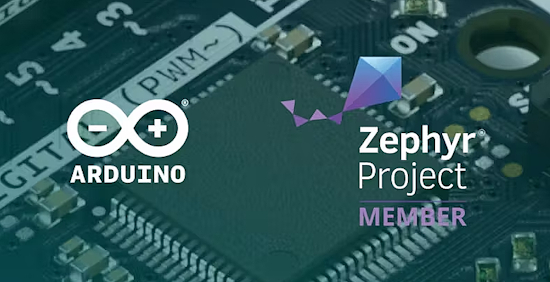](https://www.hackster.io/news/arduino-core-on-zephyr-work-hits-a-new-milestone-prepares-to-exit-beta-in-june-1702a5aaf2b5)

Arduino Core on Zephyr work hits a new milestone, prepares to exit beta in June - [Hackster.io](https://www.hackster.io/news/arduino-core-on-zephyr-work-hits-a-new-milestone-prepares-to-exit-beta-in-june-1702a5aaf2b5).

[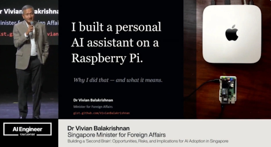](https://x.com/Raspberry_Pi/status/2057421432179544235)

Singapore Minister for Foreign Affairs, Dr. Vivian Balakrishnan, echoing Andrej Karpathy and kache on why he runs NanoClaw on a Raspberry Pi: "you can outsource memory and computation, but you cannot outsource your understanding" - [X](https://x.com/Raspberry_Pi/status/2057421432179544235) and [Facebook](https://www.facebook.com/reel/2234840087250901).

John Teel explores the practical differences between the Raspberry Pi RP2350 and the Espressive ESP32 for commercial product development. This guide focuses on critical factors for hardware engineers, including wireless integration, certification pathways, power consumption profiles, and long-term ecosystem stability to help inform design decisions beyond simple performance specifications - [YouTube](https://www.youtube.com/watch?v=HfnvBHSP8Sk).

Catch the AMA replies from Eben Upton (CEO), James Adams (CTO of Hardware Engineering), and Gordon Hollingworth (CTO of Software Engineering) at Raspberry Pi - [Reddit](https://www.reddit.com/r/engineering/comments/1tcyfvk/comment/on2ea9c/).

text - [site](url).

text - [site](url).

text - [site](url).

text - [site](url).

text - [site](url).

text - [site](url).

text - [site](url).

text - [site](url).

text - [site](url).

[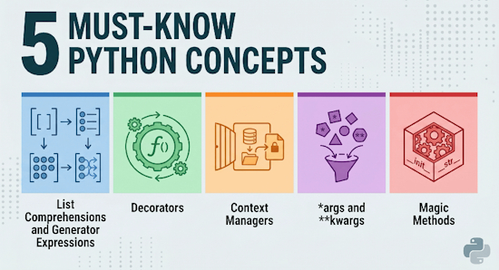](https://www.kdnuggets.com/5-must-know-python-concepts)

Five fundamental concepts that every Python developer should have in their toolkit - [KDnuggets](https://www.kdnuggets.com/5-must-know-python-concepts).

[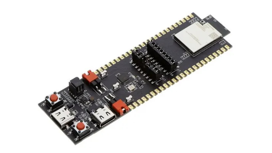](https://hackaday.com/2026/05/17/qualcomms-new-qcc74x-appears-to-target-the-esp32-mcus/)

Qualcomm’s new QCC74x microcontroller family appears To target ESP32 MCUs - [Hackaday](https://hackaday.com/2026/05/17/qualcomms-new-qcc74x-appears-to-target-the-esp32-mcus/).

[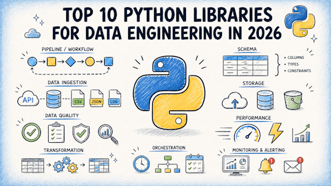](https://www.kdnuggets.com/top-10-python-libraries-for-data-engineering-in-2026)

The top 10 Python libraries for Data Engineering in 2026 - [KDnuggets](https://www.kdnuggets.com/top-10-python-libraries-for-data-engineering-in-2026).

[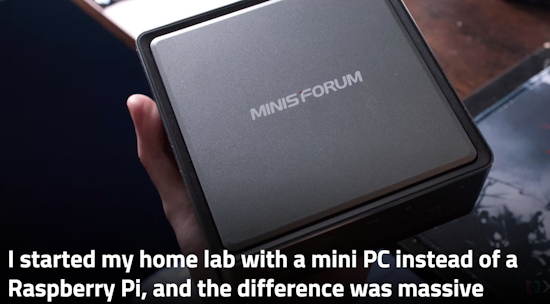](https://www.xda-developers.com/started-my-home-lab-with-a-mini-pc-instead-raspberry-pi/)

I started my home lab with a mini PC instead of a Raspberry Pi, and the difference was massive - [XDA](https://www.xda-developers.com/started-my-home-lab-with-a-mini-pc-instead-raspberry-pi/).

## New

[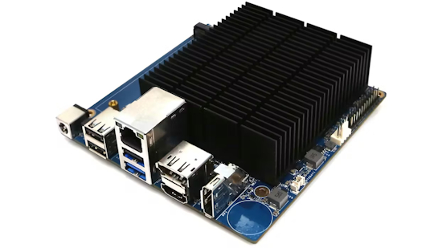](https://www.hackster.io/news/a-260-x86-sbc-that-outmuscles-the-raspberry-pi-5-7835c7003f33)

Now that the once inexpensive Raspberry Pi single-board computers (SBCs) are topping $300 at the higher end, people are increasingly looking into alternatives. A new option from Hardkernel called the ODROID-H5, for instance, is worth a look. It is a low-power SBC, but it comes equipped with an Intel Core i3-N300 processor that is considerably more powerful than the Broadcom BCM2712 found in a Raspberry Pi 5. Rather than an Arm architecture, the N300 is an x86 chip, which could also improve compatibility with many of your favorite software packages. Despite the additional horsepower, the ODROID-H5 is selling for $260 — but with a few caveats - [Hackster.io](https://www.hackster.io/news/a-260-x86-sbc-that-outmuscles-the-raspberry-pi-5-7835c7003f33).

[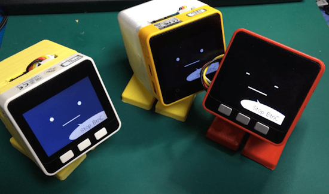](https://x.com/drjingle/status/2054355637711356048)

StackChan (commonly known as StackChan or Stack-Chan in Chinese) is a super cute AI desktop robot (Super Kawaii AI Desktop Robot) co-created by M5Stack and the global user community. It's been rolling out in Japan where users are making physical and programmatic inprovements in interaction - [X](https://x.com/drjingle/status/2054355637711356048) and [M5Stack](https://shop.m5stack.com/products/stackchan-kawaii-co-created-open-source-ai-desktop-robot).

## New Boards Supported by CircuitPython

The number of supported microcontrollers and Single Board Computers (SBC) grows every week. This section outlines which boards have been included in CircuitPython or added to [CircuitPython.org](https://circuitpython.org/).

This week there were (#/no) new boards added:

- [Board name](url)
- [Board name](url)
- [Board name](url)

*Note: For non-Adafruit boards, please use the support forums of the board manufacturer for assistance, as Adafruit does not have the hardware to assist in troubleshooting.*

Looking to add a new board to CircuitPython? It's highly encouraged! Adafruit has four guides to help you do so:

- [How to Add a New Board to CircuitPython](https://learn.adafruit.com/how-to-add-a-new-board-to-circuitpython/overview)
- [How to add a New Board to the circuitpython.org website](https://learn.adafruit.com/how-to-add-a-new-board-to-the-circuitpython-org-website)
- [Adding a Single Board Computer to PlatformDetect for Blinka](https://learn.adafruit.com/adding-a-single-board-computer-to-platformdetect-for-blinka)
- [Adding a Single Board Computer to Blinka](https://learn.adafruit.com/adding-a-single-board-computer-to-blinka)

## New Adafruit Learning System Guides

The [Adafruit Learning System](https://learn.adafruit.com/) has over 3,200 free guides for learning skills and building projects including using Python.

[title](url) from [name](url)

[title](url) from [name](url)

[title](url) from [name](url)

## Updated Learn Guides

[title](url)

## CircuitPython Libraries

The CircuitPython library numbers are continually increasing, while existing ones continue to be updated. Here we provide library numbers and updates!

To get the latest Adafruit libraries, download the [Adafruit CircuitPython Library Bundle](https://circuitpython.org/libraries). To get the latest community contributed libraries, download the [CircuitPython Community Bundle](https://circuitpython.org/libraries).

If you'd like to contribute to the CircuitPython project on the Python side of things, the libraries are a great place to start. Check out the [CircuitPython.org Contributing page](https://circuitpython.org/contributing). If you're interested in reviewing, check out Open Pull Requests. If you'd like to contribute code or documentation, check out Open Issues. We have a guide on [contributing to CircuitPython with Git and GitHub](https://learn.adafruit.com/contribute-to-circuitpython-with-git-and-github), and you can find us in the #help-with-circuitpython and #circuitpython-dev channels on the [Adafruit Discord](https://adafru.it/discord).

You can check out this [list of all the Adafruit CircuitPython libraries and drivers available](https://github.com/adafruit/Adafruit_CircuitPython_Bundle/blob/master/circuitpython_library_list.md). 

The current number of CircuitPython libraries is **###**!

**New Libraries**

Here are this week's new CircuitPython libraries:

* [library](url)

**Updated Libraries**

Here are this week's updated CircuitPython libraries:

* [library](url)

## What’s the CircuitPython team up to this week?

What is the team up to this week? Let’s check in:

**Dan**

I released CircuitPython 10.3.0-alpha.2 at the end of the week before last. I'm continuing to work on fixing bugs for 10.3.0; I fixed seven issues last week. I also cleaned up, triaged, and recategorized a bunch of issues, closing about 8% of all the open issues. Right now I'm working on BLE issues on Espressif.

**Tim**

I have continued work on I2SIn this week with a few more iterations based on feedback from the PR. It occured to me this week that I can use the Fruit Jam to test .wav file recording on `raspberrypi` port by saving to CPSAVES. I was previoulsy recording wav files to SD card and I found the writes to be too slow and cause artifacts. Writing to flash with CPSAVES had a similar issue, but the gobs of RAM on the Fruit Jam is plenty to record to a buffer and then write afterward. 

I'm also working on the embodiment kit project and guide. This week I expanded its capabilities and started testing and improving an agent SKILL.md file to give an LLM control over the hardware. Here is a photo of the hardware sans STEMMA QT sensor tail, and the results of the first diagnostics check of all capabilities.

[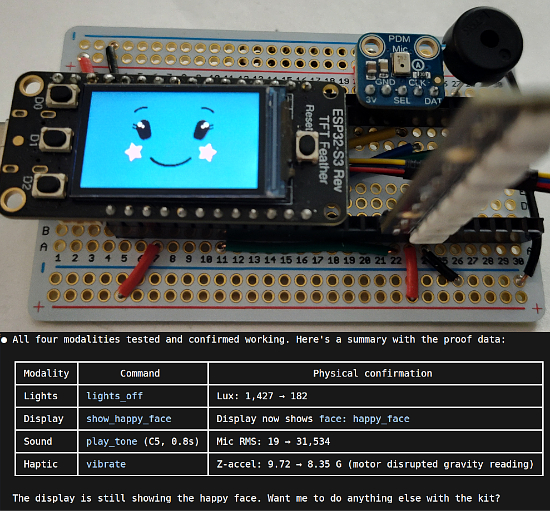](https://www.circuitpython.org/)

**Scott**

This week I've been working to get the hardware-in-the-loop (HIL) software ready for testing with my P4HIL hardware. It is scheduled to arrive in the middle of next week so I now have a deadline. I've struggled a bit with focusing on the core part of what I need for testing because it is now so easy to pull non-critical threads.

One thread I'm happy I pulled is how I sandbox LLMs. Claude's permission prompts were driving me nuts. So, I vibed up my own [`botbox`](https://github.com/tannewt/botbox) which is a Python wrapper around bubblewrap. I'm happy I did because it gives LLMs limited access to the files it needs and works to wrap any agent, not just claude. (I've been trying `pi` coding agent with open models instead of Claude.)

Another thread I've spent some time on is a JavaScript library and [website](https://breadboard.ing) for placing components and connecting them together. This is similar to Fritzing and uses its part catalog. It relates to the HIL work because the harness needs to know how the device under test (DUT) is connected to it. The easiest way I thought of doing this is by dragging a Fritzing version of the device under test (DUT) onto a Fritzing of the P4HIL. Unfortunately, that's a bit of a rabbit hole into generating a P4HIL Fritzing and web/JavaScript stuff.

**Liz**

[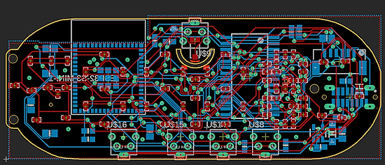](https://www.circuitpython.org/)

This week I continued working on the Ikea Alpstuga drop in board. I was able to get all of the LED and mechanical parts placed in Fusion360 based on the scan that I did. I 3D printed that layout to make sure it was compatible with the enclosure. Once I confirmed the placements, I brought the board outline into Eagle. I referenced all of the coordinates for the parts for the board layout and then was able to route. It was really tricky to route the LED matrix, but I finally got it.

## Upcoming Events

The next MicroPython Meetup in Melbourne will be on May 27 – [Luma](https://luma.com/micropython). You can see recordings of previous meetings on [YouTube](https://www.youtube.com/@MicroPythonOfficial). 

[EuroPython 2026](https://ep2026.europython.eu/) is coming to Kraków, Poland 13-19 July, 2026. Join thousands of Python enthusiasts for a week of learning, networking, and community.

**Other Events This Year**

* [PyOhio 2026](https://www.pyohio.org/2026/) is from 25 July through 26 July, 2026 this year in Cleveland, USA.
* [HOPE 26 Conference](https://store.2600.com/products/tickets-to-hope-26) is from August 14th through 16th at the New Yorker Hotel, NY, NY.
* [PyCon AU 2026](https://2026.pycon.org.au/) will be 26 Aug. 2026 – 30 Aug. 2026 in Brisbane, Australia

If you know of virtual events or upcoming events, please let us know via email to cpnews(at)adafruit(dot)com.

## Latest Releases

CircuitPython's stable release is [#.#.#](https://github.com/adafruit/circuitpython/releases/latest) and its unstable release is [#.#.#-##.#](https://github.com/adafruit/circuitpython/releases). New to CircuitPython? Start with our [Welcome to CircuitPython Guide](https://learn.adafruit.com/welcome-to-circuitpython).

[2026####](https://github.com/adafruit/Adafruit_CircuitPython_Bundle/releases/latest) is the latest Adafruit CircuitPython library bundle.

[2026####](https://github.com/adafruit/CircuitPython_Community_Bundle/releases/latest) is the latest CircuitPython Community library bundle.

[v#.#.#](https://micropython.org/download) is the latest MicroPython release. Documentation for it is [here](http://docs.micropython.org/en/latest/pyboard/).

[#.#.#](https://www.python.org/downloads/) is the latest Python release. The latest pre-release version is [#.#.#](https://www.python.org/download/pre-releases/).

[#,### Stars](https://github.com/adafruit/circuitpython/stargazers) Like CircuitPython? [Star it on GitHub!](https://github.com/adafruit/circuitpython)

## Call for Help -- Translating CircuitPython is now easier than ever

[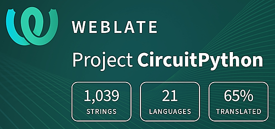](https://hosted.weblate.org/engage/circuitpython/)

One important feature of CircuitPython is translated control and error messages. With the help of fellow open source project [Weblate](https://weblate.org/), we're making it even easier to add or improve translations. 

Sign in with an existing account such as GitHub, Google or Facebook and start contributing through a simple web interface. No forks or pull requests needed! As always, if you run into trouble join us on [Discord](https://adafru.it/discord), we're here to help.

## NUMBER Thanks

The Adafruit Discord community, where we do all our CircuitPython development in the open, reached over NUMBER humans - thank you! Adafruit believes Discord offers a unique way for Python on hardware folks to connect. Join today at [https://adafru.it/discord](https://adafru.it/discord).

## ICYMI - In case you missed it

Python on hardware is the Adafruit Python video-newsletter-podcast! The news comes from the Python community, Discord, Adafruit communities and more and is broadcast on ASK an ENGINEER Wednesdays. The complete Python on Hardware weekly videocast [playlist is here](https://www.youtube.com/playlist?list=PLjF7R1fz_OOXRMjM7Sm0J2Xt6H81TdDev). The video podcast is on [iTunes](https://itunes.apple.com/us/podcast/python-on-hardware/id1451685192?mt=2), [YouTube](http://adafru.it/pohepisodes), [Instagram](https://www.instagram.com/adafruit/channel/), and [XML](https://itunes.apple.com/us/podcast/python-on-hardware/id1451685192?mt=2).

[The weekly community chat on Adafruit Discord server CircuitPython channel - Audio / Podcast edition](https://itunes.apple.com/us/podcast/circuitpython-weekly-meeting/id1451685016) - Audio from the Discord chat space for CircuitPython, meetings are usually Mondays at 2pm ET, this is the audio version on [iTunes](https://itunes.apple.com/us/podcast/circuitpython-weekly-meeting/id1451685016), Pocket Casts, [Spotify](https://adafru.it/spotify), and [XML feed](https://adafruit-podcasts.s3.amazonaws.com/circuitpython_weekly_meeting/audio-podcast.xml).

## Contribute

The CircuitPython Weekly Newsletter is a CircuitPython community-run newsletter emailed every Monday. To contribute your content, please email your news to cpnews (at) adafruit (dot) com with information and link(s) to your content. 

Join the Adafruit [Discord](https://adafru.it/discord) or [post to the forum](https://forums.adafruit.com/viewforum.php?f=60) if you have questions.
