- [ ] Library and info updates
- [ ] change date
- [ ] update title
- [ ] Feature story
- [ ] Update  for images
- [ ] Update ICYDNCI
- [ ] All images 550w max only
- [ ] Link "View this email in your browser."

News Sources

- [Adafruit Playground](https://adafruit-playground.com/)
- Twitter: [CircuitPython](https://twitter.com/search?q=circuitpython&src=typed_query&f=live), [MicroPython](https://twitter.com/search?q=micropython&src=typed_query&f=live) and [Python](https://twitter.com/search?q=python&src=typed_query)
- [Raspberry Pi News](https://www.raspberrypi.com/news/), [Pi Foundation](https://www.raspberrypi.org/blog/)
- Mastodon [CircuitPython](https://mastodon.social/tags/CircuitPython) and [MicroPython](https://mastodon.social/tags/MicroPython)
- BlueSky [CircuitPython](https://bsky.app/search?q=circuitpython), [MicroPython](https://bsky.app/search?q=micropython), [Raspberry Pi](https://bsky.app/search?q=raspberry+pi)
- [Google News Python](https://news.google.com/topics/CAAqIQgKIhtDQkFTRGdvSUwyMHZNRFY2TVY4U0FtVnVLQUFQAQ?hl=en-US&gl=US&ceid=US%3Aen)
- YouTube: [CircuitPython](https://www.youtube.com/results?search_query=circuitpython&sp=CAISBAgDEAE%253D), [MicroPython](https://www.youtube.com/results?search_query=micropython&sp=CAISBAgDEAE%253D), [Prof Gallaugher](https://www.youtube.com/@BuildWithProfG/videos)
- [maker.io Python](https://www.digikey.com/en/maker/search-results?s=createdDate&t=python)
- [hackster.io CircuitPython](https://www.hackster.io/search?q=circuitpython&i=projects&sort_by=most_recent) and [MicroPython](https://www.hackster.io/search?q=micropython&i=projects&sort_by=most_recent)
- Instructables: [CircuitPython](https://www.instructables.com/search/?q=circuitpython&projects=all&sort=Newest), [MicroPython](https://www.instructables.com/search/?q=micropython&projects=all&sort=Newest), [Raspberry Pi Python](https://www.instructables.com/search/?q=raspberry+pi+python&projects=all&sort=Newest)
- [hackaday CircuitPython](https://hackaday.com/blog/?s=circuitpython) and [MicroPython](https://hackaday.com/blog/?s=micropython)
- [python.org](https://www.python.org/)
- [Python Insider - dev team blog](https://pythoninsider.blogspot.com/)
- Individuals: [bret.dk](https://bret.dk/), [Jeff Geerling](https://www.jeffgeerling.com/blog), [Yakroo](https://x.com/Yakroo5077), [coXXect](https://coxxect.blogspot.com/)
- Tom's Hardware: [CircuitPython](https://www.tomshardware.com/search?searchTerm=circuitpython&articleType=all&sortBy=publishedDate) and [MicroPython](https://www.tomshardware.com/search?searchTerm=micropython&articleType=all&sortBy=publishedDate) and [Raspberry Pi](https://www.tomshardware.com/search?searchTerm=raspberry%20pi&articleType=all&sortBy=publishedDate)
- [hackaday.io newest projects MicroPython](https://hackaday.io/projects?tag=micropython&sort=date) and [CircuitPython](https://hackaday.io/projects?tag=circuitpython&sort=date)
- hackaday.io - [CircuitPython](https://hackaday.io/search?term=circuitpython) and [MicroPython](https://hackaday.io/search?term=micropython)
- [MicroPython Meeting](https://luma.com/micropython?k=c)

View this email in your browser. **Warning: Flashing Imagery**

Welcome to the latest Python on Microcontrollers newsletter! *insert 2-3 sentences from editor (what's in overview, banter)* - *Anne Barela, Editor*

We're on [Discord](https://discord.gg/HYqvREz), [Twitter/X](https://twitter.com/search?q=circuitpython&src=typed_query&f=live), [BlueSky](https://bsky.app/profile/circuitpython.org) and for past newsletters - [view them all here](https://www.adafruitdaily.com/category/circuitpython/). If you're reading this on the web, please [subscribe here](https://www.adafruitdaily.com/). Here's the news this week:

## Python Projects for Raspberry Pi: The Book You’ve Been Waiting For to Level Up Your Skills

[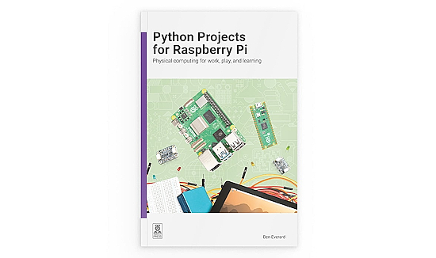](https://www.raspberrypi.com/news/python-projects-for-raspberry-pi/)

Made for those of you who ask “What next?” after learning the basics, this book is full of practical, hands-on Python and MicroPython projects to teach you how to use the more advanced capabilities of Raspberry Pi computers and microcontrollers. Use a variety of sensors, displays, and actuators, and take a deep dive into PIO (Programmable Input/Output) along the way - [Raspberry Pi News](https://www.raspberrypi.com/news/python-projects-for-raspberry-pi/).

## The Espressif CoreBoard 1 is the First ESP31-S31 Reference Board

[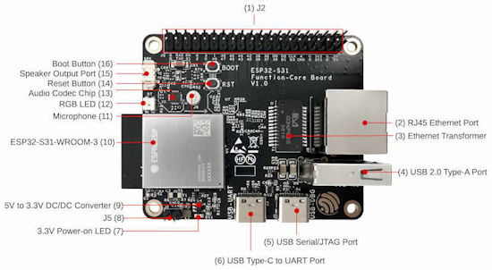](https://www.i-programmer.info/news/91-hardware/18909-coreboard-1-makes-the-new-esp32-s31-top-of-the-s-family.html)

While a couple of ESP32-S31 devices have had brief glimpses to date, the Espressif official reference device has appeared: the CoreBoard 1. It has GPIO lines brought out via a double row header with built-in DACs: two 10-bit and two 12-bit. Two type A USB connectors provide a USB serial port and a serial/JTAG port.There is also a full size USB 2.0 Type-A port and an RJ45 wired GigaBit Ethernet port - [i-programmer.info](https://www.i-programmer.info/news/91-hardware/18909-coreboard-1-makes-the-new-esp32-s31-top-of-the-s-family.html) and [Espressif](https://docs.espressif.com/projects/esp-dev-kits/en/latest/esp32s31/esp32-s31-function-coreboard-1/index.html).

## BugBuster Gives AI the Tools to Debug Physical Hardware

[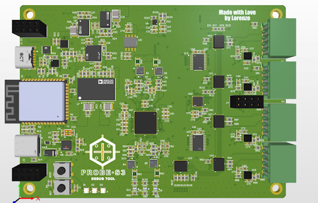](https://www.hackster.io/news/bugbuster-gives-ai-the-tools-to-debug-physical-hardware-f4fd22236ce4)

A new open source project called BugBuster is trying to provide ways for AI models to measure, control, and debug real hardware. The hardware platform, developed by Lorenzo Karavania, is able to interact with popular AI assistants, such as Claude, through a Model Context Protocol (MCP) server. This allows the AI to measure voltages, drive outputs, capture waveforms, and analyze digital signals as needed to debug hardware issues autonomously via an ESP32 and an RP2040 and software including Python/MicroPython - [GitHub](https://www.hackster.io/news/bugbuster-gives-ai-the-tools-to-debug-physical-hardware-f4fd22236ce4). Via [hackster.io](https://www.hackster.io/news/bugbuster-gives-ai-the-tools-to-debug-physical-hardware-f4fd22236ce4).

## Meatdryer, A Product Built With CircuitPython

[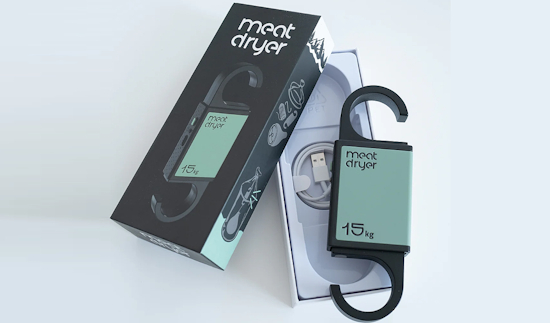](https://meatdryer.com/)

Daniel Alsén developed Meatdryer with CircuitPython and a bunch of Adafruit boards in a garage in Sweden, for personal use, without any intent to launch a product. Now it's a commercial product, a smart hook to cure meat at home, like Prosciutto, Bresaola, cured Biltong and even full Parma Hams. It tells you when your meat is ready by using target weight (e.g., 60%) and climate monitoring. You can use it with or without WiFi - [Meatdryer](https://meatdryer.com/).

## Microsoft Introduces Coreutils for Windows, Bringing Familiar Unix-style Command-line Tools to Windows Without Requiring WSL

Microsoft has introduced Coreutils for Windows, a new Microsoft-maintained set of Unix-style command-line utilities that run natively on Windows. It requires PowerShell 7.4 or later, and some commands conflict with existing CMD or PowerShell built-ins and aliases - [Linuxiac](https://linuxiac.com/microsoft-brings-linux-like-coreutils-natively-to-windows/), [YouTube](https://www.youtube.com/watch?v=_bcFOTI35gI), [The Verge](https://www.theverge.com/news/941314/microsoft-windows-11-developer-optimized-experience-linux) and [GitHub](https://github.com/microsoft/coreutils). Via the [Adafruit Blog](https://blog.adafruit.com/2026/06/03/microsoft-introduces-coreutils-for-windows-bringing-familiar-unix-style-command-line-tools-to-windows-without-requiring-wsl/).

## Run Python Code in a MicroPython/WASM Sandbox

[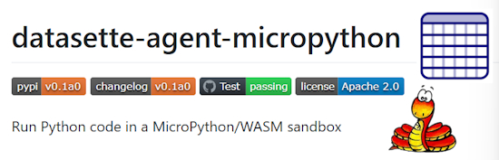](https://github.com/datasette/datasette-agent-micropython)

`datasette-agent-micropython` run Python code in a MicroPython/WASM sandbox in a browser. The plugin adds an `execute_micropython` tool to a Datasette Agent. The tool runs Python code using a sandboxed MicroPython interpreter compiled to WASM. It may be used for pure computation, parsing, data transformation, math, and checking algorithms. Output is captured from stdout and stderr, so code should use `print()` to return values - [GitHub](https://github.com/datasette/datasette-agent-micropython).

## AI and Python Weekly Round Up

Here's a condensed wrap-up of interesting AI/LLM articles from this week.

I asked Gemini, Claude, and ChatGPT to debug the same Python error, and only two explained what actually broke - [Make Use Of](https://www.makeuseof.com/asked-gemini-claude-chatgpt-debug-python-error-two-explained-what-broke/).

Cognition’s Scott Wu says AI coding agents shouldn’t replace humans - [TechCrunch](https://techcrunch.com/2026/05/29/cognitions-scott-wu-says-ai-coding-agents-shouldnt-replace-humans/).

Coders are refusing to work without AI — and that could come back to bite them  - [TechCrunch](https://techcrunch.com/2026/05/29/coders-are-refusing-to-work-without-ai-and-that-could-come-back-to-bite-them/).

[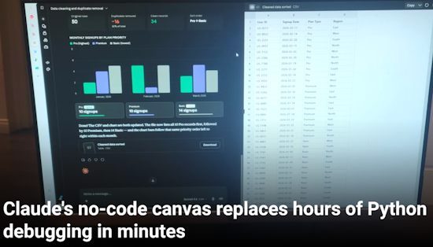](https://www.howtogeek.com/claudes-no-code-canvas-replaces-hours-of-python-debugging-in-minutes/)

Cleaning massive, disorganized spreadsheets or parsing through thousands of lines of raw server logs is annoying. You can do it yourself, make a program to do it, or you can just give it to Claude and ask it to fix your problems. Claude has a built-in execution canvas that handles smaller tasks. It's a sandboxed processing environment that lives right inside your chat window, so you can drop in files and use plain language to make the fixes you need - [How-To Geek](https://www.howtogeek.com/claudes-no-code-canvas-replaces-hours-of-python-debugging-in-minutes/).

> "You don't have a Python environment to configure, no matplotlib syntax to remember, and no pandas documentation to dig through. It is great for people who have a simple project to get through and just want to see a final result, or those who want to see a prototype of their idea before they build it."

## This Week's Python Streams

Python on Hardware is all about building a cooperative ecosphere which allows contributions to be valued and to grow knowledge. Below are the streams within the last week focusing on the community.

**CircuitPython Deep Dive Stream**

[Last Friday](https://youtube.com/live/RwSnIbqSSn4), Tim filled in for Scott and discussed his work on hardware-in-the-loop (HIL) testing for CircuitPython libraries with PyTest.

You can see the latest video and past videos on the Adafruit YouTube channel under the Deep Dive playlist - [YouTube](https://www.youtube.com/playlist?list=PLjF7R1fz_OOXBHlu9msoXq2jQN4JpCk8A).

**CircuitPython Parsec**

John Park’s CircuitPython Parsec this week is on LCD Character Display Animation - [Adafruit Blog](https://blog.adafruit.com/2026/06/05/john-parks-circuitpython-parsec-lcd-character-display-animation/) and [YouTube](https://youtu.be/Us6NrdmzLGI?si=_8tt8DGQIBLaEXtn).

Catch all the episodes in the [YouTube playlist](https://www.youtube.com/playlist?list=PLjF7R1fz_OOWFqZfqW9jlvQSIUmwn9lWr).

**Deep Dive with Tim**

[Last week](https://youtube.com/live/TjXhl0cq8tg), Tim streamed work on Web Workflow Pytest Integration.

You can see the latest video and past videos on the Adafruit YouTube channel under the Deep Dive playlist - [YouTube](https://www.youtube.com/playlist?list=PLjF7R1fz_OOWFqZfqW9jlvQSIUmwn9lWr).

## Project of the Week: Web-Based Control For a CB Radio

[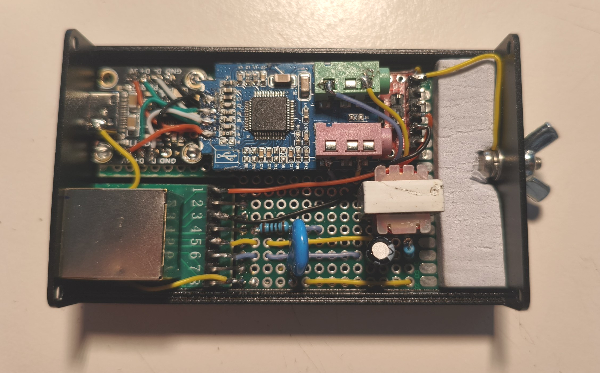](https://github.com/ThatCrazyDcGuy/AE5900_Remote_V2)

Mario (ThatCrazyDcGuy) has an Albrecht AE-5900 citizen band radio which has the interesting feature that it can be entirely controlled from its microphone. This led to a web-based interface for the rig, through clever emulation of the microphone with a single board computer and Python - [GitHub](https://github.com/ThatCrazyDcGuy/AE5900_Remote_V2) and [Hackaday](https://hackaday.com/2026/06/03/web-based-control-for-a-cb-radio/).

## Popular Last Week

What was the most popular, most clicked link, in [last week's newsletter](https://www.adafruitdaily.com/2026/06/01/python-on-microcontrollers-newsletter-a-new-circuitpython-editor-ai-on-the-edge-and-projects-galore/)? [Rovari RV Circuit Studio Purports to Replace Mu for CircuitPython Editing](https://github.com/ArmstrongSubero/rvcircuit-studio).

Did you know you can read past issues of this newsletter in the Adafruit Daily Archive? [Check it out](https://www.adafruitdaily.com/category/circuitpython/).

## New Notes from Adafruit Playground

[Adafruit Playground](https://adafruit-playground.com/) is a new place for the community to post their projects and other making tips/tricks/techniques. Ad-free, it's an easy way to publish your work in a safe space for free.

[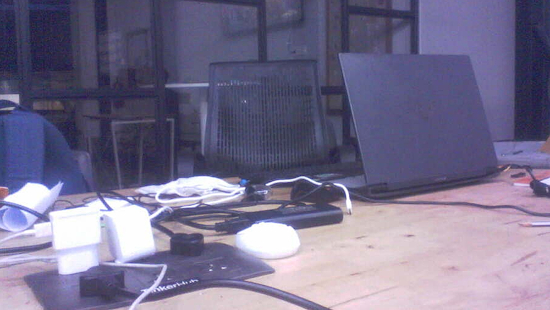](https://adafruit-playground.com/u/_MightyThor_/pages/the-student-flexible-camera-memento-flex)

The Student Flexible Camera-Memento-Flex - [Adafruit Playground](https://adafruit-playground.com/u/_MightyThor_/pages/the-student-flexible-camera-memento-flex).

## News From Around the Web

[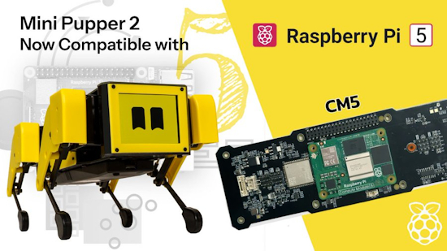](https://github.com/mangdangroboticsclub/mini_pupper_2_bsp/pull/72)

Mini Pupper 2 upgrades from Raspberry Pi CM4 to the beefier CM5 with Ubuntu 24.04 support - [GitHub](https://github.com/mangdangroboticsclub/mini_pupper_2_bsp). Via [X](https://x.com/LeggedRobot/status/2062519235801436464).

[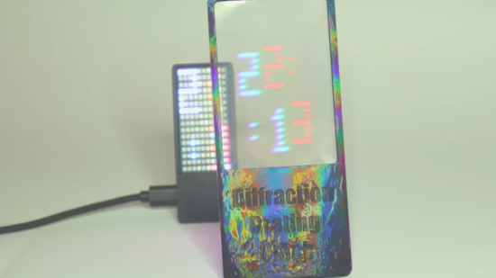](https://www.instructables.com/Diffraction-Grating-Clock/)

A diffraction grating clock using MicroPython on a Raspberry Pi Pico W - [Instructables](https://www.instructables.com/Diffraction-Grating-Clock/), [GitHub](https://github.com/vonsivers/DiffractionGratingClock) and [YouTube](https://youtu.be/1DD9vaVy1H8?si=Tc2agLc8syIkbmw2). Via [Hackaday](https://hackaday.com/2026/06/03/a-diffraction-grating-makes-this-clock-readable/).

[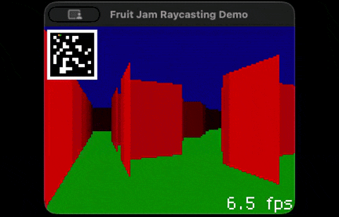](https://github.com/relic-se/Fruit_Jam_Raycast)

Cooper Dalrymple was inspired by the recent Doom on Neo Geo video by modernvintagegamer.com to get some raycasting working on the Adafruit FruitJam using CircuitPython. It runs at about 3 fps on real hardware - [GitHub](https://github.com/relic-se/Fruit_Jam_Raycast). Via [BlueSky](https://bsky.app/profile/dcdalrymple.com/post/3mndv2p3un22p).

[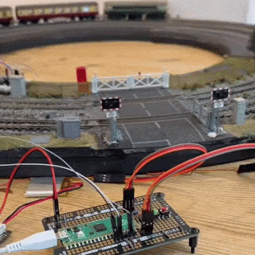](https://x.com/PaterPracticus/status/2062894280872481035)

@PaterPracticus on X (formerly Twitter) posts a MicroPython project "My level crossing is finally fully automated! Not without a few hiccups along the way, but my existing Raspberry Pi Pico now triggers the one for the servos, just in time to close the gates before the train comes, opening them again after it has completely passed." - [X](https://x.com/PaterPracticus/status/2062894280872481035).

[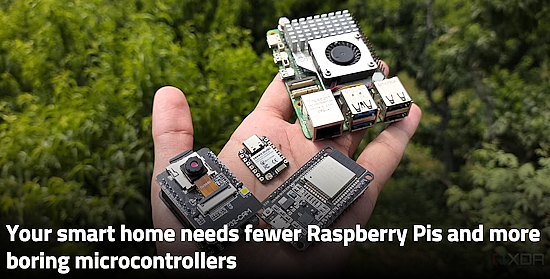](https://www.xda-developers.com/your-smart-home-needs-fewer-raspberry-pis-and-more-microcontrollers/)

Your smart home needs fewer Raspberry Pis and more boring microcontrollers - [XDA](https://www.xda-developers.com/your-smart-home-needs-fewer-raspberry-pis-and-more-microcontrollers/).

Why ESP32 boards are replacing Raspberry Pi for wireless projects - [How-To Geek](https://www.howtogeek.com/esp32-boards-replacing-raspberry-pi/).

[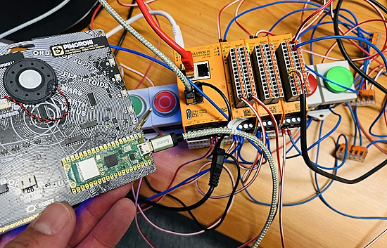](https://x.com/r_schulz_maker/status/2062895316639084982)

Roland Schulzposts "Just connected a Pimoroni Stellar Unicorn to a Raspberry Pi Revolution Pi via USB serial, and it was easy! BME680 sensor data flows straight into NodeRED, visualized on the Dashboard, and the exact same values are live on the Stellar Unicorn’s LED matrix. #maker #micropython" - [X](https://x.com/r_schulz_maker/status/2062895316639084982).

[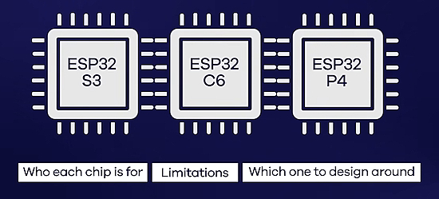](https://www.youtube.com/watch?v=KRolCZ0ksPU)

ESP32-S3 vs. ESP32-C6 vs. ESP32-P4: Which one for your product? - [YouTube](https://www.youtube.com/watch?v=KRolCZ0ksPU).

[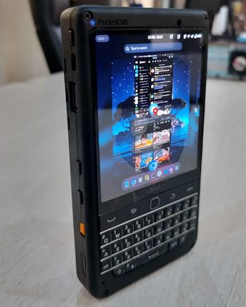](https://daily-gadget.net/gadgets/115329/)

The piBrick Pocket-CM5 is a $172 compact DIY handheld PC featuring the latest Raspberry Pi CM5 as its core and is characterized by its physical keyboard and AMOLED (organic EL) display - [Daily Gadget](https://daily-gadget.net/gadgets/115329/) (Japanese) and [Yanko Design](https://www.yankodesign.com/2026/06/03/this-172-raspberry-pi-handheld-doubles-as-a-usb-keyboard/) (English).

[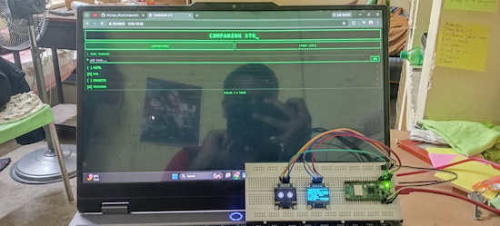](https://github.com/kritishmohapatra/PicoDesk)

PicoDesk is a retro terminal style desktop companion station built with Raspberry Pi Pico 2W, MicroPython and two SSD1306 OLED displays. It shows live time, date, weather on one screen and animated eyes, heart rain, and a mobile controlled todo list on the other - [GitHub](https://github.com/kritishmohapatra/PicoDesk). Via [X](https://x.com/0D_KR/status/2061390266104525197).

[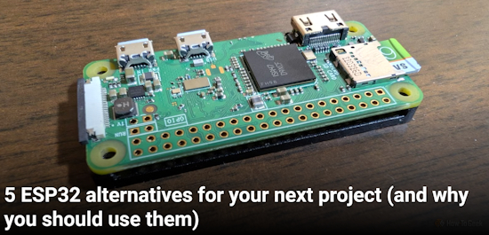](https://www.howtogeek.com/esp32-alternatives-for-your-next-project-and-why-you-should-use-them/)

5 ESP32 alternatives for your next project (and why you should use them) - [How-to Geek](https://www.howtogeek.com/esp32-alternatives-for-your-next-project-and-why-you-should-use-them/).

[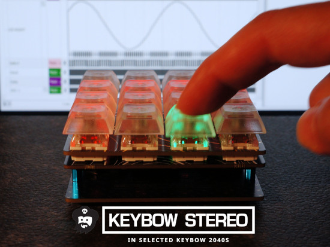](https://www.instructables.com/Keybow-2040-I2S-Stereo-Speakers-Macropad-Addition/)

A second look at adding audio to the Pimoroni Keybow 2040 (macropad). this time with digital audio using an I2S stereo audio amplifier board based on a pair of Analog Devices MAX98357A chips - [Instructables](https://www.instructables.com/Keybow-2040-I2S-Stereo-Speakers-Macropad-Addition/).

[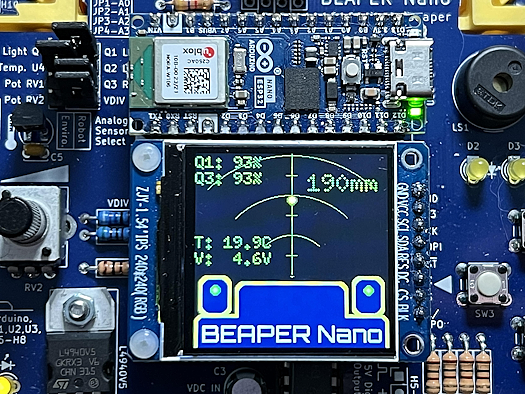](https://github.com/mirobotech/BEAPER-Nano/tree/main/MicroPython/VL53L4CD)

A radar-like parameter display in MicroPython using either a VL53L0X, VL53L4CD, or SONAR distance sensor - [GitHub](https://github.com/mirobotech/BEAPER-Nano/tree/main/MicroPython/VL53L4CD). Via [Mastodon](https://mastodon.social/tags/MicroPython).

text - [site](url).

[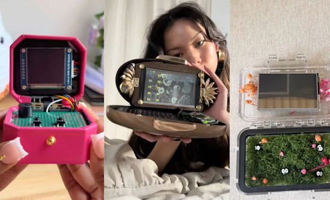](https://www.theverge.com/tech/943445/cyberdeck-tiktok)

Cyberdecks used to look like little laptops, but now they’re getting more personal - [The Verge](https://www.theverge.com/tech/943445/cyberdeck-tiktok).

[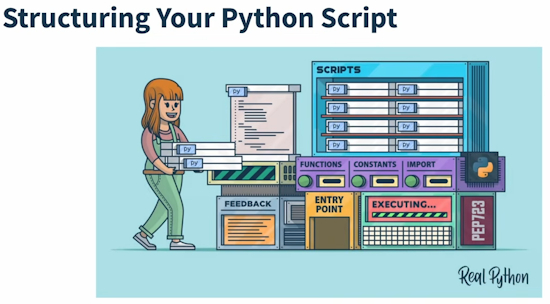](https://www.youtube.com/watch?v=_FzqRlBjRJQ)

Structuring your Python script: Making your file executable with a shebang & using Import statements - [YouTube](https://www.youtube.com/watch?v=_FzqRlBjRJQ).

[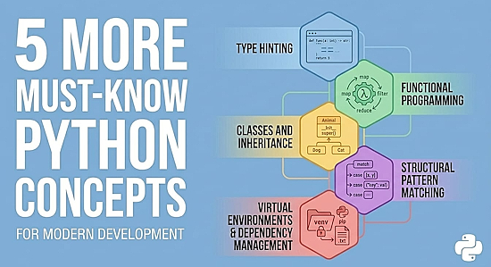](https://www.kdnuggets.com/5-more-must-know-python-concepts)

Five more must-know Python concepts - [KDnuggets](https://www.kdnuggets.com/5-more-must-know-python-concepts).

nVidia CUDA 13.3 enhances GPU development with tile programming in C++, compiler autotuning, and Python updates - [nVidia Developer](https://developer.nvidia.com/blog/nvidia-cuda-13-3-enhances-gpu-development-with-tile-programming-in-c-compiler-autotuning-and-python-updates/).

SQL rivals Python as America’s most in-demand programming language – and it’s needed far beyond Silicon Valley - [Yahoo! Finance](https://finance.yahoo.com/sectors/technology/articles/research-sql-rivals-python-america-131700698.html).

## New

[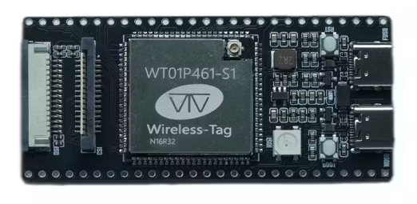](https://www.hackster.io/news/the-40-dev-board-that-does-it-all-4871193d0d69)

The ESP32P4C61-TINY is equipped with an ESP32-P4 and an ESP32-C61 microcontroller. Both chips are housed in the onboard Wireless-Tag WT01P461-S1 module. The ESP32-P4 provides a dual-core RISC-V processor running at 400 MHz with up to 32MB of PSRAM and 16MB of flash memory. The ESP32-C61 is included for wireless networking with both Wi-Fi 6 and Bluetooth Low Energy 5 radios. The board is also equipped with exposed GPIO pins, a MIPI DSI display connector, a MIPI CSI camera connector, dual USB-C ports, and a microSD card slot - [hackster.io](https://www.hackster.io/news/the-40-dev-board-that-does-it-all-4871193d0d69).

[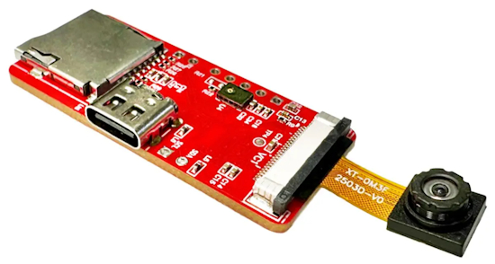](https://www.cnx-software.com/2026/06/01/nuvoton-numaker-gestureai-m55m1-module-combines-cortex-m55-mcu-with-gc0308-camera-for-ai-gesture-control/)

The NuMaker-GestureAI-M55M1 integrates the M55M1 MCU (Cortex-M55 MCU @ 220 MHz, 1.5 MB SRAM, 2MB Flash) with a GC0308 CMOS image sensor, a digital microphone, and a microSD card slot for storing AI models. It is designed for applications such as gesture control, basic vision systems, and touchless interfaces - [CNX](https://www.cnx-software.com/2026/06/01/nuvoton-numaker-gestureai-m55m1-module-combines-cortex-m55-mcu-with-gc0308-camera-for-ai-gesture-control/).

## New Boards Supported by CircuitPython

The number of supported microcontrollers and Single Board Computers (SBC) grows every week. This section outlines which boards have been included in CircuitPython or added to [CircuitPython.org](https://circuitpython.org/).

This week there were (#/no) new boards added:

- [Board name](url)
- [Board name](url)
- [Board name](url)

*Note: For non-Adafruit boards, please use the support forums of the board manufacturer for assistance, as Adafruit does not have the hardware to assist in troubleshooting.*

Looking to add a new board to CircuitPython? It's highly encouraged! Adafruit has four guides to help you do so:

- [How to Add a New Board to CircuitPython](https://learn.adafruit.com/how-to-add-a-new-board-to-circuitpython/overview)
- [How to add a New Board to the circuitpython.org website](https://learn.adafruit.com/how-to-add-a-new-board-to-the-circuitpython-org-website)
- [Adding a Single Board Computer to PlatformDetect for Blinka](https://learn.adafruit.com/adding-a-single-board-computer-to-platformdetect-for-blinka)
- [Adding a Single Board Computer to Blinka](https://learn.adafruit.com/adding-a-single-board-computer-to-blinka)

## New Adafruit Learning System Guides

The [Adafruit Learning System](https://learn.adafruit.com/) has over 3,200 free guides for learning skills and building projects including using Python.

[title](url) from [name](url)

[title](url) from [name](url)

[title](url) from [name](url)

## Updated Learn Guides

[title](url)

## CircuitPython Libraries

The CircuitPython library numbers are continually increasing, while existing ones continue to be updated. Here we provide library numbers and updates!

To get the latest Adafruit libraries, download the [Adafruit CircuitPython Library Bundle](https://circuitpython.org/libraries). To get the latest community contributed libraries, download the [CircuitPython Community Bundle](https://circuitpython.org/libraries).

If you'd like to contribute to the CircuitPython project on the Python side of things, the libraries are a great place to start. Check out the [CircuitPython.org Contributing page](https://circuitpython.org/contributing). If you're interested in reviewing, check out Open Pull Requests. If you'd like to contribute code or documentation, check out Open Issues. We have a guide on [contributing to CircuitPython with Git and GitHub](https://learn.adafruit.com/contribute-to-circuitpython-with-git-and-github), and you can find us in the #help-with-circuitpython and #circuitpython-dev channels on the [Adafruit Discord](https://adafru.it/discord).

You can check out this [list of all the Adafruit CircuitPython libraries and drivers available](https://github.com/adafruit/Adafruit_CircuitPython_Bundle/blob/master/circuitpython_library_list.md). 

The current number of CircuitPython libraries is **569**!

**New Libraries**

Here are this week's new CircuitPython libraries:

There are no new CircuitPython libraries this week.

**Updated Libraries**

* [adafruit/Adafruit_CircuitPython_RGB_Display](https://github.com/adafruit/Adafruit_CircuitPython_RGB_Display)

* [adafruit/Adafruit_CircuitPython_PyCamera](https://github.com/adafruit/Adafruit_CircuitPython_PyCamera)

## What’s the CircuitPython team up to this week?

What is the team up to this week? Let’s check in:

**Dan**

I fixed several issues, working toward the CircuitPython 10.3.0 release, and also closed several other issues that had been solved since they were filed. As of this writing, there are 49 open issues on the 10.3.0 milestone.

I'm continuing to work on Espressif BLE issues and discussed them with Scott.

**Tim**

This week my PR adding `audioi2sin` module to the core was merged. It supports I2S microphones on absolute newest builds. I fixed an issue with the Circup docs build inside of Read The Docs. I also dove much deeper into Ubuntu Core to figure out how to create custom images with preloaded snaps in them. I'm getting close to having the pages done for a guide that details how to try it out and use Blinka and other CircuitPython libraries with it.

**Scott**

[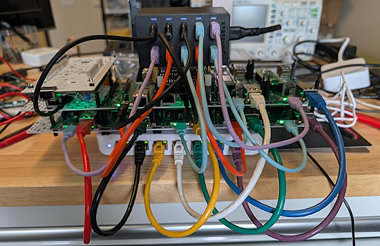](https://www.circuitpython.org/)

This week I've continued testing the P4HIL board. I realized the the pull up resistors network was preventing USB from working on a board that split it out. So, I'm going to revise the board to do per-pin pulls via additional IO expanders. This is more flexible and prevents cross talk between pins.

I also put all 10 HIL boards together on two swirly grids to see the Ethernet and USB wiring situation. It is pretty busy, but it is the best way to go, I think. Dan and I discussed it and thought using off the shelf Ethernet switches and USB chargers were the best approach. We also found a Kallax shelf insert that will help stack the switch and charger around the swirly grids.

## Upcoming Events

The next MicroPython Meetup in Melbourne will be on June 24 – [Luma](https://luma.com/micropython). You can see recordings of previous meetings on [YouTube](https://www.youtube.com/@MicroPythonOfficial). 

[EuroPython 2026](https://ep2026.europython.eu/) is coming to Kraków, Poland 13-19 July, 2026. Join thousands of Python enthusiasts for a week of learning, networking, and community.

**Other Events This Year**

* [PyOhio 2026](https://www.pyohio.org/2026/) is from 25 July through 26 July, 2026 this year in Cleveland, USA.
* [HOPE 26 Conference](https://store.2600.com/products/tickets-to-hope-26) is from August 14th through 16th at the New Yorker Hotel, NY, NY.
* [PyCon AU 2026](https://2026.pycon.org.au/) will be 26 Aug. 2026 – 30 Aug. 2026 in Brisbane, Australia

If you know of virtual events or upcoming events, please let us know via email to cpnews(at)adafruit(dot)com.

## Latest Releases

CircuitPython's stable release is [10.2.1](https://github.com/adafruit/circuitpython/releases/tag/10.2.1) and its unstable release is [10.3.0-alpha.2](https://github.com/adafruit/circuitpython/releases/tag/10.3.0-alpha.2). New to CircuitPython? Start with our [Welcome to CircuitPython Guide](https://learn.adafruit.com/welcome-to-circuitpython).
 
[20260603](https://github.com/adafruit/Adafruit_CircuitPython_Bundle/releases/latest) is the latest Adafruit CircuitPython library bundle.
 
[20260523](https://github.com/adafruit/CircuitPython_Community_Bundle/releases/latest) is the latest CircuitPython Community library bundle.
 
[v1.28.0](https://micropython.org/download) is the latest MicroPython release. Documentation for it is [here](http://docs.micropython.org/en/latest/pyboard/).
 
[3.14.5](https://www.python.org/downloads/) is the latest Python release. The latest pre-release version is [3.15.0b2](https://www.python.org/download/pre-releases/).
 
[4,508 Stars](https://github.com/adafruit/circuitpython/stargazers) Like CircuitPython? [Star it on GitHub!](https://github.com/adafruit/circuitpython)

## Call for Help -- Translating CircuitPython is now easier than ever

[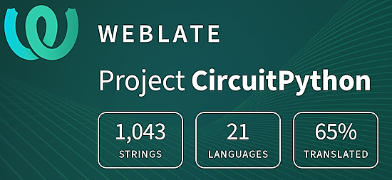](https://hosted.weblate.org/engage/circuitpython/)

One important feature of CircuitPython is translated control and error messages. With the help of fellow open source project [Weblate](https://weblate.org/), we're making it even easier to add or improve translations. 

Sign in with an existing account such as GitHub, Google or Facebook and start contributing through a simple web interface. No forks or pull requests needed! As always, if you run into trouble join us on [Discord](https://adafru.it/discord), we're here to help.

## NUMBER Thanks

The Adafruit Discord community, where we do all our CircuitPython development in the open, reached over NUMBER humans - thank you! Adafruit believes Discord offers a unique way for Python on hardware folks to connect. Join today at [https://adafru.it/discord](https://adafru.it/discord).

## ICYMI - In case you missed it

Python on hardware is the Adafruit Python video-newsletter-podcast! The news comes from the Python community, Discord, Adafruit communities and more and is broadcast on ASK an ENGINEER Wednesdays. The complete Python on Hardware weekly videocast [playlist is here](https://www.youtube.com/playlist?list=PLjF7R1fz_OOXRMjM7Sm0J2Xt6H81TdDev). The video podcast is on [iTunes](https://itunes.apple.com/us/podcast/python-on-hardware/id1451685192?mt=2), [YouTube](http://adafru.it/pohepisodes), [Instagram](https://www.instagram.com/adafruit/channel/), and [XML](https://itunes.apple.com/us/podcast/python-on-hardware/id1451685192?mt=2).

[The weekly community chat on Adafruit Discord server CircuitPython channel - Audio / Podcast edition](https://itunes.apple.com/us/podcast/circuitpython-weekly-meeting/id1451685016) - Audio from the Discord chat space for CircuitPython, meetings are usually Mondays at 2pm ET, this is the audio version on [iTunes](https://itunes.apple.com/us/podcast/circuitpython-weekly-meeting/id1451685016), Pocket Casts, [Spotify](https://adafru.it/spotify), and [XML feed](https://adafruit-podcasts.s3.amazonaws.com/circuitpython_weekly_meeting/audio-podcast.xml).

## Contribute

The CircuitPython Weekly Newsletter is a CircuitPython community-run newsletter emailed every Monday. To contribute your content, please email your news to cpnews (at) adafruit (dot) com with information and link(s) to your content. 

Join the Adafruit [Discord](https://adafru.it/discord) or [post to the forum](https://forums.adafruit.com/viewforum.php?f=60) if you have questions.
