- [ ] Library and info updates
- [ ] change date
- [ ] update title
- [ ] Feature story
- [ ] Update  for images
- [ ] Update ICYDNCI
- [ ] All images 550w max only
- [ ] Link "View this email in your browser."

News Sources

- [Adafruit Playground](https://adafruit-playground.com/)
- Twitter: [CircuitPython](https://twitter.com/search?q=circuitpython&src=typed_query&f=live), [MicroPython](https://twitter.com/search?q=micropython&src=typed_query&f=live) and [Python](https://twitter.com/search?q=python&src=typed_query)
- [Raspberry Pi News](https://www.raspberrypi.com/news/), [Pi Foundation](https://www.raspberrypi.org/blog/)
- Mastodon [CircuitPython](https://mastodon.social/tags/CircuitPython) and [MicroPython](https://mastodon.social/tags/MicroPython)
- BlueSky [CircuitPython](https://bsky.app/search?q=circuitpython), [MicroPython](https://bsky.app/search?q=micropython), [Raspberry Pi](https://bsky.app/search?q=raspberry+pi)
- [Google News Python](https://news.google.com/topics/CAAqIQgKIhtDQkFTRGdvSUwyMHZNRFY2TVY4U0FtVnVLQUFQAQ?hl=en-US&gl=US&ceid=US%3Aen)
- YouTube: [CircuitPython](https://www.youtube.com/results?search_query=circuitpython&sp=CAISBAgDEAE%253D), [MicroPython](https://www.youtube.com/results?search_query=micropython&sp=CAISBAgDEAE%253D), [Prof Gallaugher](https://www.youtube.com/@BuildWithProfG/videos)
- [maker.io Python](https://www.digikey.com/en/maker/search-results?s=createdDate&t=python)
- [hackster.io CircuitPython](https://www.hackster.io/search?q=circuitpython&i=projects&sort_by=most_recent) and [MicroPython](https://www.hackster.io/search?q=micropython&i=projects&sort_by=most_recent)
- Instructables: [CircuitPython](https://www.instructables.com/search/?q=circuitpython&projects=all&sort=Newest), [MicroPython](https://www.instructables.com/search/?q=micropython&projects=all&sort=Newest), [Raspberry Pi Python](https://www.instructables.com/search/?q=raspberry+pi+python&projects=all&sort=Newest)
- [hackaday CircuitPython](https://hackaday.com/blog/?s=circuitpython) and [MicroPython](https://hackaday.com/blog/?s=micropython)
- [python.org](https://www.python.org/)
- [Python Insider - dev team blog](https://pythoninsider.blogspot.com/)
- Individuals: [bret.dk](https://bret.dk/), [Jeff Geerling](https://www.jeffgeerling.com/blog), [Yakroo](https://x.com/Yakroo5077), [coXXect](https://coxxect.blogspot.com/)
- Tom's Hardware: [CircuitPython](https://www.tomshardware.com/search?searchTerm=circuitpython&articleType=all&sortBy=publishedDate) and [MicroPython](https://www.tomshardware.com/search?searchTerm=micropython&articleType=all&sortBy=publishedDate) and [Raspberry Pi](https://www.tomshardware.com/search?searchTerm=raspberry%20pi&articleType=all&sortBy=publishedDate)
- [hackaday.io newest projects MicroPython](https://hackaday.io/projects?tag=micropython&sort=date) and [CircuitPython](https://hackaday.io/projects?tag=circuitpython&sort=date)
- hackaday.io - [CircuitPython](https://hackaday.io/search?term=circuitpython) and [MicroPython](https://hackaday.io/search?term=micropython)
- [MicroPython Meeting](https://luma.com/micropython?k=c)

View this email in your browser. **Warning: Flashing Imagery**

Welcome to the latest Python on Microcontrollers newsletter! *insert 2-3 sentences from editor (what's in overview, banter)* - *Anne Barela, Editor*

We're on [Discord](https://discord.gg/HYqvREz), [Twitter/X](https://twitter.com/search?q=circuitpython&src=typed_query&f=live), [BlueSky](https://bsky.app/profile/circuitpython.org) and for past newsletters - [view them all here](https://www.adafruitdaily.com/category/circuitpython/). If you're reading this on the web, please [subscribe here](https://www.adafruitdaily.com/). Here's the news this week:

## Python JIT compiler project under threat after steering council says proper process wasn't followed

[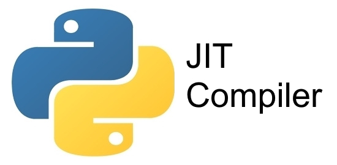](https://www.theregister.com/devops/2026/06/08/python-jit-compiler-may-be-removed/5252079)

The Python steering council has surprised onlookers by asking for the suspension of new development on the JIT (just in time) compiler project from the main branch of the Python code repository, pending creation and acceptance of a new PEP (Python enhancement proposal) for the project. The announcement is unexpected because an improved JIT compiler is one of the key features of Python 3.15, for which features are frozen, and for which full release is expected in October - [The Register](https://www.theregister.com/devops/2026/06/08/python-jit-compiler-may-be-removed/5252079).

## Feature

text - [site](url).

## RoSys - The Python-Based Robot Operating System

RoSys provides an easy-to-use robot system based on Python. Its purpose is similar to ROS, but RoSys is fully based on modern web technologies and focusses on mobile robotics - [RoSys.io](https://rosys.io/) and [GitHub](https://github.com/zauberzeug/rosys).

## Docker for Microcontrollers? AkiraOS combines Zephyr RTOS with WebAssembly (WASM) applications

AkiraOS is a Zephyr-based embedded OS that runs sandboxed WebAssembly applications on microcontrollers and lets users deploy and update firmware OTA without reflashing. In other words, it’s similar to Docker containers, but for microcontrollers. The open-source embedded platform separates the OS from the application. That means the firmware stays stable, while apps are independent .wasm binaries deployable over-the-air without touching the OS, and portable so a single binary works on ESP32-S3, nRF5x, or STM32 MCU boards - [CNX](https://www.cnx-software.com/2026/06/06/docker-for-microcontrollers-akiraos-combines-zephyr-rtos-with-webassembly-wasm-applications/).

## The Raspberry Pi 6 Delay Until 2028 Solves a Problem Nobody's Talking About

[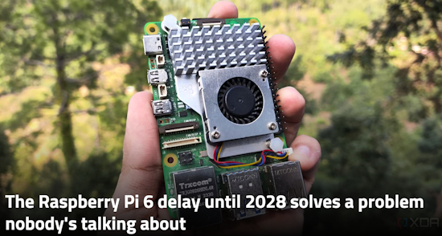](https://www.xda-developers.com/raspberry-pi-6-delay-until-2028-solves-a-problem-nobodys-talking-about/)

Raspberry Pi 5 arrived in 2023, almost three years ago, and brought some interesting changes. The founders recently hinted at the release date of the upcoming version in a Reddit interaction. The company doesn't have plans to release the Raspberry Pi 6 until early 2028. It continues the tradition of a longer wait cycle and is the first good thing to hear about since the unpredictable price surge of Raspberry Pi boards - [XDA](https://www.xda-developers.com/raspberry-pi-6-delay-until-2028-solves-a-problem-nobodys-talking-about/).

> "Raspberry Pi Zero 3W is also not possible in the near future, until the LPDDR4/4X memory prices come down. Design changes would become necessary for the Zero 3W because it would need a separate space for faster memory."

## Why Python Dependency Management Trips Up So Many New Developers

Transitioning to Python as a systems engineer turned analyst can feel like stepping into a minefield. Every attempt to execute code may hit a wall: missing dependencies, version conflicts, or cryptic errors. It’s not just about writing algorithms, it’s about wrestling with an ecosystem that seems designed to resist newcomers. Python’s promise of simplicity collides with the reality of its decentralized package management, creating a paradox where the language’s flexibility becomes its barrier to entry - [HackerNoon](https://hackernoon.com/why-python-dependency-management-trips-up-so-many-new-developers).

## This Week's Python Streams

Python on Hardware is all about building a cooperative ecosphere which allows contributions to be valued and to grow knowledge. Below are the streams within the last week focusing on the community.

**CircuitPython Deep Dive Stream**

[Last Friday](), Scott streamed work on .

You can see the latest video and past videos on the Adafruit YouTube channel under the Deep Dive playlist - [YouTube](https://www.youtube.com/playlist?list=PLjF7R1fz_OOXBHlu9msoXq2jQN4JpCk8A).

**CircuitPython Parsec**

John Park’s CircuitPython Parsec this week is on  - [Adafruit Blog]() and [YouTube]().

Catch all the episodes in the [YouTube playlist](https://www.youtube.com/playlist?list=PLjF7R1fz_OOWFqZfqW9jlvQSIUmwn9lWr).

**Deep Dive with Tim**

[Last week](), Tim streamed work on .

You can see the latest video and past videos on the Adafruit YouTube channel under the Deep Dive playlist - [YouTube](https://www.youtube.com/playlist?list=PLjF7R1fz_OOWFqZfqW9jlvQSIUmwn9lWr).

**CircuitPython Weekly Meeting**

CircuitPython Weekly Meeting for {date} ([notes](file)) [on YouTube](link).

## Project of the Week: 

[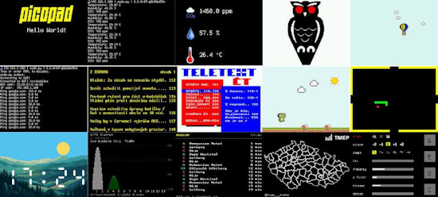](url)

text - [site](url).

## Popular Last Week

[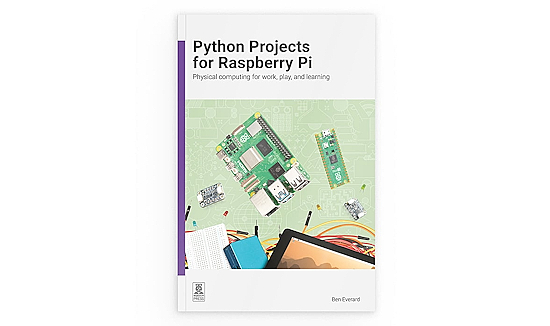]()

What was the most popular, most clicked link, in [last week's newsletter](newslink)? .

Did you know you can read past issues of this newsletter in the Adafruit Daily Archive? [Check it out](https://www.adafruitdaily.com/category/circuitpython/).

## New Notes from Adafruit Playground

[Adafruit Playground](https://adafruit-playground.com/) is a new place for the community to post their projects and other making tips/tricks/techniques. Ad-free, it's an easy way to publish your work in a safe space for free.

text - [Adafruit Playground](url).

[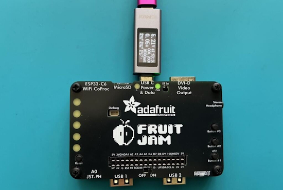](url)

text - [Adafruit Playground](url).

[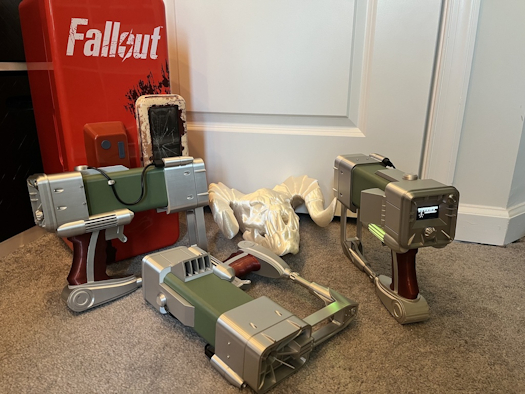](url)

text - [Adafruit Playground](url).

## News From Around the Web

text - [site](url).

RISC-V International CEO, Andrea Gallo kicks off the day with an update full of announcements including that RISC-V market penetration set to go from 2.5% to 33.7% in just 10 years - [X](https://x.com/risc_v/status/2064255175733252491).

text - [site](url).

[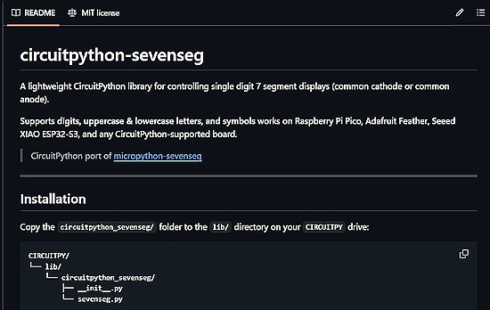](https://github.com/kritishmohapatra/circuitpython-sevenseg)

`circuitpython-sevenseg` is a lightweight CircuitPython library for controlling single digit 7 segment displays (common cathode or common anode) by Kritish Mohapatra - [GitHub](https://github.com/kritishmohapatra/circuitpython-sevenseg). Via [X](https://x.com/0D_KR/status/2064028575830102080).

[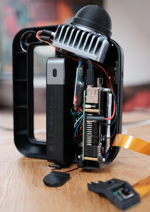](https://www.raspberrypi.com/news/peppes-ghost-lidar-scanner/)

Pi-based Peppe’s ghost LiDAR scanner - [Raspberry PPi News](https://www.raspberrypi.com/news/peppes-ghost-lidar-scanner/) and [YouTube](https://www.youtube.com/shorts/EmHF8sp_p8g).

[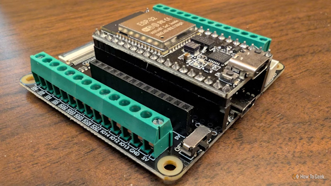](https://www.howtogeek.com/not-all-esp32-boards-are-built-equal-why-manufacturer-matters/)

Not all ESP32 boards are built equal—here's why the manufacturer actually matters - [How-to Geek](https://www.howtogeek.com/not-all-esp32-boards-are-built-equal-why-manufacturer-matters/).

text - [site](url).

text - [site](url).

text - [site](url).

text - [site](url).

text - [site](url).

text - [site](url).

[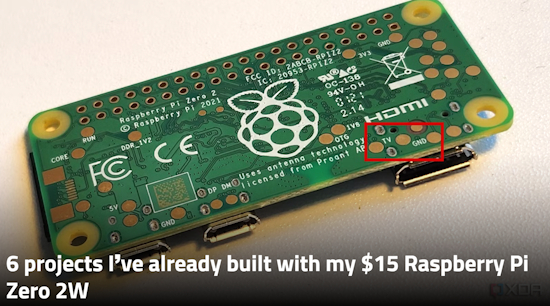](https://www.xda-developers.com/6-projects-ive-already-built-with-my-15-raspberry-pi-zero-2w/)

Six projects I’ve already built with my $15 Raspberry Pi Zero 2W - [XDA](https://www.xda-developers.com/6-projects-ive-already-built-with-my-15-raspberry-pi-zero-2w/).

text - [site](url).

Ten GitHub repositories for web development in Python - [KDnuggets](https://www.kdnuggets.com/10-github-repositories-for-web-development-in-python).

Package managers: uv vs pip in 2026, it's 8x faster, tested - [Tech Insider](https://tech-insider.org/uv-vs-pip-2026/).

[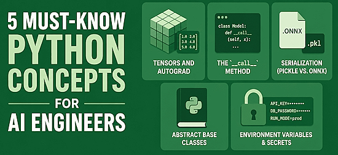](https://www.kdnuggets.com/5-must-know-python-concepts-for-ai-engineers)

Five must-know Python concepts for AI engineers - [KDnuggets](https://www.kdnuggets.com/5-must-know-python-concepts-for-ai-engineers).

Why Python is easy to start but hard to master - [YouTube](https://www.youtube.com/shorts/jkgIDkCwQIE).

## Coming Soon / New

[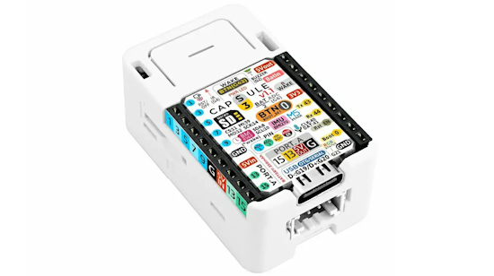](url)

text - [site](url).

[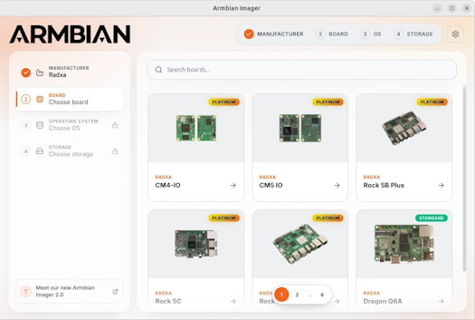](url)

text - [site](url).

## New Boards Supported by CircuitPython

The number of supported microcontrollers and Single Board Computers (SBC) grows every week. This section outlines which boards have been included in CircuitPython or added to [CircuitPython.org](https://circuitpython.org/).

This week there were (#/no) new boards added:

- [Board name](url)
- [Board name](url)
- [Board name](url)

*Note: For non-Adafruit boards, please use the support forums of the board manufacturer for assistance, as Adafruit does not have the hardware to assist in troubleshooting.*

Looking to add a new board to CircuitPython? It's highly encouraged! Adafruit has four guides to help you do so:

- [How to Add a New Board to CircuitPython](https://learn.adafruit.com/how-to-add-a-new-board-to-circuitpython/overview)
- [How to add a New Board to the circuitpython.org website](https://learn.adafruit.com/how-to-add-a-new-board-to-the-circuitpython-org-website)
- [Adding a Single Board Computer to PlatformDetect for Blinka](https://learn.adafruit.com/adding-a-single-board-computer-to-platformdetect-for-blinka)
- [Adding a Single Board Computer to Blinka](https://learn.adafruit.com/adding-a-single-board-computer-to-blinka)

## New Adafruit Learning System Guides

[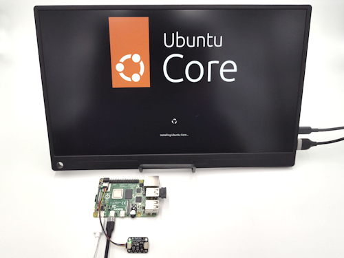](https://learn.adafruit.com/guides/latest)

The [Adafruit Learning System](https://learn.adafruit.com/) has over 3,200 free guides for learning skills and building projects including using Python.

[title](url) from [name](url)

[title](url) from [name](url)

[title](url) from [name](url)

## Updated Learn Guides

[title](url)

## CircuitPython Libraries

The CircuitPython library numbers are continually increasing, while existing ones continue to be updated. Here we provide library numbers and updates!

To get the latest Adafruit libraries, download the [Adafruit CircuitPython Library Bundle](https://circuitpython.org/libraries). To get the latest community contributed libraries, download the [CircuitPython Community Bundle](https://circuitpython.org/libraries).

If you'd like to contribute to the CircuitPython project on the Python side of things, the libraries are a great place to start. Check out the [CircuitPython.org Contributing page](https://circuitpython.org/contributing). If you're interested in reviewing, check out Open Pull Requests. If you'd like to contribute code or documentation, check out Open Issues. We have a guide on [contributing to CircuitPython with Git and GitHub](https://learn.adafruit.com/contribute-to-circuitpython-with-git-and-github), and you can find us in the #help-with-circuitpython and #circuitpython-dev channels on the [Adafruit Discord](https://adafru.it/discord).

You can check out this [list of all the Adafruit CircuitPython libraries and drivers available](https://github.com/adafruit/Adafruit_CircuitPython_Bundle/blob/master/circuitpython_library_list.md). 

The current number of CircuitPython libraries is **###**!

**New Libraries**

Here are this week's new CircuitPython libraries:

* [library](url)

**Updated Libraries**

Here are this week's updated CircuitPython libraries:

* [library](url)

## What’s the CircuitPython team up to this week?

What is the team up to this week? Let’s check in:

**Dan**

text.

**Tim**

This week I finished up the guide for using [Blinka in Ubuntu Core on a Raspberry Pi](https://learn.adafruit.com/use-blinka-with-ubuntu-core-on-raspberry-pi) and it's now published. I've started working on moving some CircuitPython runner scripts I've been developing for on device testing into Circup. It will become a new circup run command. I'm also working on my next guide project: a Pi video feedback system inspired by [this blogpost](https://andreijaycreativecoding.com/getting_started-with-video-feedback). Here are a few photos I've captured so far using the feedback effect and other filters.

**Scott**

I fixed some Espressif BLE issues and I'm working on some more. I also tested a fix for BLE and WiFi workflow in CircuitPython that prevented writing files.

I did some performance tests running local LLM models on my regular Intel Ultra 7 265 development machine, and compared its performance with a Mac Mini M1. I don't have a separate graphics card on the Intel box, so I tried the 20 core CPU and also its integrated GPU. Tokens/second performance was noticeably slower on the GPU that just using a lot of CPU cores. Also, interestingly, there was a noticeable difference between Windows and Linux, probably due to the underlying drivers. The Mac Mini M1 held its own against the newer Intel chip, but the Mini has only has 8 GB of RAM, so the models it can use are limited.

I don't have an immediate use for a local LLM but this testing was a good introduction for me.

**Liz**

I returned from vacation this week. I've started working on a new project: a chiptune player. This is based on an [Arduino project that emulates the AY-3-8910](https://github.com/Dim-aka/AY8912_ESP32). I've ported it to CircuitPython, taking advantage of `synthio`. I have decompiled YM format music files playing back through an I2S DAC. The next steps are to add a GUI with a TFT FeatherWing.

## Upcoming Events

The next MicroPython Meetup in Melbourne will be on June 24 – [Luma](https://luma.com/micropython). You can see recordings of previous meetings on [YouTube](https://www.youtube.com/@MicroPythonOfficial). 

[EuroPython 2026](https://ep2026.europython.eu/) is coming to Kraków, Poland 13-19 July, 2026. Join thousands of Python enthusiasts for a week of learning, networking, and community.

**Other Events This Year**

* [PyOhio 2026](https://www.pyohio.org/2026/) is from 25 July through 26 July, 2026 this year in Cleveland, USA.
* [HOPE 26 Conference](https://store.2600.com/products/tickets-to-hope-26) is from August 14th through 16th at the New Yorker Hotel, NY, NY.
* [PyCon AU 2026](https://2026.pycon.org.au/) will be 26 Aug. 2026 – 30 Aug. 2026 in Brisbane, Australia

If you know of virtual events or upcoming events, please let us know via email to cpnews(at)adafruit(dot)com.

## Latest Releases

CircuitPython's stable release is [#.#.#](https://github.com/adafruit/circuitpython/releases/latest) and its unstable release is [#.#.#-##.#](https://github.com/adafruit/circuitpython/releases). New to CircuitPython? Start with our [Welcome to CircuitPython Guide](https://learn.adafruit.com/welcome-to-circuitpython).

[2026####](https://github.com/adafruit/Adafruit_CircuitPython_Bundle/releases/latest) is the latest Adafruit CircuitPython library bundle.

[2026####](https://github.com/adafruit/CircuitPython_Community_Bundle/releases/latest) is the latest CircuitPython Community library bundle.

[v#.#.#](https://micropython.org/download) is the latest MicroPython release. Documentation for it is [here](http://docs.micropython.org/en/latest/pyboard/).

[#.#.#](https://www.python.org/downloads/) is the latest Python release. The latest pre-release version is [#.#.#](https://www.python.org/download/pre-releases/).

[#,### Stars](https://github.com/adafruit/circuitpython/stargazers) Like CircuitPython? [Star it on GitHub!](https://github.com/adafruit/circuitpython)

## Call for Help -- Translating CircuitPython is now easier than ever

[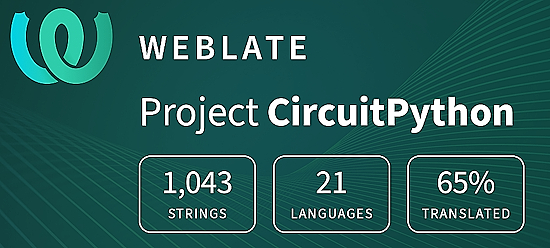](https://hosted.weblate.org/engage/circuitpython/)

One important feature of CircuitPython is translated control and error messages. With the help of fellow open source project [Weblate](https://weblate.org/), we're making it even easier to add or improve translations. 

Sign in with an existing account such as GitHub, Google or Facebook and start contributing through a simple web interface. No forks or pull requests needed! As always, if you run into trouble join us on [Discord](https://adafru.it/discord), we're here to help.

## 38,978 Thanks

The Adafruit Discord community, where we do all our CircuitPython development in the open, reached nearly 39,000 humans - thank you! Adafruit believes Discord offers a unique way for Python on hardware folks to connect. Join today at [https://adafru.it/discord](https://adafru.it/discord).

## ICYMI - In case you missed it

Python on hardware is the Adafruit Python video-newsletter-podcast! The news comes from the Python community, Discord, Adafruit communities and more and is broadcast on ASK an ENGINEER Wednesdays. The complete Python on Hardware weekly videocast [playlist is here](https://www.youtube.com/playlist?list=PLjF7R1fz_OOXRMjM7Sm0J2Xt6H81TdDev). The video podcast is on [iTunes](https://itunes.apple.com/us/podcast/python-on-hardware/id1451685192?mt=2), [YouTube](http://adafru.it/pohepisodes), [Instagram](https://www.instagram.com/adafruit/channel/), and [XML](https://itunes.apple.com/us/podcast/python-on-hardware/id1451685192?mt=2).

[The weekly community chat on Adafruit Discord server CircuitPython channel - Audio / Podcast edition](https://itunes.apple.com/us/podcast/circuitpython-weekly-meeting/id1451685016) - Audio from the Discord chat space for CircuitPython, meetings are usually Mondays at 2pm ET, this is the audio version on [iTunes](https://itunes.apple.com/us/podcast/circuitpython-weekly-meeting/id1451685016), Pocket Casts, [Spotify](https://adafru.it/spotify), and [XML feed](https://adafruit-podcasts.s3.amazonaws.com/circuitpython_weekly_meeting/audio-podcast.xml).

## Contribute

The CircuitPython Weekly Newsletter is a CircuitPython community-run newsletter emailed every Monday. To contribute your content, please email your news to cpnews (at) adafruit (dot) com with information and link(s) to your content. 

Join the Adafruit [Discord](https://adafru.it/discord) or [post to the forum](https://forums.adafruit.com/viewforum.php?f=60) if you have questions.
