- [ ] Library and info updates
- [ ] change date
- [ ] update title
- [ ] Feature story
- [ ] Update  for images
- [ ] Update ICYDNCI
- [ ] All images 550w max only
- [ ] Link "View this email in your browser."

News Sources

- [Adafruit Playground](https://adafruit-playground.com/)
- Twitter: [CircuitPython](https://twitter.com/search?q=circuitpython&src=typed_query&f=live), [MicroPython](https://twitter.com/search?q=micropython&src=typed_query&f=live) and [Python](https://twitter.com/search?q=python&src=typed_query)
- [Raspberry Pi News](https://www.raspberrypi.com/news/), [Pi Foundation](https://www.raspberrypi.org/blog/)
- Mastodon [CircuitPython](https://mastodon.social/tags/CircuitPython) and [MicroPython](https://mastodon.social/tags/MicroPython)
- BlueSky [CircuitPython](https://bsky.app/search?q=circuitpython), [MicroPython](https://bsky.app/search?q=micropython), [Raspberry Pi](https://bsky.app/search?q=raspberry+pi)
- [Google News Python](https://news.google.com/topics/CAAqIQgKIhtDQkFTRGdvSUwyMHZNRFY2TVY4U0FtVnVLQUFQAQ?hl=en-US&gl=US&ceid=US%3Aen)
- YouTube: [CircuitPython](https://www.youtube.com/results?search_query=circuitpython&sp=CAISBAgDEAE%253D), [MicroPython](https://www.youtube.com/results?search_query=micropython&sp=CAISBAgDEAE%253D), [Prof Gallaugher](https://www.youtube.com/@BuildWithProfG/videos)
- [maker.io Python](https://www.digikey.com/en/maker/search-results?s=createdDate&t=python)
- [hackster.io CircuitPython](https://www.hackster.io/search?q=circuitpython&i=projects&sort_by=most_recent) and [MicroPython](https://www.hackster.io/search?q=micropython&i=projects&sort_by=most_recent)
- Instructables: [CircuitPython](https://www.instructables.com/search/?q=circuitpython&projects=all&sort=Newest), [MicroPython](https://www.instructables.com/search/?q=micropython&projects=all&sort=Newest), [Raspberry Pi Python](https://www.instructables.com/search/?q=raspberry+pi+python&projects=all&sort=Newest)
- [hackaday CircuitPython](https://hackaday.com/blog/?s=circuitpython) and [MicroPython](https://hackaday.com/blog/?s=micropython)
- [python.org](https://www.python.org/)
- [Python Insider - dev team blog](https://pythoninsider.blogspot.com/)
- Individuals: [bret.dk](https://bret.dk/), [Jeff Geerling](https://www.jeffgeerling.com/blog), [Yakroo](https://x.com/Yakroo5077), [coXXect](https://coxxect.blogspot.com/)
- Tom's Hardware: [CircuitPython](https://www.tomshardware.com/search?searchTerm=circuitpython&articleType=all&sortBy=publishedDate) and [MicroPython](https://www.tomshardware.com/search?searchTerm=micropython&articleType=all&sortBy=publishedDate) and [Raspberry Pi](https://www.tomshardware.com/search?searchTerm=raspberry%20pi&articleType=all&sortBy=publishedDate)
- [hackaday.io newest projects MicroPython](https://hackaday.io/projects?tag=micropython&sort=date) and [CircuitPython](https://hackaday.io/projects?tag=circuitpython&sort=date)
- hackaday.io - [CircuitPython](https://hackaday.io/search?term=circuitpython) and [MicroPython](https://hackaday.io/search?term=micropython)
- [MicroPython ](https://luma.com/micropython?k=c)

View this email in your browser. **Warning: Flashing Imagery**

Welcome to the latest Python on Microcontrollers newsletter! *insert 2-3 sentences from editor (what's in overview, banter)* - *Anne Barela, Editor*

We're on [Discord](https://discord.gg/HYqvREz), [Twitter/X](https://twitter.com/search?q=circuitpython&src=typed_query&f=live), [BlueSky](https://bsky.app/profile/circuitpython.org) and for past newsletters - [view them all here](https://www.adafruitdaily.com/category/circuitpython/). If you're reading this on the web, please [subscribe here](https://www.adafruitdaily.com/). Here's the news this week:

## Code like Hemingway

Software developers are soon going to have to take a lesson from Hemingway. It’s not hard to be concise in code. You have to be, by design. Claude Code, Codex, Copilot, and the rest all love to be “spoken” to [in Markdown](https://www.infoworld.com/article/4146579/markdown-is-now-a-first-class-coding-language-deal-with-it.html). We used to define our code with unit tests and specifications written for humans. Now, it’s all about the spec. And the spec needs to be both complete and concise - [InfoWorld](https://www.infoworld.com/article/4185817/code-like-hemingway.html).

## A CircuitPython MCP Server

Frederick Blais has created an open source CircuitPython MCP Server, minimal MCP JSON-RPC server helpers for CircuitPython projects using `adafruit_httpserver` - [GitHub](https://github.com/speccy88/circuitpython-mcp-server).

## A New Raspberry Pi Desktop Style Refresh

What is currently known as the Raspberry Pi Desktop has been around for over a decade now – it started out as a customised version of the LXDE desktop, and over the years has slowly evolved into something with almost entirely different underpinnings, based on Wayland and labwc. Now comes real change - [Raspberry Pi News](https://forums.raspberrypi.com/viewtopic.php?p=2379576#p2379576). Via [Adafruit Blog](https://blog.adafruit.com/2026/06/16/a-new-raspberry-pi-desktop-style-refresh-arttuesday/).

> "We are now ready to roll changes out for beta testing. If you update your system from the beta repository, you ought to notice no differences at first, but the components which enable the new desktop will be installed and ready to use. The biggest change in the new desktop is the introduction of an icon dock, in addition to the existing taskbar. Two new plugins have been added which are intended to be used in the dock – one is a graphical application launcher, and the other an icon-based combined quick launcher and task list."

## Snakie: A Modern, Cross-Platform MicroPython Editor.

[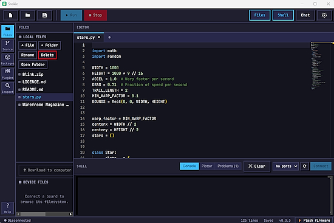](https://github.com/kevinmcaleer/Snakie)

Snakie is a modern, cross-platform MicroPython editor by Kevin McAleer. It has a clean, uncluttered IDE for writing MicroPython code and working with connected MicroPython devices. It is built on Electron, so it runs on Windows, macOS and Linux, and updates easily - [GitHub](https://github.com/kevinmcaleer/Snakie).

## BASIC Ruled the '80s. Here's Why Python Quietly Became the New Gateway to Coding

[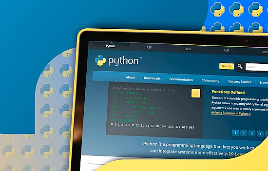](https://tech.yahoo.com/computing/articles/basic-ruled-80s-heres-why-134619003.html)

If you ever used a computer in the '70s, '80s, and '90s, your first foray into programming was most likely with BASIC. Here are the reasons why Python has taken its place as the language of choice for people learning to program - [yahoo!tech](https://tech.yahoo.com/computing/articles/basic-ruled-80s-heres-why-134619003.html).

## AI Can Rewrite Open Source Code, But Can It Rewrite the License, Too?

AI coding tools are raising new issues with how that “clean room” rewrite process plays out both legally, ethically, and practically. Those issues came to the forefront last week with the release of a new version of chardet, a popular open source python library for automatically detecting character encoding - [Ars Technica](https://arstechnica.com/ai/2026/03/ai-can-rewrite-open-source-code-but-can-it-rewrite-the-license-too/).

## Linux Kernel 7.1 Officially Released

The Linux Kernel 7.1 has been officially released. It introduces a new NTFS file system implementation and a new Landlock access right for pathname UNIX domain sockets - [9to5Linux](https://9to5linux.com/linux-kernel-7-1-officially-released-heres-whats-new).

## This Week's Python Streams

Python on Hardware is all about building a cooperative ecosphere which allows contributions to be valued and to grow knowledge. Below are the streams within the last week focusing on the community.

**CircuitPython Deep Dive Stream**

[Last Friday](), Scott streamed work on .

You can see the latest video and past videos on the Adafruit YouTube channel under the Deep Dive playlist - [YouTube](https://www.youtube.com/playlist?list=PLjF7R1fz_OOXBHlu9msoXq2jQN4JpCk8A).

**CircuitPython Parsec**

John Park’s CircuitPython Parsec this week is on  - [Adafruit Blog]() and [YouTube]().

Catch all the episodes in the [YouTube playlist](https://www.youtube.com/playlist?list=PLjF7R1fz_OOWFqZfqW9jlvQSIUmwn9lWr).

**Deep Dive with Tim**

[Last week](), Tim streamed work on .

You can see the latest video and past videos on the Adafruit YouTube channel under the Deep Dive playlist - [YouTube](https://www.youtube.com/playlist?list=PLjF7R1fz_OOWFqZfqW9jlvQSIUmwn9lWr).

**CircuitPython Weekly Meeting**

CircuitPython Weekly Meeting for June 15, 2026 ([notes](https://github.com/adafruit/adafruit-circuitpython-weekly-meeting/blob/main/2024/2026-06-15.md)) [on YouTube](https://youtu.be/jxK8BoIql18).

## Project of the Week: Taking High Quality Motion-triggered Iimages Using a Raspberry Pi HQ or Global Shutter Camera

[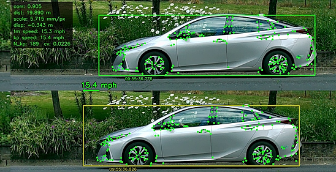](https://github.com/jbeale1/traffic)

John Beale has posted a high quality motion-triggered images using a Raspberry Pi HQ or global shutter camera along with Python. It is possible to estimate a vehicle’s speed using a pair of images taken from the side, if you know the camera-vehicle distance and therefor the image scale in mm per pixel, and the image frame rate - [GitHub](https://github.com/jbeale1/traffic). Via [Adafruit Blog](https://blog.adafruit.com/2026/06/18/taking-high-quality-motion-triggered-images-using-a-raspberry-pi-hq-or-global-shutter-camera/).

## Popular Last Week

[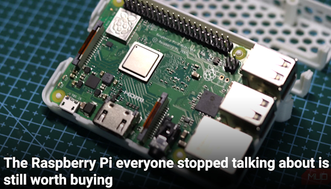](https://www.makeuseof.com/raspberry-pi-stopped-talking-still-worth-buying/)

What was the most popular, most clicked link, in [last week's newsletter](https://www.adafruitdaily.com/2026/06/15/python-on-microcontrollers-newsletter-is-jit-python-in-trouble-micropython-in-a-wasm-sandbox-and-more/)? [The Raspberry Pi everyone stopped talking about is still worth buying](https://www.makeuseof.com/raspberry-pi-stopped-talking-still-worth-buying/).

Did you know you can read past issues of this newsletter in the Adafruit Daily Archive? [Check it out](https://www.adafruitdaily.com/category/circuitpython/).

## New Notes from Adafruit Playground

[Adafruit Playground](https://adafruit-playground.com/) is a new place for the community to post their projects and other making tips/tricks/techniques. Ad-free, it's an easy way to publish your work in a safe space for free.

[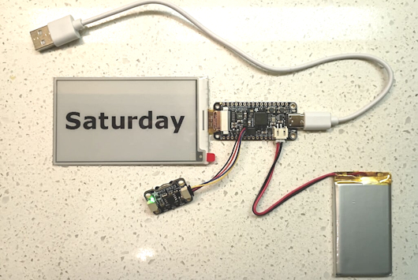](https://adafruit-playground.com/u/scenography/pages/eink-calendar-with-no-soldering)

eInk Calendar With No Soldering - [Adafruit Playground](https://adafruit-playground.com/u/scenography/pages/eink-calendar-with-no-soldering).

text - [Adafruit Playground](url).

text - [Adafruit Playground](url).

## News From Around the Web

[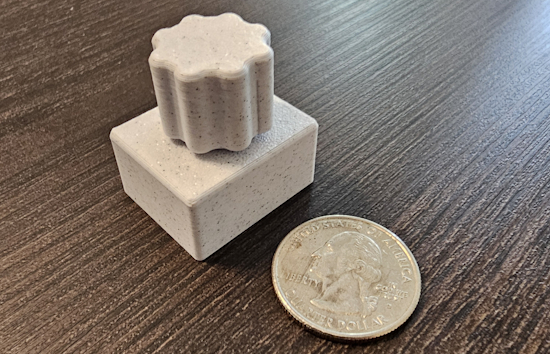](https://keepeverythingyours.com/projects/mighty%20mini%20media%20controller/)

Mighty Mini Media Controller is a CircuitPython USB HID media controller built from an RP2040 board and a rotary encoder. Plug it into any computer and it works instantly as a media keyboard — no drivers required. Rotate the encoder to raise or lower volume. Press down for play/pause. All pins and timing constants are configurable at the top of `code.py`. It works on Windows, macOS, Linux, and ChromeOS - [Keep Everything Yours](https://keepeverythingyours.com/projects/mighty%20mini%20media%20controller/). Via [Reddit](https://www.reddit.com/r/circuitpython/comments/1u1fgbv/i_made_a_very_small_volume_and_playback/).

[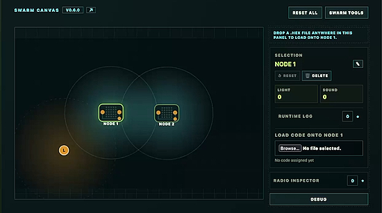](https://headtilt.me/swarm-sim/)

Simulating Micro:bit swarms with MicroPython - [headtilt.me](https://headtilt.me/swarm-sim/) and [GitHub](https://github.com/zarify/swarm_sim). Via [Mastodon](https://mastodon.social/@pRobably@aus.social/116731239844293289).

text - [site](url).

text - [site](url).

text - [site](url).

text - [site](url).

text - [site](url).

text - [site](url).

text - [site](url).

text - [site](url).

text - [site](url).

text - [site](url).

text - [site](url).

𝗖𝗿𝗮𝗻𝗸𝗚𝗣𝗧 𝗥𝘂𝗻𝘀 𝗔𝗜 𝗼𝗻 𝗮 h𝗮𝗻𝗱 c𝗿𝗮𝗻𝗸, n𝗼 b𝗮𝘁𝘁𝗲𝗿𝘆 n𝗲𝗲𝗱𝗲𝗱. Europe-based Squeez Labs built it around a Raspberry Pi 5 and a 20W hand-crank generator - [X](https://x.com/GenAISpotlight/status/2067987524945948760)

What are git worktrees, and why should I use them? - [GitHub Blog](https://github.blog/ai-and-ml/github-copilot/what-are-git-worktrees-and-why-should-i-use-them/).

[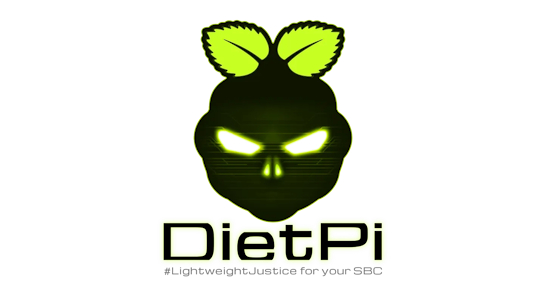](https://9to5linux.com/dietpi-10-5-enables-kms-drm-graphics-system-by-default-for-raspberry-pi-sbcs)

DietPi 10.5 Enables KMS/DRM Graphics System by Default for Raspberry Pi SBCs - [9to5Linux](https://9to5linux.com/dietpi-10-5-enables-kms-drm-graphics-system-by-default-for-raspberry-pi-sbcs).

[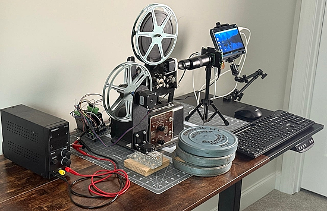](https://www.raspberrypi.com/news/saving-family-football-footage-with-a-raspberry-pi-and-a-1928-projector/)

Saving family football footage with a Raspberry Pi and a 1928 projector - [Raspberry Pi News](https://www.raspberrypi.com/news/saving-family-football-footage-with-a-raspberry-pi-and-a-1928-projector/) and [YouTube](https://www.youtube.com/watch?v=XEnJPB9su_0).

text - [site](url).

## New

[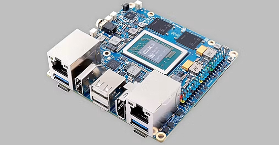](https://www.hackster.io/news/the-new-orange-pi-6-is-way-more-powerful-than-your-current-sbc-42744f98815c)

The Orange Pi 6 is built around the CIX CD8180 processor. This chip combines four Cortex-A720 performance cores, four Cortex-A720 medium cores, and four Cortex-A520 efficiency cores for a total of twelve Arm CPU cores. Display connectivity includes HDMI 2.0, DisplayPort 1.4, eDP, and DisplayPort output over USB-C. Memory options include 8GB, 16GB, and 24GB of LPDDR5. There are two PCIe 4.0 x4 M.2 Key-M slots for NVMe SSDs, a microSD card slot and onboard SPI flash. The board includes dual 2.5 Gigabit Ethernet ports and an M.2 Key-E slot for an optional Wi-Fi 6 and Bluetooth 5.4 module. Additional connectivity includes USB 3.0 and USB 2.0 ports, dual full-function USB Type-C connectors, dual MIPI CSI camera interfaces, audio input and output, and a 40-pin GPIO header - [hackster.io](https://www.hackster.io/news/the-new-orange-pi-6-is-way-more-powerful-than-your-current-sbc-42744f98815c).

[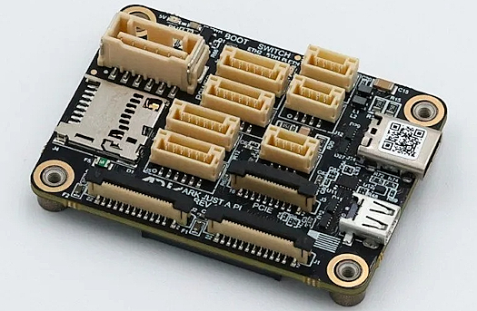](https://linuxgizmos.com/ark-just-a-pi-carrier-board-links-raspberry-pi-cm5-to-autopilot-systems/)

ARK Electronics has recently featured the ARK Just A Pi, a compact carrier board for the Raspberry Pi Compute Module 5. The board provides USB, Ethernet, CSI camera, UART, PCIe, HDMI, and GPIO connectivity in a small form factor intended for integration with autopilot and embedded systems - [LinuxGizmos](https://linuxgizmos.com/ark-just-a-pi-carrier-board-links-raspberry-pi-cm5-to-autopilot-systems/).

## New Boards Supported by CircuitPython

The number of supported microcontrollers and Single Board Computers (SBC) grows every week. This section outlines which boards have been included in CircuitPython or added to [CircuitPython.org](https://circuitpython.org/).

This week there were (#/no) new boards added:

- [Board name](url)
- [Board name](url)
- [Board name](url)

*Note: For non-Adafruit boards, please use the support forums of the board manufacturer for assistance, as Adafruit does not have the hardware to assist in troubleshooting.*

Looking to add a new board to CircuitPython? It's highly encouraged! Adafruit has four guides to help you do so:

- [How to Add a New Board to CircuitPython](https://learn.adafruit.com/how-to-add-a-new-board-to-circuitpython/overview)
- [How to add a New Board to the circuitpython.org website](https://learn.adafruit.com/how-to-add-a-new-board-to-the-circuitpython-org-website)
- [Adding a Single Board Computer to PlatformDetect for Blinka](https://learn.adafruit.com/adding-a-single-board-computer-to-platformdetect-for-blinka)
- [Adding a Single Board Computer to Blinka](https://learn.adafruit.com/adding-a-single-board-computer-to-blinka)

## New Adafruit Learning System Guides

The [Adafruit Learning System](https://learn.adafruit.com/) has over 3,200 free guides for learning skills and building projects including using Python.

[Video Feedback with Raspberry Pi](https://learn.adafruit.com/video-feedback-with-raspberry-pi/overview) from [Tim C](https://learn.adafruit.com/u/Foamyguy)

[Prop It Game](https://learn.adafruit.com/prop-it-game) from [Ruiz Brothers](https://learn.adafruit.com/u/pixil3d) and Liz Clark

[Cluetooth Scanner](https://learn.adafruit.com/cluetooth-scanner) from [John Park](https://learn.adafruit.com/u/johnpark)

## CircuitPython Libraries

The CircuitPython library numbers are continually increasing, while existing ones continue to be updated. Here we provide library numbers and updates!

To get the latest Adafruit libraries, download the [Adafruit CircuitPython Library Bundle](https://circuitpython.org/libraries). To get the latest community contributed libraries, download the [CircuitPython Community Bundle](https://circuitpython.org/libraries).

If you'd like to contribute to the CircuitPython project on the Python side of things, the libraries are a great place to start. Check out the [CircuitPython.org Contributing page](https://circuitpython.org/contributing). If you're interested in reviewing, check out Open Pull Requests. If you'd like to contribute code or documentation, check out Open Issues. We have a guide on [contributing to CircuitPython with Git and GitHub](https://learn.adafruit.com/contribute-to-circuitpython-with-git-and-github), and you can find us in the #help-with-circuitpython and #circuitpython-dev channels on the [Adafruit Discord](https://adafru.it/discord).

You can check out this [list of all the Adafruit CircuitPython libraries and drivers available](https://github.com/adafruit/Adafruit_CircuitPython_Bundle/blob/master/circuitpython_library_list.md). 

The current number of CircuitPython libraries is **###**!

**New Libraries**

Here are this week's new CircuitPython libraries:

* [library](url)

**Updated Libraries**

Here are this week's updated CircuitPython libraries:

* [library](url)

## What’s the CircuitPython team up to this week?

What is the team up to this week? Let’s check in:

**Dan**

I continued fixing more issues for the CircuitPython 10.3.0 release. The fixes included more Espressif BLE fixes, some clarifications on `PDMIn` on Espressif, and fixing a regression in camera support when we upgraded to ESP-IDF 6.

**Tim**

The Raspberry Pi video feedback guide I mentioned last week is now wrapped up and published. Next I am looking into USB Audio protocols. The goal is to enable CircuitPython to act as USB Audio output/input devices like a microphone or speaker. I've started with the input/microphone side. The CircuitPython device gets seen as a USB microphone by the computer it is connected to and Python code can control what sound gets sent into the channel with `synthio` and other audio APIs. I started by adapting existing examples from TinyUSB and then porting the functionality into a CircuitPython module using the lessons learned. I will demonstrate the new functionality with a morse code paddle project.

**Liz**

This week I am starting to document the CircuitPython chiptune player project. I have written a [CircuitPython helper library](https://github.com/adafruit/Adafruit_CircuitPython_AY8912_Emulator) that emulates the AY8912 sound generator using `synthio`. It also decodes VGM (video game music) sound files. Noe is working on an enclosure and we will wrap everything up next week.

## Upcoming Events

The next MicroPython Meetup in Melbourne will be on June 24 – [Luma](https://luma.com/micropython). You can see recordings of previous meetings on [YouTube](https://www.youtube.com/@MicroPythonOfficial). 

[EuroPython 2026](https://ep2026.europython.eu/) is coming to Kraków, Poland 13-19 July, 2026. Join thousands of Python enthusiasts for a week of learning, networking, and community.

**Other Events This Year**

* [PyOhio 2026](https://www.pyohio.org/2026/) is from 25 July through 26 July, 2026 this year in Cleveland, USA.
* [HOPE 26 Conference](https://store.2600.com/products/tickets-to-hope-26) is from August 14th through 16th at the New Yorker Hotel, NY, NY.
* [PyCon AU 2026](https://2026.pycon.org.au/) will be 26 Aug. 2026 – 30 Aug. 2026 in Brisbane, Australia

If you know of virtual events or upcoming events, please let us know via email to cpnews(at)adafruit(dot)com.

## Latest Releases

CircuitPython's stable release is [#.#.#](https://github.com/adafruit/circuitpython/releases/latest) and its unstable release is [#.#.#-##.#](https://github.com/adafruit/circuitpython/releases). New to CircuitPython? Start with our [Welcome to CircuitPython Guide](https://learn.adafruit.com/welcome-to-circuitpython).

[2026####](https://github.com/adafruit/Adafruit_CircuitPython_Bundle/releases/latest) is the latest Adafruit CircuitPython library bundle.

[2026####](https://github.com/adafruit/CircuitPython_Community_Bundle/releases/latest) is the latest CircuitPython Community library bundle.

[v#.#.#](https://micropython.org/download) is the latest MicroPython release. Documentation for it is [here](http://docs.micropython.org/en/latest/pyboard/).

[#.#.#](https://www.python.org/downloads/) is the latest Python release. The latest pre-release version is [#.#.#](https://www.python.org/download/pre-releases/).

[#,### Stars](https://github.com/adafruit/circuitpython/stargazers) Like CircuitPython? [Star it on GitHub!](https://github.com/adafruit/circuitpython)

## Call for Help -- Translating CircuitPython is now easier than ever

[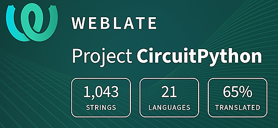](https://hosted.weblate.org/engage/circuitpython/)

One important feature of CircuitPython is translated control and error messages. With the help of fellow open source project [Weblate](https://weblate.org/), we're making it even easier to add or improve translations. 

Sign in with an existing account such as GitHub, Google or Facebook and start contributing through a simple web interface. No forks or pull requests needed! As always, if you run into trouble join us on [Discord](https://adafru.it/discord), we're here to help.

## NUMBER Thanks

The Adafruit Discord community, where we do all our CircuitPython development in the open, reached over NUMBER humans - thank you! Adafruit believes Discord offers a unique way for Python on hardware folks to connect. Join today at [https://adafru.it/discord](https://adafru.it/discord).

## ICYMI - In case you missed it

Python on hardware is the Adafruit Python video-newsletter-podcast! The news comes from the Python community, Discord, Adafruit communities and more and is broadcast on ASK an ENGINEER Wednesdays. The complete Python on Hardware weekly videocast [playlist is here](https://www.youtube.com/playlist?list=PLjF7R1fz_OOXRMjM7Sm0J2Xt6H81TdDev). The video podcast is on [iTunes](https://itunes.apple.com/us/podcast/python-on-hardware/id1451685192?mt=2), [YouTube](http://adafru.it/pohepisodes), [Instagram](https://www.instagram.com/adafruit/channel/), and [XML](https://itunes.apple.com/us/podcast/python-on-hardware/id1451685192?mt=2).

[The weekly community chat on Adafruit Discord server CircuitPython channel - Audio / Podcast edition](https://itunes.apple.com/us/podcast/circuitpython-weekly-meeting/id1451685016) - Audio from the Discord chat space for CircuitPython, meetings are usually Mondays at 2pm ET, this is the audio version on [iTunes](https://itunes.apple.com/us/podcast/circuitpython-weekly-meeting/id1451685016), Pocket Casts, [Spotify](https://adafru.it/spotify), and [XML feed](https://adafruit-podcasts.s3.amazonaws.com/circuitpython_weekly_meeting/audio-podcast.xml).

## Contribute

The CircuitPython Weekly Newsletter is a CircuitPython community-run newsletter emailed every Monday. To contribute your content, please email your news to cpnews (at) adafruit (dot) com with information and link(s) to your content. 

Join the Adafruit [Discord](https://adafru.it/discord) or [post to the forum](https://forums.adafruit.com/viewforum.php?f=60) if you have questions.
