- [ ] Library and info updates
- [ ] change date
- [ ] update title
- [ ] Feature story
- [ ] Update  for images
- [ ] Update ICYDNCI
- [ ] All images 550w max only
- [ ] Link "View this email in your browser."

News Sources

- [Adafruit Playground](https://adafruit-playground.com/)
- Twitter: [CircuitPython](https://twitter.com/search?q=circuitpython&src=typed_query&f=live), [MicroPython](https://twitter.com/search?q=micropython&src=typed_query&f=live) and [Python](https://twitter.com/search?q=python&src=typed_query)
- [Raspberry Pi News](https://www.raspberrypi.com/news/), [Pi Foundation](https://www.raspberrypi.org/blog/)
- Mastodon [CircuitPython](https://mastodon.social/tags/CircuitPython) and [MicroPython](https://mastodon.social/tags/MicroPython)
- BlueSky [CircuitPython](https://bsky.app/search?q=circuitpython), [MicroPython](https://bsky.app/search?q=micropython), [Raspberry Pi](https://bsky.app/search?q=raspberry+pi)
- [Google News Python](https://news.google.com/topics/CAAqIQgKIhtDQkFTRGdvSUwyMHZNRFY2TVY4U0FtVnVLQUFQAQ?hl=en-US&gl=US&ceid=US%3Aen)
- YouTube: [CircuitPython](https://www.youtube.com/results?search_query=circuitpython&sp=CAISBAgDEAE%253D), [MicroPython](https://www.youtube.com/results?search_query=micropython&sp=CAISBAgDEAE%253D), [Prof Gallaugher](https://www.youtube.com/@BuildWithProfG/videos)
- [maker.io Python](https://www.digikey.com/en/maker/search-results?s=createdDate&t=python)
- [hackster.io CircuitPython](https://www.hackster.io/search?q=circuitpython&i=projects&sort_by=most_recent) and [MicroPython](https://www.hackster.io/search?q=micropython&i=projects&sort_by=most_recent)
- Instructables: [CircuitPython](https://www.instructables.com/search/?q=circuitpython&projects=all&sort=Newest), [MicroPython](https://www.instructables.com/search/?q=micropython&projects=all&sort=Newest), [Raspberry Pi Python](https://www.instructables.com/search/?q=raspberry+pi+python&projects=all&sort=Newest)
- [hackaday CircuitPython](https://hackaday.com/blog/?s=circuitpython) and [MicroPython](https://hackaday.com/blog/?s=micropython)
- [python.org](https://www.python.org/)
- [Python Insider - dev team blog](https://pythoninsider.blogspot.com/)
- Individuals: [bret.dk](https://bret.dk/), [Jeff Geerling](https://www.jeffgeerling.com/blog), [Yakroo](https://x.com/Yakroo5077), [coXXect](https://coxxect.blogspot.com/)
- Tom's Hardware: [CircuitPython](https://www.tomshardware.com/search?searchTerm=circuitpython&articleType=all&sortBy=publishedDate) and [MicroPython](https://www.tomshardware.com/search?searchTerm=micropython&articleType=all&sortBy=publishedDate) and [Raspberry Pi](https://www.tomshardware.com/search?searchTerm=raspberry%20pi&articleType=all&sortBy=publishedDate)
- [hackaday.io newest projects MicroPython](https://hackaday.io/projects?tag=micropython&sort=date) and [CircuitPython](https://hackaday.io/projects?tag=circuitpython&sort=date)
- hackaday.io - [CircuitPython](https://hackaday.io/search?term=circuitpython) and [MicroPython](https://hackaday.io/search?term=micropython)
- [MicroPython Meeting](https://luma.com/micropython?k=c)

View this email in your browser. **Warning: Flashing Imagery**

Welcome to the latest Python on Microcontrollers newsletter! *insert 2-3 sentences from editor (what's in overview, banter)* - *Anne Barela, Editor*

We're on [Discord](https://discord.gg/HYqvREz), [Twitter/X](https://twitter.com/search?q=circuitpython&src=typed_query&f=live), [BlueSky](https://bsky.app/profile/circuitpython.org) and for past newsletters - [view them all here](https://www.adafruitdaily.com/category/circuitpython/). If you're reading this on the web, please [subscribe here](https://www.adafruitdaily.com/). Here's the news this week:

## Microsoft is Taming Their Python Dependencies with AI

[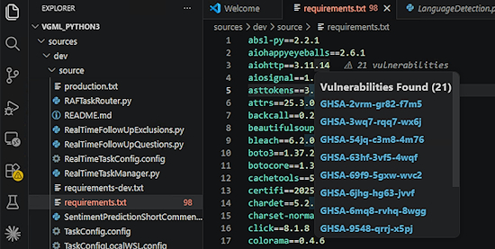](https://www.microsoft.com/insidetrack/blog/taming-our-python-dependencies-at-microsoft-with-ai/)

At Microsoft, Python has long been one of the most popular programming languages. Developers use it for building production systems, internal tools, automation workflows, and more. At least 67,000 employees use it every day - [Microsoft Inside Track Blog](https://www.microsoft.com/insidetrack/blog/taming-our-python-dependencies-at-microsoft-with-ai/) and plug-in - [Visual Studio Marketplace](https://marketplace.visualstudio.com/items?itemName=mspythondeprem.python-dependency-remediation).

> "In the past, when engineers received a vulnerability notification, they would have to step outside their development workflow and address the issue. What was needed was a solution that could be enacted within their normal workflow—integrating remediation directly into the tools they were already using. So, we created the Python Dependency Remediation extension for Visual Studio Code, a common Python development environment. Once installed, engineers can address vulnerabilities in the flow of their work."   “The extension automatically finds the right updates and then fixes the vulnerabilities, so developers don’t need to do the research, the manual upgrades and fixes, run test cases, debugging—all those things that used to take so much time. With our solution, it’s just one button click and it does all of that automatically, with the help of AI.”

## CircuitPython 10.3.0-alpha.3 Released

CircuitPython 10.3.0-alpha.3, an alpha release for 10.3.0, is available. Further features, changes, and bug fixes will be added before the final release of 10.3.0 - [Adafruit Bloge](https://blog.adafruit.com/2026/06/24/circuitpython-10-3-0-alpha-3-released/) and release page - [GitHub](https://github.com/adafruit/circuitpython/releases/tag/10.3.0-alpha.3).

**Highlights of this Release**

* Add usb_audio.USBMicrophone` and `usb_audio.USBSpeaker`, which provide audio source and sink USB devices.
* Add `audiospeed.Resampler`.
* Add `audio_i2sin` input audio stream; supported only on Espressif and RP2xxx.
* Fix Espressif camera support regression.
* Fix several Espressif BLE bugs.
* Other bug fixes.

## ChatGPT Wants to Make Open-Source Projects More Secure

OpenAI has launched Patch the Planet, a new initiative aimed at fixing one of the internet’s quietest problems – the chronically underfunded security of open-source software. Patch the Planet pairs OpenAI’s most security-capable AI models with Trail of Bits, a security firm that has committed its entire research organization to the effort - [digitaltrends](https://www.digitaltrends.com/computing/the-maker-of-chatgpt-wants-to-make-open-source-projects-less-of-a-security-bargain/).

## KENSAT — Edge-AI Compute in Orbit Using an SBC and Python

[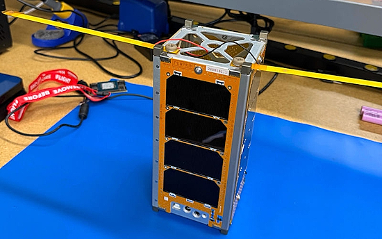](https://github.com/kenchangh/kensat)

KENSAT, a 2U CubeSat that runs an LLM in orbit, has been oppen sourced. AI inference is run on a NVIDIA Jetson running Python and downlinked to Earth with RF. Launching on the SpaceX Falcon9 in October - [GitHub](https://github.com/kenchangh/kensat). Via [X](https://x.com/kenchangh/status/2069316715067097159).

> KENSAT's mission is to demonstrate autonomous AI compute on a small satellite — taking a GPU-class accelerator and a quantized LLM out of the data center and running them inside the tight power, thermal, and reliability envelope of a 2U CubeSat. The on-board computer wakes the Jetson only when needed, runs an inference within a measured energy budget, and frames the output for downlink. Everything else in the spacecraft — the flight software, the UHF radio and its RF matching networks, the power system, and the antenna-deployment hardware — exists to get that compute on orbit, keep it alive, and get its results to the ground.

## Raspberry Pi Locator Website To Shut Down In July

[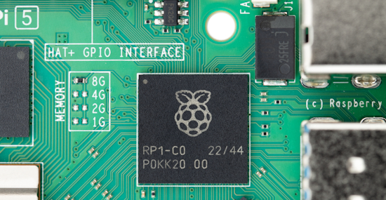](https://hackaday.com/2026/06/24/raspberry-pi-locator-website-to-shut-down-in-july/)

As announced by André on [BlueSky](https://bsky.app/profile/makerbymistake.com/post/3moybqsrlp22j), next month the much loved [Rpilocator.com](https://rpilocator.com/) website will cease displaying the stock status and pricing of Raspberry Pi computers from various online retailers. One of the main reasons is that the indexing bot used by the site has been blocked by most shopping sites. It’s not clear whether this blocking is on purpose or just another consequence of website owners protecting themselves from the onslaught of obnoxious ‘AI’ scraping bots. But in any event, the effort of finding workarounds that may only work for a few days or weeks was becoming too much. - [Hackaday](https://hackaday.com/2026/06/24/raspberry-pi-locator-website-to-shut-down-in-july/).

## Feature

text - [site](url).

## OpenC6 BIOS project brings PC-like firmware to ESP32-C6

[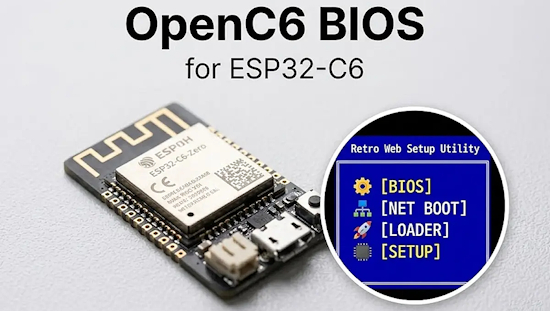](https://www.cnx-software.com/2026/06/25/openc6-bios-project-brings-pc-like-firmware-to-esp32-c6-mcu-with-network-boot-and-ota-support/)

OpenC6 BIOS is an open-source project by Rompass that takes a different approach to MCU development. It adds a BIOS-like system to the ESP32-C6, so the system part and application code can run separately rather than being combined into a single firmware image. In traditional development, hardware setup, networking, and application code are combined into a single firmware image. But the OpenC6 BIOS operates differently: it runs as the base system on the ESP32-C6 and handles hardware initialization and system functions. Instead of flashing a full application each time, it can load small payload programs separately. These payloads can run from RAM or flash (XIP) and use system functions through a simple Application Binary Interface (ABI), without needing the full firmware - [CNX](https://www.cnx-software.com/2026/06/25/openc6-bios-project-brings-pc-like-firmware-to-esp32-c6-mcu-with-network-boot-and-ota-support/https://www.cnx-software.com/2026/06/25/openc6-bios-project-brings-pc-like-firmware-to-esp32-c6-mcu-with-network-boot-and-ota-support/), [Hackaday](https://hackaday.com/2026/06/23/a-bios-for-your-esp32-c6/) and source of this MIT licensed project - [GitHub](https://github.com/Rompass/openc6-bios).

## This Week's Python Streams

Python on Hardware is all about building a cooperative ecosphere which allows contributions to be valued and to grow knowledge. Below are the streams within the last week focusing on the community.

**CircuitPython Deep Dive Stream**

[Last Friday](), Scott streamed work on .

You can see the latest video and past videos on the Adafruit YouTube channel under the Deep Dive playlist - [YouTube](https://www.youtube.com/playlist?list=PLjF7R1fz_OOXBHlu9msoXq2jQN4JpCk8A).

**CircuitPython Parsec**

John Park’s CircuitPython Parsec this week is on  - [Adafruit Blog]() and [YouTube]().

Catch all the episodes in the [YouTube playlist](https://www.youtube.com/playlist?list=PLjF7R1fz_OOWFqZfqW9jlvQSIUmwn9lWr).

**Deep Dive with Tim**

[Last week](), Tim streamed work on .

You can see the latest video and past videos on the Adafruit YouTube channel under the Deep Dive playlist - [YouTube](https://www.youtube.com/playlist?list=PLjF7R1fz_OOWFqZfqW9jlvQSIUmwn9lWr).

**CircuitPython Weekly Meeting**

CircuitPython Weekly Meeting for June 22, 2026 ([notes](https://github.com/adafruit/adafruit-circuitpython-weekly-meeting/blob/main/2026/2026-06-22.md)) [on YouTube](https://youtu.be/Y-9uVdj28jY).

## Project of the Week: ColecoVision Cartridge Reader Shield

[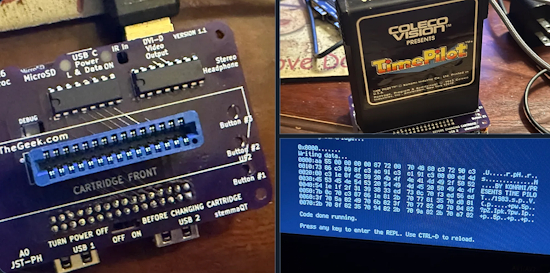](https://bsky.app/profile/cogliano.bsky.social/post/3mp3ejpsrxc2k)

Dan Cogliano's work in progress is a ColecoVision cartridge reader shield for the Adafruit FruitJam. The initial cartridge reading via a 
CircuitPython script works. Next up is enhance code to write the cartridge data to an SD card. This may be the first shield made for the Fruit Jam - [BlueSky](https://bsky.app/profile/cogliano.bsky.social/post/3mp3ejpsrxc2k).

## Popular Last Week

What was the most popular, most clicked link, in [last week's newsletter](https://www.adafruitdaily.com/2026/06/22/python-on-microcontrollers-newsletter-code-like-hemingway-circuitpython-mcp-micropython-editor-and-more/)? [Snakie: A Modern, Cross-Platform MicroPython Editor](https://github.com/kevinmcaleer/Snakie).

Did you know you can read past issues of this newsletter in the Adafruit Daily Archive? [Check it out](https://www.adafruitdaily.com/category/circuitpython/).

## New Notes from Adafruit Playground

[Adafruit Playground](https://adafruit-playground.com/) is a new place for the community to post their projects and other making tips/tricks/techniques. Ad-free, it's an easy way to publish your work in a safe space for free.

text - [Adafruit Playground](url).

text - [Adafruit Playground](url).

text - [Adafruit Playground](url).

## News From Around the Web

[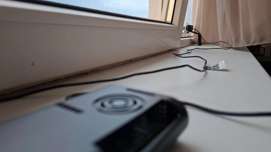](https://www.xda-developers.com/someone-built-an-automatic-lightning-photographer-with-a-raspberry-pi-and-it-actually-works/)

An automatic lightning photographer with a Raspberry Pi and Python - [XDA](https://www.xda-developers.com/someone-built-an-automatic-lightning-photographer-with-a-raspberry-pi-and-it-actually-works/) and [GitHub]().

[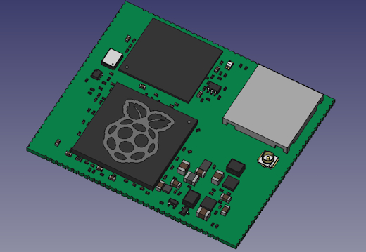](https://github.com/mfolejewski/RPI_SOM_CM0_3D_Model)

Mirosław Folejewski has published an unofficial 3D STEP model of the Raspberry Pi CM0 SOM module extacted from MoCM0 project for designing PCBs dedicated to carrier boards based on this module - [GitHub](https://github.com/mfolejewski/RPI_SOM_CM0_3D_Model). Via [X](https://x.com/Mirko_DIY/status/2068199417983750309).

[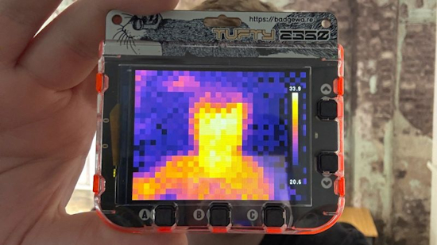](https://learn.pimoroni.com/article/build-a-thermal-camera-with-tufty-2350)

Les Pounder's new tutorial is a thermal camera with a Pimoroni Tufty 2350 and an MLX90640 thermal camera breakout programmed in MicroPython. Ones conference badge can do more than tell everyone your name - [Pimoroni](https://learn.pimoroni.com/article/build-a-thermal-camera-with-tufty-2350). Via [LinkedIn](https://www.linkedin.com/posts/les-pounder-15838129_new-tutorial-build-a-thermal-camera-with-share-7474834981127847937-f4Wm/).

[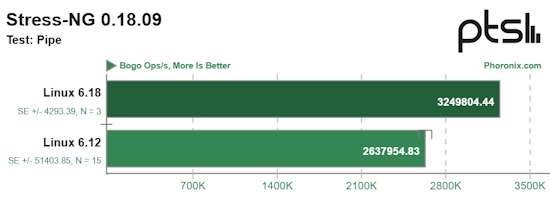](https://www.phoronix.com/review/raspberry-pi-os-linux-618/5)

Updated Raspberry Pi OS with Linux 6.18 LTS delivers some performance benefits - [Phoronix](https://www.phoronix.com/review/raspberry-pi-os-linux-618/5).

[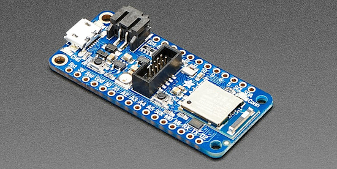](https://www.howtogeek.com/low-power-chips-beat-the-esp32-for-battery-life/)

The nRF52840 low-power chips beat the ESP32 for battery life - [How-To Geek](https://www.howtogeek.com/low-power-chips-beat-the-esp32-for-battery-life/).

[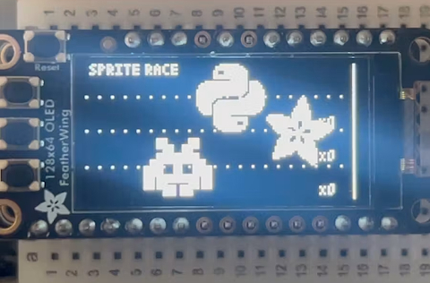](https://blog.adafruit.com/2026/06/24/a-python-tool-to-quickly-prototype-adafruit-gfx-displays-in-python/)

A Python tool to quickly prototype Adafruit GFX displays in Python - [Adafruit Blog](https://blog.adafruit.com/2026/06/24/a-python-tool-to-quickly-prototype-adafruit-gfx-displays-in-python/).

[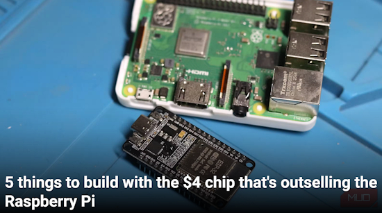](https://www.makeuseof.com/things-build-chip-outselling-raspberry-pi/)

Five things to build with the $4 chip that's outselling the Raspberry Pi - [MUD](https://www.makeuseof.com/things-build-chip-outselling-raspberry-pi/).

text - [site](url).

text - [site](url).

text - [site](url).

text - [site](url).

text - [site](url).

text - [site](url).

text - [site](url).

[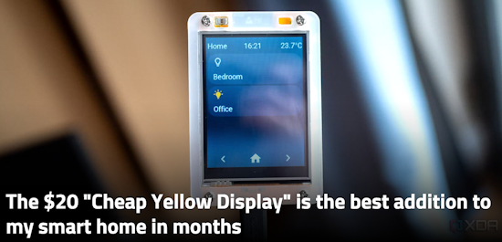](https://www.xda-developers.com/the-20-cheap-yellow-display-is-the-best-addition-to-my-smart-home-in-months/)

The $20 "Cheap Yellow Display" is the best addition to my smart home in months - [XDA](https://www.xda-developers.com/the-20-cheap-yellow-display-is-the-best-addition-to-my-smart-home-in-months/).

text - [site](url).

Python is slow, so how did I make physics fast? - [YouTube](https://www.youtube.com/watch?v=XQHNYX5eMRo).

[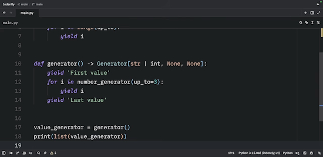](https://www.youtube.com/watch?v=XlW4K8oqqLw)

"yield from" is Awesome in Python - [YouTube](https://www.youtube.com/watch?v=XlW4K8oqqLw).

## New

[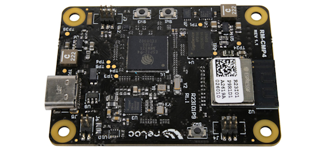](https://www.crowdsupply.com/reloc/scintix-p4)

SCINTIX P4 is a real-time ESP32-P4 module for the Raspberry Pi CM4/CM5 ecosystem. it features a real-time ESP32-P4 MCU with an ESP32-C6 companion for Wi-Fi 6, Bluetooth 5, and 802.15.4 into the same mechanical and electrical footprint - [CrowdSuppply](https://www.crowdsupply.com/reloc/scintix-p4). Via [Discord](https://discord.com/channels/327254708534116352/577995245132840960/1519340563248185535).

[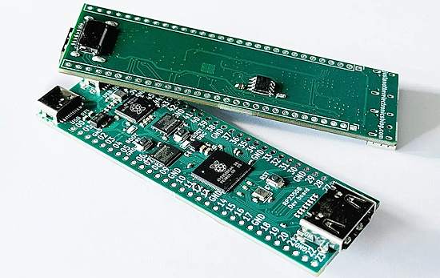](https://www.cnx-software.com/2026/06/24/rp2350b-bellswhistles-development-board-features-on-board-rp2040-debugger-hdmi-and-microsd-card-slot/)

“Bells&Whistles” is a Raspberry Pi RP2350B-based development board which also features an onboard RP2040-based debugger running Picoprobe firmware, removing the need for a separate debug probe. It has an HDMI output, a MicroSD card slot for storage, an optional 8 MB of PSRAM, and since it uses the Raspberry Pi RP2350B variant, it supports up to 46 GPIO pins. The board also features two USB Type-C ports, one for the RP2350B and the other for the RP2040 debugger - [CNX](https://www.cnx-software.com/2026/06/24/rp2350b-bellswhistles-development-board-features-on-board-rp2040-debugger-hdmi-and-microsd-card-slot/).

## New Boards Supported by CircuitPython

The number of supported microcontrollers and Single Board Computers (SBC) grows every week. This section outlines which boards have been included in CircuitPython or added to [CircuitPython.org](https://circuitpython.org/).

This week there were (#/no) new boards added:

- [Board name](url)
- [Board name](url)
- [Board name](url)

*Note: For non-Adafruit boards, please use the support forums of the board manufacturer for assistance, as Adafruit does not have the hardware to assist in troubleshooting.*

Looking to add a new board to CircuitPython? It's highly encouraged! Adafruit has four guides to help you do so:

- [How to Add a New Board to CircuitPython](https://learn.adafruit.com/how-to-add-a-new-board-to-circuitpython/overview)
- [How to add a New Board to the circuitpython.org website](https://learn.adafruit.com/how-to-add-a-new-board-to-the-circuitpython-org-website)
- [Adding a Single Board Computer to PlatformDetect for Blinka](https://learn.adafruit.com/adding-a-single-board-computer-to-platformdetect-for-blinka)
- [Adding a Single Board Computer to Blinka](https://learn.adafruit.com/adding-a-single-board-computer-to-blinka)

## New Adafruit Learning System Guides

[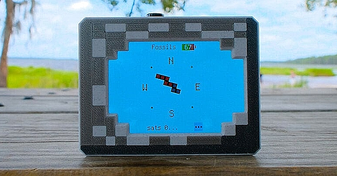](https://learn.adafruit.com/guides/latest)

The [Adafruit Learning System](https://learn.adafruit.com/) has over 3,200 free guides for learning skills and building projects including using Python.

[title](url) from [name](url)

[title](url) from [name](url)

[title](url) from [name](url)

## Updated Learn Guides

[title](url)

## CircuitPython Libraries

The CircuitPython library numbers are continually increasing, while existing ones continue to be updated. Here we provide library numbers and updates!

To get the latest Adafruit libraries, download the [Adafruit CircuitPython Library Bundle](https://circuitpython.org/libraries). To get the latest community contributed libraries, download the [CircuitPython Community Bundle](https://circuitpython.org/libraries).

If you'd like to contribute to the CircuitPython project on the Python side of things, the libraries are a great place to start. Check out the [CircuitPython.org Contributing page](https://circuitpython.org/contributing). If you're interested in reviewing, check out Open Pull Requests. If you'd like to contribute code or documentation, check out Open Issues. We have a guide on [contributing to CircuitPython with Git and GitHub](https://learn.adafruit.com/contribute-to-circuitpython-with-git-and-github), and you can find us in the #help-with-circuitpython and #circuitpython-dev channels on the [Adafruit Discord](https://adafru.it/discord).

You can check out this [list of all the Adafruit CircuitPython libraries and drivers available](https://github.com/adafruit/Adafruit_CircuitPython_Bundle/blob/master/circuitpython_library_list.md). 

The current number of CircuitPython libraries is **###**!

**New Libraries**

Here are this week's new CircuitPython libraries:

* [library](url)

**Updated Libraries**

Here are this week's updated CircuitPython libraries:

* [library](url)

## What’s the CircuitPython team up to this week?

What is the team up to this week? Let’s check in:

**Dan**

I released CircuitPython 10.3.0-alpha.3 last week, after testing several PR's that I wanted to include, most notably Tim's `USBSpeaker` and `USBMicrophone` implementations.

I'm working on more bugs and feature now. First up is being able to specify the WiFi hostname in settings.toml.

**Tim**

I've been working on a few audio enhancements in the CircuitPython core this week. I implemented `USBSpeaker` which allows the computer to send audio to CircuitPython devices. Effect chains can be applied and the audio can ultimately be streamed to another output source, or even looped back to the computer via `USBMicrophone`. I also added support to `I2SIn` for the streaming protocol. This allows the class to be chained with the various audio effects modules and sent to outputs that support the same protocol like `AudioOut` and similar. I've written a learn guide for a USB Morse code key that uses a CircuitPlayground Bluefruit and demonstrates some of the new USB audio functionality.

**Scott**

text.

**Liz**

I've been documenting the CircuitPython chiptune player project. Noe Ruiz is designing a fun, arcade themed enclosure for it. The [code is available now](https://github.com/adafruit/Adafruit_Learning_System_Guides/blob/main/CircuitPython_Chiptune_Player/code.py) if folks are curious about it. I've also been reviewing some PR's and I published a new [Learn Guide recap video](https://youtube.com/shorts/ngXkDoVyKuA).

## Upcoming Events

The next MicroPython Meetup in Melbourne will be on June 24 – [Luma](https://luma.com/micropython). You can see recordings of previous meetings on [YouTube](https://www.youtube.com/@MicroPythonOfficial). 

[EuroPython 2026](https://ep2026.europython.eu/) is coming to Kraków, Poland 13-19 July, 2026. Join thousands of Python enthusiasts for a week of learning, networking, and community.

**Other Events This Year**

* [PyOhio 2026](https://www.pyohio.org/2026/) is from 25 July through 26 July, 2026 this year in Cleveland, USA.
* [HOPE 26 Conference](https://store.2600.com/products/tickets-to-hope-26) is from August 14th through 16th at the New Yorker Hotel, NY, NY.
* [PyCon AU 2026](https://2026.pycon.org.au/) will be 26 Aug. 2026 – 30 Aug. 2026 in Brisbane, Australia

If you know of virtual events or upcoming events, please let us know via email to cpnews(at)adafruit(dot)com.

## Latest Releases

CircuitPython's stable release is [#.#.#](https://github.com/adafruit/circuitpython/releases/latest) and its unstable release is [#.#.#-##.#](https://github.com/adafruit/circuitpython/releases). New to CircuitPython? Start with our [Welcome to CircuitPython Guide](https://learn.adafruit.com/welcome-to-circuitpython).

[2026####](https://github.com/adafruit/Adafruit_CircuitPython_Bundle/releases/latest) is the latest Adafruit CircuitPython library bundle.

[2026####](https://github.com/adafruit/CircuitPython_Community_Bundle/releases/latest) is the latest CircuitPython Community library bundle.

[v#.#.#](https://micropython.org/download) is the latest MicroPython release. Documentation for it is [here](http://docs.micropython.org/en/latest/pyboard/).

[#.#.#](https://www.python.org/downloads/) is the latest Python release. The latest pre-release version is [#.#.#](https://www.python.org/download/pre-releases/).

[#,### Stars](https://github.com/adafruit/circuitpython/stargazers) Like CircuitPython? [Star it on GitHub!](https://github.com/adafruit/circuitpython)

## Call for Help -- Translating CircuitPython is now easier than ever

[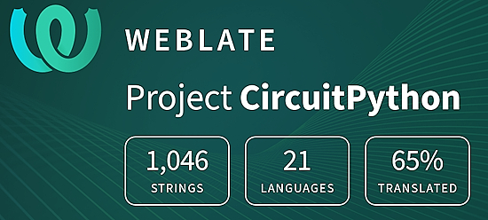](https://hosted.weblate.org/engage/circuitpython/)

One important feature of CircuitPython is translated control and error messages. With the help of fellow open source project [Weblate](https://weblate.org/), we're making it even easier to add or improve translations. 

Sign in with an existing account such as GitHub, Google or Facebook and start contributing through a simple web interface. No forks or pull requests needed! As always, if you run into trouble join us on [Discord](https://adafru.it/discord), we're here to help.

## NUMBER Thanks

The Adafruit Discord community, where we do all our CircuitPython development in the open, reached over NUMBER humans - thank you! Adafruit believes Discord offers a unique way for Python on hardware folks to connect. Join today at [https://adafru.it/discord](https://adafru.it/discord).

## ICYMI - In case you missed it

Python on hardware is the Adafruit Python video-newsletter-podcast! The news comes from the Python community, Discord, Adafruit communities and more and is broadcast on ASK an ENGINEER Wednesdays. The complete Python on Hardware weekly videocast [playlist is here](https://www.youtube.com/playlist?list=PLjF7R1fz_OOXRMjM7Sm0J2Xt6H81TdDev). The video podcast is on [iTunes](https://itunes.apple.com/us/podcast/python-on-hardware/id1451685192?mt=2), [YouTube](http://adafru.it/pohepisodes), [Instagram](https://www.instagram.com/adafruit/channel/), and [XML](https://itunes.apple.com/us/podcast/python-on-hardware/id1451685192?mt=2).

[The weekly community chat on Adafruit Discord server CircuitPython channel - Audio / Podcast edition](https://itunes.apple.com/us/podcast/circuitpython-weekly-meeting/id1451685016) - Audio from the Discord chat space for CircuitPython, meetings are usually Mondays at 2pm ET, this is the audio version on [iTunes](https://itunes.apple.com/us/podcast/circuitpython-weekly-meeting/id1451685016), Pocket Casts, [Spotify](https://adafru.it/spotify), and [XML feed](https://adafruit-podcasts.s3.amazonaws.com/circuitpython_weekly_meeting/audio-podcast.xml).

## Contribute

The CircuitPython Weekly Newsletter is a CircuitPython community-run newsletter emailed every Monday. To contribute your content, please email your news to cpnews (at) adafruit (dot) com with information and link(s) to your content. 
